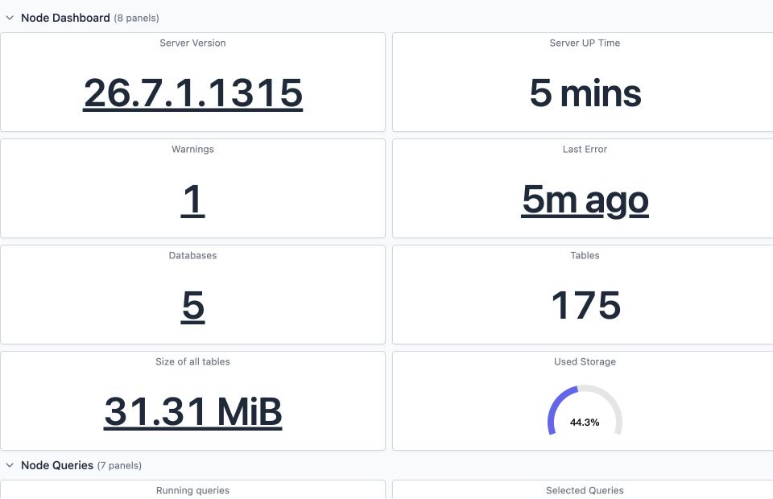
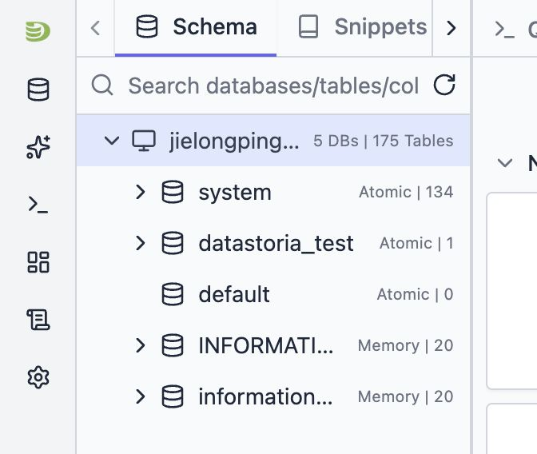
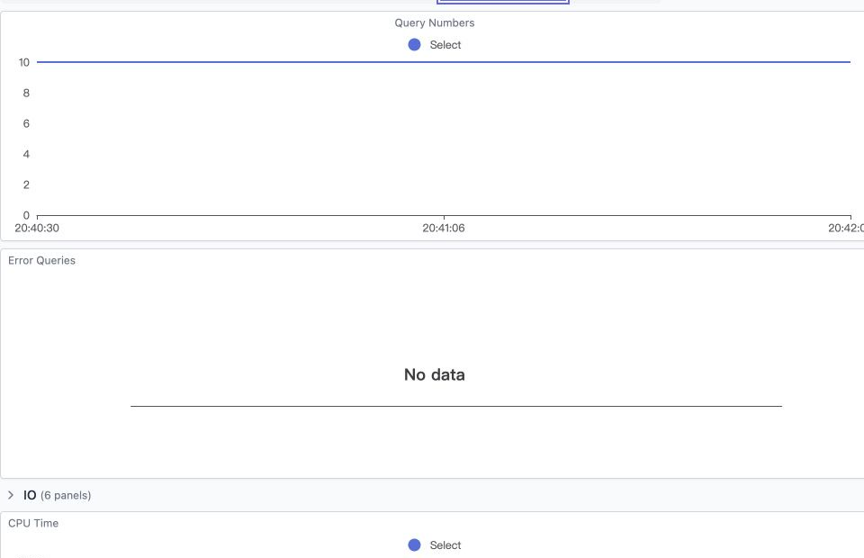
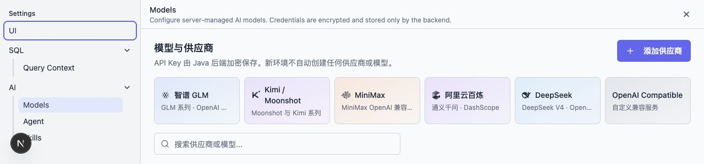

This manual uses the desktop browser as an example. Icon placement may vary slightly between
versions, but object names and server-side behavior stay consistent. All illustrations use local
demo data; passwords and API keys never appear in screenshots.

[Watch the 12-second silent feature tour](./img/datastoria-tour.mp4)

## 1. First Sign-in

1. Open the DataStoria URL provided by your administrator;
2. Sign in with your username and password (the bootstrap administrator is provisioned by the
   server on first start);
3. When you sign in with no connections configured, the page guides you through creating a
   ClickHouse Connection.

## 2. Managing ClickHouse Connections

### Creating a Connection

1. Click the connection entry on the left;
2. Pick a built-in template or "New Connection";
3. Enter the HTTP URL, for example `https://clickhouse.example.com:8443`;
4. Enter the username, password and an optional Database;
5. For cluster deployments, enter the exact Cluster name from `system.clusters`;
6. Click Test, then save once it succeeds.

Notes:

- DataStoria uses the ClickHouse HTTP port, `8123/8443` by default — not the Native protocol
  `9000/9440`;
- When editing a saved connection, an empty password keeps the stored password; the plaintext
  password is never loaded back into the browser;
- Production accounts should only be granted read access to business databases and the necessary
  `system.*` tables;
- When multiple clusters are discovered you must fill in the Cluster explicitly; the system does
  not guess.

### Switching and Deleting

Switch the active connection from the connection list on the left. Before deleting a connection,
make sure no session bindings need to be kept; session history is not re-bound to another database
automatically.

## 3. SQL Workbench

1. Select the database and table in the Schema tree;
2. Open a new Query tab;
3. Type SQL and run it with the execute button or a keyboard shortcut;
4. Switch between table, JSON, visualization or Explain views in the result area;
5. Restore earlier SQL through the history.

When AI explains an error, the system sends the necessary error context to the configured model.
For sensitive tables, review the SQL and the error content first — never paste business data into
the prompt.

## 4. Dashboards and Cluster Nodes

Open Dashboards and use the scope selector at the top:

- **Cluster summary · all shards and replicas**: aggregates every topology node;
- **Shard N · Replica N · node name**: inspect a single replica;
- Without cluster metadata: the current connection's entry node is used.

Time range, refresh interval and panel layout are adjusted at the top of the dashboard. Some
charts depend on the ClickHouse `metric_log`, `query_log`, `part_log` or OpenTelemetry logs; when
the target table is not enabled, that panel being unavailable does not mean the connection failed.

When the topology contains two or more nodes, a Monitoring scope selector appears at the top;
single-node connections do not show this control.

## 5. Configuring Model Providers

Go to **Settings → Models**. No callable models are bundled; an administrator must configure them.

### Using Templates

Start from templates such as Zhipu GLM, Kimi/Moonshot, MiniMax, Alibaba Bailian or DeepSeek:

1. Click "Add Provider";
2. Choose a template and verify the Base URL;
3. Enter the API Key;
4. Save and click Test;
5. Click Discover Models and enable the models you need.

If the service does not expose a model-list API, add the Model ID manually with a display name,
context window, tier and multimodal capabilities. The Base URL should point at the provider's
OpenAI-compatible API root.

### Security Rules

- Once saved, an API Key only shows "configured"; the full value is never returned;
- Enter a new value to update the key; leaving it blank does not overwrite the stored credential;
- Never pass keys through the chat input, browser environment variables or frontend request
  bodies;
- Before deleting a provider, confirm no default model, agent or running task references it.

## 6. AI Sessions

1. Select the ClickHouse connection and the model;
2. Start a new session and describe the problem;
3. Review the AI's SQL, tool results and evidence;
4. Choose Approve or Deny for actions requiring authorization;
5. Answer follow-up questions when asked; the server resumes the original run through the Action
   API;
6. After a network interruption the page reconnects using event sequence numbers — do not
   re-submit the same question.

Sessions created with "no connection" do not automatically pick up connections added later. Start
a new session or select the connection explicitly so the AI does not query the wrong database.

## 7. Skills and Agents

**Settings → Skills** lists built-in and custom skills. Administrators can create, edit, inspect
resources and enable or disable skills; slash commands come from enabled skills.

Agent management consists of Agent Definitions and immutable Revisions. After editing, create a
Revision first, then publish; deactivation only blocks new runs and must not break already
persisted run history.

## 8. Sessions, Sharing and Feedback

- The session list supports renaming and deletion;
- Share links are read according to their permission and can be revoked by administrators;
- Upvote/downvote AI messages with an optional note; feedback reports are visible to
  administrators only;
- Before sharing, check whether the session contains business SQL, table names or results.

## 9. Troubleshooting

| Symptom | Fix |
|---|---|
| Add-provider button unresponsive | Refresh to the latest version and make sure the dialog is not covered by another modal |
| Connection works but the AI session has no connection | Start a new session and select that connection |
| Cluster summary denied | Fill in the Cluster exactly as it appears in `system.clusters` |
| A dashboard panel reports a missing table | Enable the corresponding system log in ClickHouse, or ignore the optional panel |
| Model discovery returns nothing | Test the provider first; add models manually when no list API exists |
| Streaming answer interrupted | Keep the session page open; the system replays by Last-Event-ID |

For more errors see the [troubleshooting guide](https://github.com/CCweixiao/datastoria-server/blob/master/docs/operations/troubleshooting.md).
