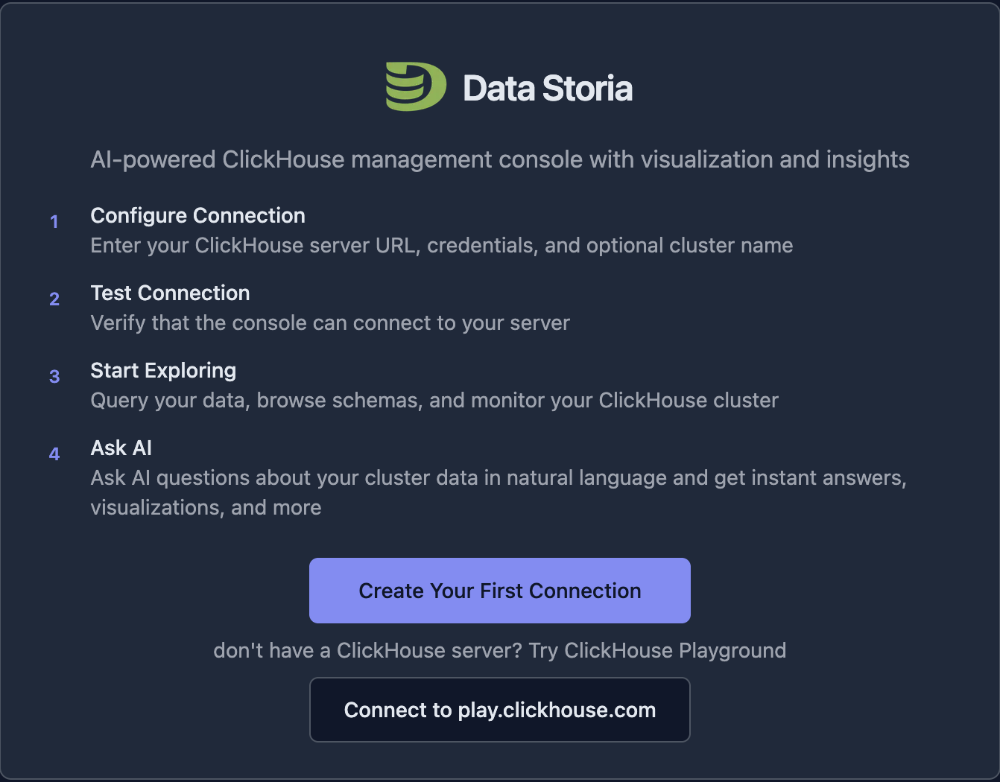
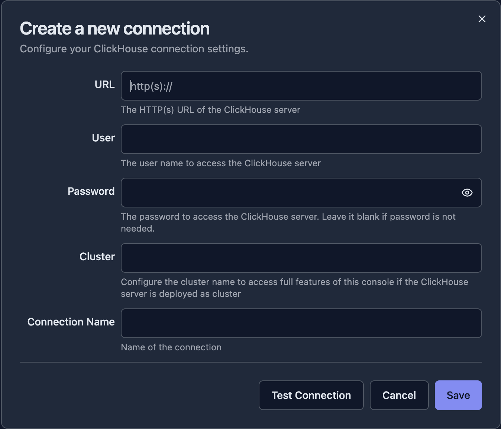
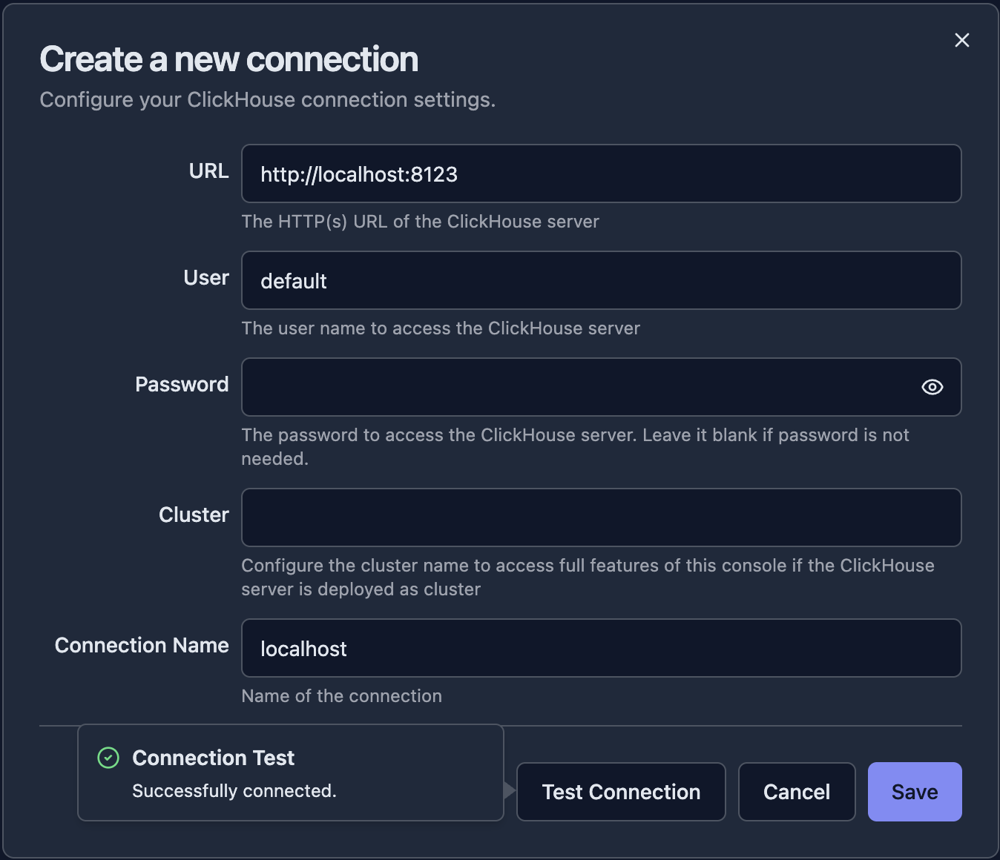
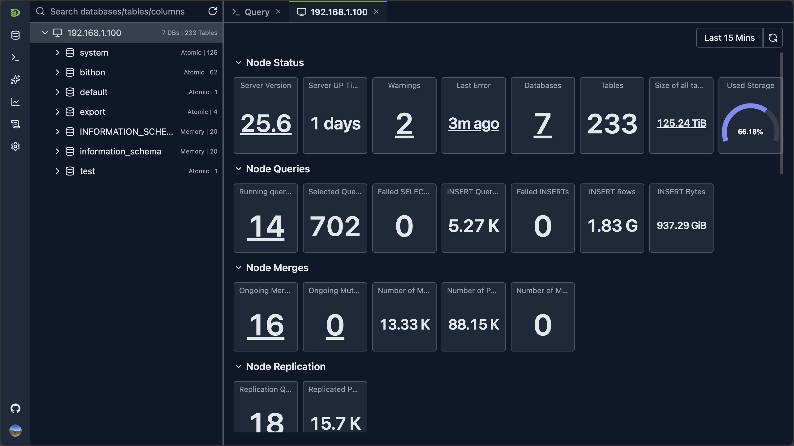
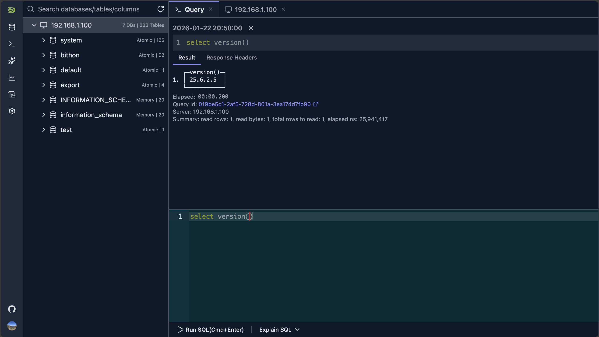

# 首次连接

本指南将带你一步步完成 DataStoria 与 ClickHouse 实例的首次连接。

## 开始之前

请确保你已具备：

- ✅ 已安装并正在运行的 DataStoria（参见[安装与配置](./installation.md)）
- ✅ 可访问的 ClickHouse 服务器（本地或远程）
- ✅ 连接凭据（主机、端口、用户名、密码、数据库）

## 连接方式

DataStoria 支持多种连接方式，取决于你的 ClickHouse 部署情况：

### 标准 HTTP 连接

这是连接 ClickHouse 最常见的方式。

#### 连接参数

- **Host**：你的 ClickHouse 服务器地址（例如 `localhost`、`clickhouse.example.com` 或某个 IP 地址）
- **Port**：ClickHouse HTTP 端口（默认：`8123`）
- **Database**：要连接的数据库名（可选，可以稍后选择）
- **Username**：你的 ClickHouse 用户名
- **Password**：你的 ClickHouse 密码
- **Protocol**：HTTP 或 HTTPS

### 安全的 HTTPS 连接

对于生产环境，请使用 HTTPS 加密连接。

#### 附加参数

- **Protocol**：选择 HTTPS
- **Port**：HTTPS 通常为 `443`（或你配置的 HTTPS 端口）
- **SSL Verification**：启用以校验 SSL 证书

### 通过代理连接

如果你的 ClickHouse 服务器位于代理或负载均衡器之后：

1. 将代理地址作为主机填写
2. 使用代理端口
3. 确保代理会将请求转发到你的 ClickHouse 服务器

## 逐步连接指南

### 第 1 步：打开 DataStoria

1. 访问 `http://localhost:8080`（或你配置的端口）
2. 你将看到 DataStoria 的欢迎界面

### 第 2 步：创建你的第一个连接

点击 'Create Your First Connection'（创建你的第一个连接）按钮，将进入连接配置对话框。

### 第 3 步：填写连接详情

在连接表单中填写你的 ClickHouse 信息：

| 属性 | 说明 | 示例 |
|----------|------------|---------|
| URL | 带协议和端口的 ClickHouse 服务器 URL | `http://localhost:8123` |
| User | 你的 ClickHouse 用户名 | `default` |
| Password | （可选）你的 ClickHouse 实例密码 | `<你的 ClickHouse 实例密码>` |
| Cluster | （可选）如果你的 ClickHouse 集群有多个副本，可以将其设置为集群名称，从而在本应用中访问所有节点。  如果配置，它应当是你集群配置中的名称（SHOW CLUSTERS）。 | `my_cluster` |
| Connection Name | 用于标识该连接的友好名称。默认取 URL 中的主机名自动填充，建议改为自定义名称。 | `My ClickHouse` |

### 第 4 步：测试连接

1. 点击 **"Test Connection"**（测试连接）以验证你的配置
2. 等待连接测试完成
3. 如果成功，按钮左侧会显示一条确认消息

> **注意**
>
> 如果配置正确但连接仍然失败：DataStoria 的所有查询都由后端服务代理执行，浏览器不直接访问 ClickHouse，因此**无需为 ClickHouse 配置 CORS**。请检查后端进程所在主机能否访问该 URL（防火墙、安全组、Docker 网络等），以及账号密码是否有权登录。

### 第 5 步：保存并连接

点击 **"Save"**（保存）存储该连接，应用将连接到你的 ClickHouse 实例并进入主界面。

> 注意：连接信息保存在服务端数据库中；密码使用 AES-256 信封加密存储，且任何接口都不会把密码明文返回给浏览器。

## 基本导航

连接成功后，应用会自动打开查询编辑器，以及最先返回响应的那个节点的 Dashboard，你会看到如下所示的 DataStoria 主界面：

### 主要组件

1. **侧边栏（Sidebar）** —— 在以下入口之间导航：
   - 连接
   - 查询页签
   - 聊天页签
   - Dashboard
   - 系统表内省
   - 设置

2. **Schema 树**

   该视图展示所有数据库/表/列的信息，并支持全局搜索能力。
   它也是表元数据等其他功能的主要入口。

3. **主页签区域**
   主要的工作区域，包括查询编辑器、Dashboard 等。

4. **右侧面板**
   默认隐藏，可用于展示聊天面板。

### 你的第一条查询

点击 'Query' 页签，或点击侧边栏上的查询图标按钮，即可显示查询视图；在编辑器中编写 SQL 并运行。

## 多连接管理

DataStoria 支持管理多个 ClickHouse 集群：

1. **添加新连接**：将鼠标移到侧边栏的数据库图标按钮上，选择 "Add Connection"
2. **在连接之间切换**：从侧边栏数据库图标按钮的下拉列表中选择连接
3. **管理连接**：在侧边栏数据库图标按钮的下拉连接列表中，点击所选连接的 'Edit'（编辑）图标按钮

## 连接故障排查

### 常见问题

#### 连接被拒绝

**问题**："Connection refused" 或 "Cannot connect to server"

**解决方案**：
- 确认 ClickHouse 正在运行
- 检查防火墙设置
- 确认主机和端口正确
- 确保 ClickHouse HTTP 接口已启用
- 核实是 HTTPS 还是 HTTP

#### 身份认证失败

**问题**："Authentication failed" 或 "Invalid credentials"

**解决方案**：
- 仔细核对用户名和密码
- 确认该用户存在于 ClickHouse 中
- 检查用户是否具有相应权限
- 先尝试用 `default` 用户连接

## 接下来做什么？

连接成功后，可以探索以下功能：

- **[Schema Explorer](../04-cluster-management/schema-explorer.md)** —— 浏览你的数据库和表
- **[SQL 编辑器](../03-query-experience/sql-editor.md)** —— 开始编写和执行查询
- **[自然语言查询](../02-ai-features/natural-language-sql.md)** —— 用平实的语言提问

