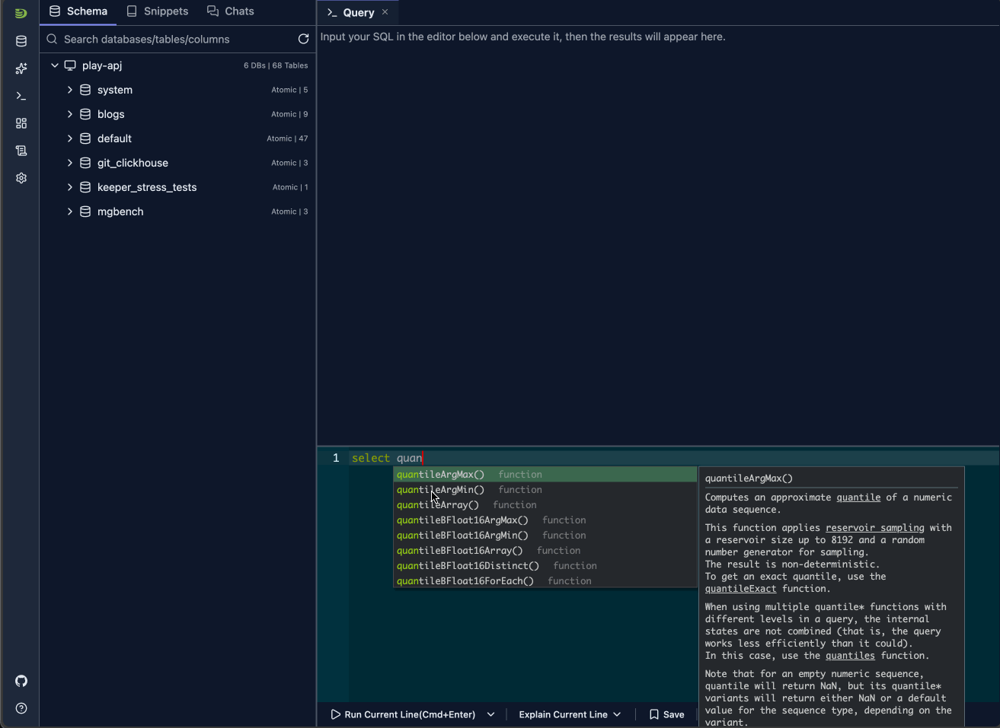
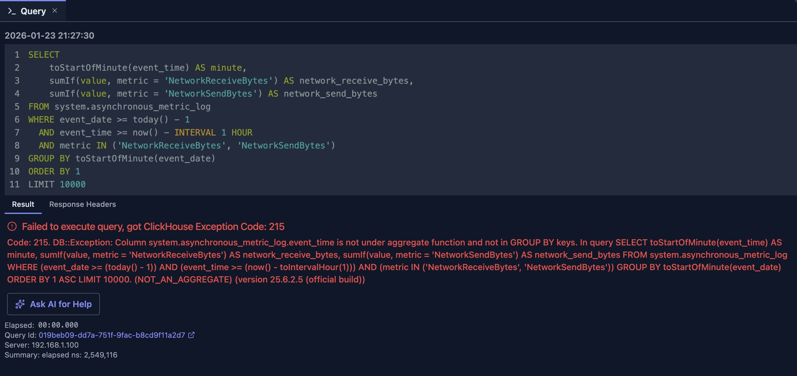
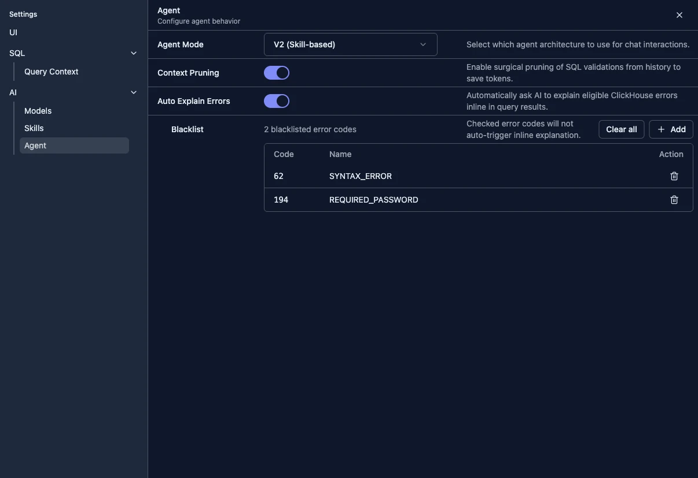
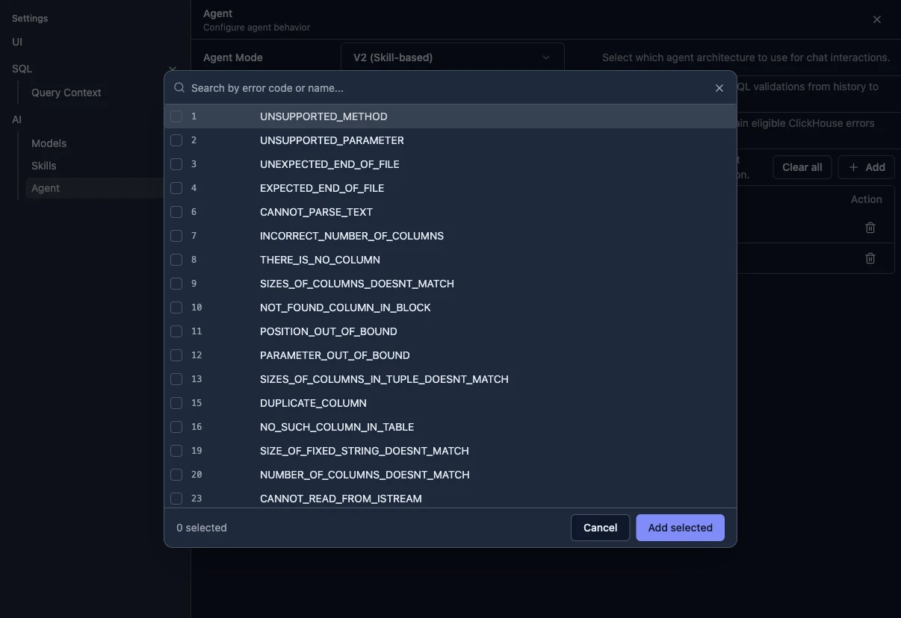

# Ask AI for Help（向 AI 求助）

"Ask AI for Help"（向 AI 求助）功能可在查询编辑器中的查询失败时提供 AI 驱动的帮助。它能解释出了什么问题、给出可能的修复方案，并提供修正后的 SQL 示例。

## 概述

DataStoria 支持两种方式来获取 ClickHouse 错误的帮助：

- **自动内联解释**：启用后，符合条件的 ClickHouse 错误会直接在查询结果视图中得到解释
  
- **手动求助**：你仍然可以点击 **Ask AI for Fix**（请求 AI 修复）按需获取帮助

此功能借助 AI 来：

- **解释错误**：理解查询哪里出了问题
- **提供修复**：获得可直接使用的修正后 SQL 查询
- **节省时间**：无需手动检索错误消息或调试语法问题

## 工作原理

### 自动内联解释

如果设置中启用了 **Auto Explain Errors**（自动解释错误），DataStoria 可以在以下情况下自动请求 AI 解释：

1. 查询失败并带有 ClickHouse 错误码
2. AI 模型可用
3. 该错误码未被列入自动解释的黑名单

解释内容会直接流式展示在错误视图中，位于 ClickHouse 错误详情的下方。

响应特意设计得紧凑且以行动为导向，通常组织为：

- **Cause（原因）**：哪里失败了
- **Fix（修复）**：可以尝试的具体操作
- **Example（示例）**：适用时提供修正后的 SQL 示例

### 手动求助

即使自动解释被禁用，你仍然可以手动请求帮助。

当查询执行失败时，DataStoria 会在错误消息旁显示 **Ask AI for Fix**（请求 AI 修复）按钮。点击它会将 SQL 查询和 ClickHouse 错误详情发送给 AI，并内联渲染流式返回的解释。

这在以下情况很有用：

1. 自动解释被禁用
2. 该错误被列入了自动解释的黑名单
3. 你只想对选定的失败请求 AI 帮助



在上面的示例中，AI 指出了可能的原因并给出修正后的查询，比人工逐行检查冗长的 ClickHouse 异常快得多。

以下是错误 SQL 与修正后 SQL 的简化对比：

```sql
--wrong
GROUP BY toStartOfMinute(event_date)

--correct
GROUP BY toStartOfMinute(event_time)
```

## 设置

打开 **Settings → AI → Agent** 来控制此功能：



- **Auto Explain Errors**（自动解释错误）：为符合条件的 ClickHouse 错误启用自动内联解释
- **Blacklist**（黑名单）：阻止选定的 ClickHouse 错误码自动触发 AI，同时仍允许手动求助

当某些错误码过于频繁、过于显而易见或不适合自动诊断时，可以使用黑名单。

在黑名单区域使用 **Add**（添加）来搜索 ClickHouse 错误码，并选择那些应保持仅手动的错误码：



## 最佳实践

### 何时使用

✅ **在以下情况使用自动或手动 AI 帮助：**
- 你遇到了无法理解的错误
- 错误消息不清晰或过于技术化
- 你需要快速修复语法错误
- 你想了解查询失败的原因

❌ **在以下情况考虑其他途径：**
- 错误明显是连接问题（检查你的连接设置）
- 错误与权限有关（检查你的用户权限）
- 你想要更广泛的 SQL 学习或探索（使用聊天面板提出一般性问题）

### 获得更好的结果

1. **先查看 ClickHouse 错误**：当原始错误信息有意义时，内联解释的效果最佳
2. **核实 Schema 名称**：尽可能确认表名和列名
3. **有选择地使用手动求助**：将嘈杂的错误码加入黑名单，仅在需要时手动求助
4. **验证修复方案**：AI 建议很有帮助，但你仍应验证修正后的查询

## 局限性

- 自动解释仅适用于符合条件的 ClickHouse 错误
- AI 的建议基于错误消息和你的 SQL 查询
- 复杂错误可能需要多轮迭代才能解决
- AI 可能无法访问你完整的数据库 Schema 上下文
- 某些 ClickHouse 特有的功能仍需人工验证

## 与其他功能的集成

### 查询优化

如果你的查询可以执行但很慢：

1. 使用 AI 帮助理解明显的查询问题
2. 切换到查询优化功能进行详细分析
3. 将两者结合，形成更完整的工作流

## 后续步骤

- **[Slash Commands](./slash-commands.md)** — 使用 `/explain_error_code` 等命令直接从聊天输入框触发 AI 工作流
- **[自然语言数据探索](./natural-language-sql.md)** — 从零开始生成查询
- **[查询优化](./query-optimization.md)** — 优化可正常运行的查询
- **[错误诊断](../03-query-experience/error-diagnostics.md)** — 深入了解错误解读
