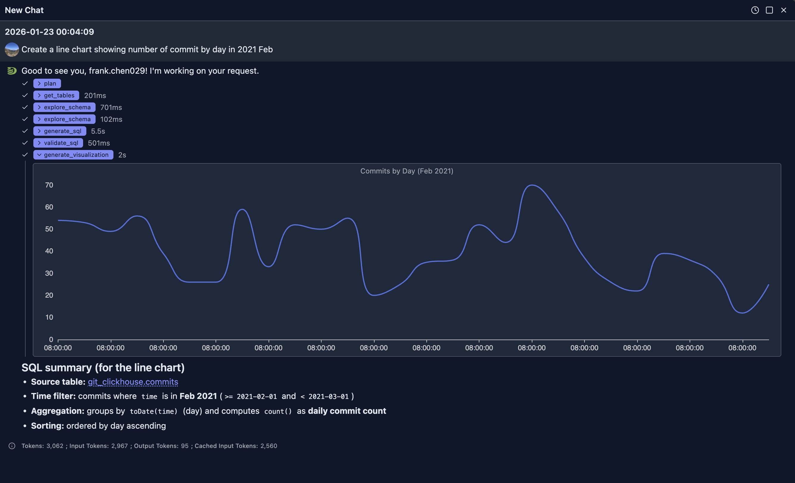
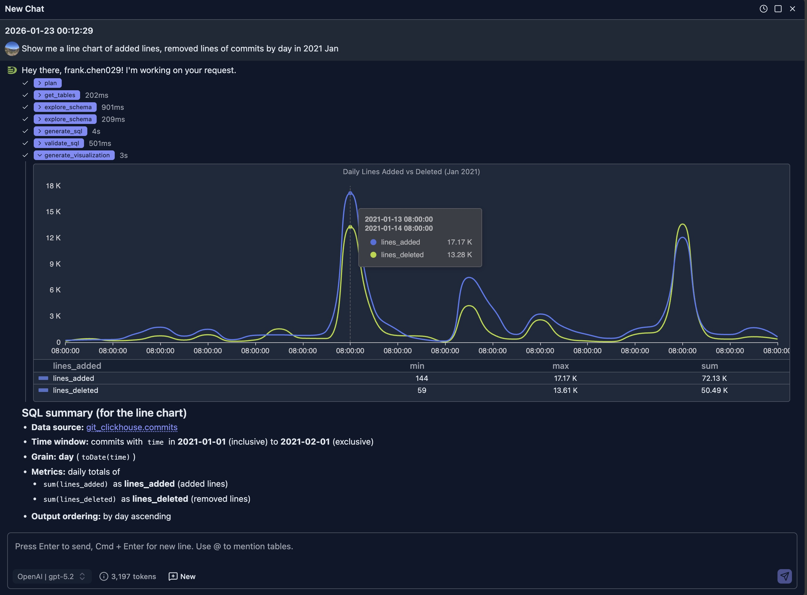
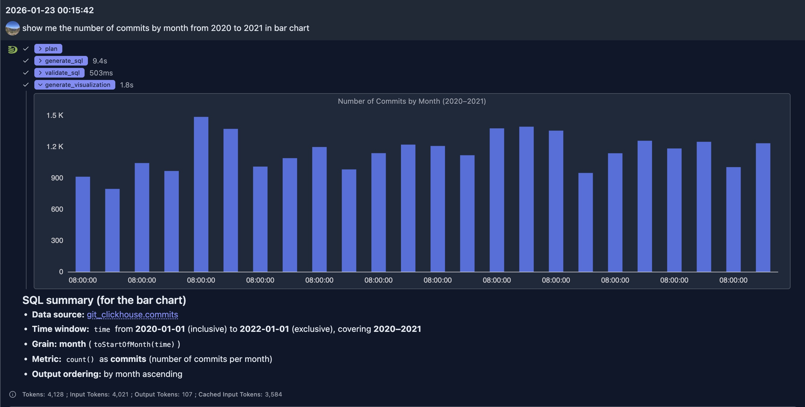
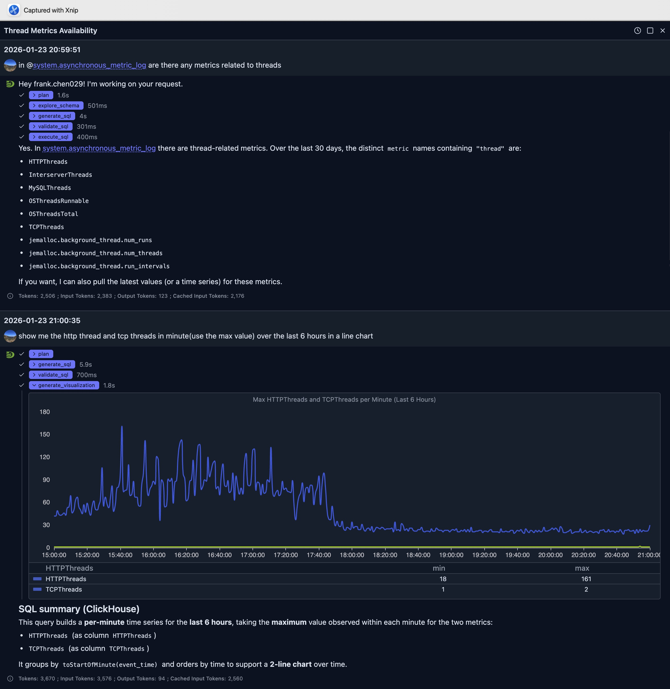

# 智能可视化

DataStoria 的智能可视化功能允许你通过简单的 Prompt 生成精美的可视化，如时序图、饼图和数据表格。将查询结果即时转化为可视化洞察。

它是数据探索的扩展，能大大节省了解数据的时间。

## 概述

智能可视化功能利用 AI 来：

- 生成满足你需求的 SQL
- 自动生成可视化

Java AgentScope 运行时生成 SQL 和可视化规格。Spring Boot 通过持久化的 ClickHouse 连接执行 SQL；浏览器渲染返回的可视化数据。

> **注意**：可视化基于查询结果生成。了解更多关于[查询执行](../03-query-experience/query-execution.md)的内容。

## 通过 Prompt 生成图表

以下示例使用 [ClickHouse Playground](https://play.clickhouse.com) 进行演示。
你可以创建一个到该 Playground 的连接来尝试下面的示例。

### 时序图

**Prompt**: "Create a line chart showing number of commit by day in 2021 Feb"



生成的 SQL 如下：

```sql
SELECT
  toDate(time) AS day,
  count() AS commits
FROM git_clickhouse.commits
WHERE time >= toDateTime('2021-02-01 00:00:00')
  AND time < toDateTime('2021-03-01 00:00:00')
GROUP BY day
ORDER BY day
LIMIT 1000
```

**Prompt**: "Show me a line chart of added lines, removed lines of commits by day in 2021 Jan"




### 柱状图

**Prompt**: "show me the number of commits by month from 2020 to 2021 in bar chart"




#### 饼图

**Prompt**: "Show me a pie chart of market share by product category"

**结果**：一张饼图，每个扇区代表一个产品类别的市场份额

**Prompt**: "Create a donut chart showing the distribution of order statuses"

**结果**：一张环形图，不同的分段代表每种订单状态

### 其他图表

更多图表将在近期陆续添加。

## 最佳实践

### 选择合适的图表类型

1. **时序数据**：使用折线图或面积图
2. **类别数据**：使用柱状图或条形图
3. **占比数据**：使用饼图或环形图
4. **关系数据**：使用散点图或气泡图
5. **分布数据**：使用直方图或箱线图

### 编写有效的可视化 Prompt

1. **具体明确**：说明图表类型以及要包含的数据
   - ✅ 好："Create a line chart with by day and revenue on y-axis, grouped by product category"
   - ❌ 模糊："Show me a chart"

2. **指定时间范围**：为时序数据包含日期范围
   - ✅ 好："Show monthly sales from January to December 2024"
   - ❌ 欠清晰："Show sales"

3. **提及聚合方式**：说明数据应如何聚合
   - ✅ 好："Bar chart showing average order value by region"
   - ❌ 含糊："Show orders by region"

4. **要求多个系列**：需要对比时直接提出
   - ✅ 好："Compare this year's revenue vs last year's on the same chart"
   - ❌ 单一序列："Show revenue"

5. **为不相关问题开启新会话**：
   - ✅ 好：当你的问题与之前的问答无关时，开启一个新的聊天会话。这样可以避免上下文膨胀并节省 Token。


## 案例展示

可视化是对前述基于 SQL 的数据探索的扩展，它为数据提供了直观的洞察，帮助我们更好地理解数据。

### ClickHouse 性能监控

ClickHouse 本身包含许多系统表，提供数千个指标。即使是专家，基于这些指标构建监控面板也十分耗时。为所有指标构建面板并不现实，而且即便做到了，从如此多的指标中找到合适的面板也颇具挑战。

借助 AI，我们可以通过多轮对话确定特定场景下我们关心的指标，并快速生成可视化面板来解决问题。



在上面的提问中，我们首先让 AI 查看 *system.asynchronous_metric_log* 表中是否有与线程相关的指标。

它生成了如下 SQL 来寻找答案：

```sql
SELECT DISTINCT metric
FROM system.asynchronous_metric_log
WHERE event_date >= today() - 30
  AND metric ILIKE '%thread%'
ORDER BY metric
LIMIT 500
```

并向我们展示了结果。基于该结果，我们又提交了一个追问，要求对 HTTP 线程和 TCP 线程进行可视化。

从生成 SQL 到最终生成可在浏览器端渲染的可视化规格，整个过程不到 10 秒即完成。

最终 LLM 用于可视化的 SQL 如下：

```sql
SELECT
    toStartOfMinute(event_time) AS ts,
    maxIf(value, metric = 'HTTPThreads') AS HTTPThreads,
    maxIf(value, metric = 'TCPThreads') AS TCPThreads
FROM system.asynchronous_metric_log
WHERE event_date >= today() - 1
  AND event_time >= now() - INTERVAL 6 HOUR
  AND metric IN ('HTTPThreads', 'TCPThreads')
GROUP BY ts
ORDER BY ts
LIMIT 10000
```

从折线图可以看出，下午 6 点之前每分钟的 HTTP 连接数远高于 6 点之后，这说明系统当时较为繁忙。

## 与其他功能的集成

### 自然语言数据探索

1. 使用自然语言数据探索生成查询
2. 执行查询
3. 请求对结果进行可视化
4. AI 会理解查询上下文，从而生成更好的可视化

### 查询优化

将查询性能改进可视化：

1. 运行原始查询和优化后的查询
2. 创建并排的可视化
3. 直观地比较性能指标


## 局限性

- 图表质量取决于查询结果的结构
- 非常大的数据集可能需要先聚合再可视化
- 某些复杂可视化可能需要人工完善
- 自定义样式选项因图表类型而异

## 后续步骤

- **[自然语言数据探索](./natural-language-sql.md)** — 生成待可视化的查询
- **[查询优化](./query-optimization.md)** — 可视化之前先优化查询
- **[节点监控面板](../05-monitoring-dashboards/node-dashboard.md)** — 监控单个节点的性能
- **[集群监控面板](../05-monitoring-dashboards/cluster-dashboard.md)** — 监控集群范围的指标
