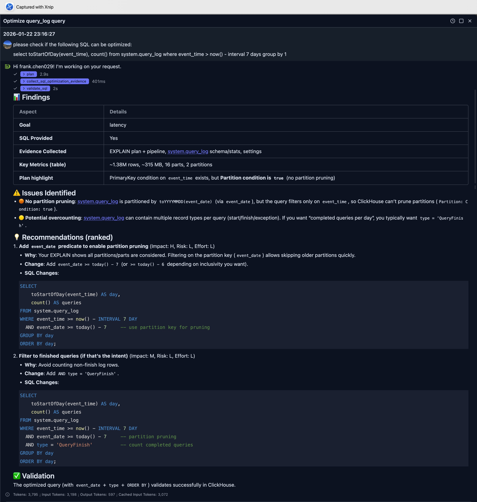
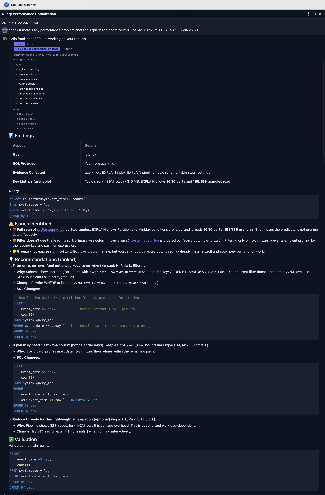

# 查询优化

DataStoria 的智能查询优化功能使用 AI 基于证据分析你的查询，并提供可落地的性能改进建议。无需深厚的 ClickHouse 专业知识，即可获得专家级的优化建议。

## 概述

查询优化功能会分析你的 SQL 查询，并基于以下内容提出改进建议：

- ClickHouse 最佳实践
- 你的数据库 Schema 和索引
- 查询执行模式
- 性能指标与证据

## 使用场景

查询优化功能支持三种灵活的方式来选定待优化的查询：

### 1. 直接提供 SQL 查询

你可以直接粘贴或编写一条 SQL 查询进行优化。适用于：

- 你有一条具体想要优化的查询
- 你正在编写新查询，希望从一开始就是优化过的
- 你从其他来源复制了一条查询

**示例**：直接粘贴你的 SQL 查询，并提问 "Optimize this query" 或 "How can I improve this query's performance?"

```text
please check if the following SQL can be optimized:

select toStartOfDay(event_time), count() 
from system.query_log
where event_time > now() - interval 7 days group by 1
```

LLM 能够从请求中提取 SQL，开始分析，并基于证据给出建议。



在本例中，LLM 指出了一个关键改进点：只需在 SQL 中额外添加一个过滤条件，即可利用分区裁剪。

```sql
SELECT
    toStartOfDay(event_time) AS day,
    count() AS queries
FROM system.query_log
WHERE event_time >= now() - INTERVAL 7 DAY
  AND event_date >= today() - 7     -- use partition key for pruning
GROUP BY day
ORDER BY day;
```

### 2. 提供 Query ID

> 注意
>
> 使用此功能，你的数据库用户必须拥有 *system.query_log* 表的访问权限。
> 如果没有，请让管理员为你授予。


如果你有来自 ClickHouse 查询日志的 `query_id`，可以直接提供。适用于：

- 你已从查询日志中发现一条慢查询
- 你想优化一条最近执行过的查询
- 你正在处理 ClickHouse 系统表中记录的查询

**示例**："Optimize query with query_id: abc123-def456-ghi789"

在下图展示的示例中，我们再次使用上面的 SQL，但先执行它并获得 query id，然后向 LLM 提问。该示例发送的问题如下：

```text
check if there's any performance problem about this query and optimize it: 019be64c-64b2-7109-876b-098060a6c763
```

应用会自动从查询日志中检索该查询，并收集必要的信息以生成优化建议。

完整响应如下：



### 3. 自动发现高开销查询

> 注意：
>
> 使用此功能，你的数据库用户必须拥有 *system.query_log* 表的访问权限。
> 如果没有，请让管理员为你授予。


该功能可以基于性能指标自动发现并分析高开销查询。非常适合：

- 你想找出系统中最慢的查询
- 你需要找到消耗资源最多的查询
- 你正在做性能审计

**支持的指标**：

- **CPU**：找出 CPU 占用最高的查询
- **Memory**：找出消耗内存最多的查询
- **Duration**：找出最慢/运行时间最长的查询
- **Disk**：找出 I/O 或存储占用最高的查询

**示例请求**：

- "Find the top 5 queries by CPU and optimize them"
- "What queries are consuming the most memory?"
- "Find the slowest queries from the last hour and analyze them"
- "Optimize queries with highest disk usage"

你也可以指定时间范围：

- 相对时间："last hour"、"past 30 minutes"、"last 2 hours"
- 绝对时间："between 2025-01-01 and 2025-02-01"、"on January 15th"

**注意**：发现模式仅支持按 CPU、内存、磁盘和时长指标过滤。如需其他过滤条件（用户、数据库、表名、查询模式），请直接提供具体的 query_id 或 SQL 查询。

## 工作原理

### 理解 AI 建议

当你提交一条查询进行优化时，AI 会：

1. **分析查询结构**：检查 JOIN、聚合、过滤条件以及数据访问模式
2. **审查 Schema 上下文**：考虑表结构（包括主键、分区表达式）、索引和数据类型
3. **收集证据**：收集索引使用情况、执行 pipeline、表大小等信息
4. **识别瓶颈**：发现低效模式，如全表扫描、不必要的 JOIN 或次优的聚合
5. **提出改进**：给出具体、可落地的建议及解释

你可以展开 `collect_sql_optimization_evidence` 步骤了解更多细节。

## 局限性

- 优化建议基于最佳实践，并不构成保证
- 实际性能可能因数据分布和硬件而异
- 某些优化可能需要更改 Schema（索引、物化视图）
- 复杂优化可能需要人工完善

## 与其他功能的集成

### 自然语言数据探索

由自然语言生成的查询会自动优化（系统 Prompt 中内置了一些规则），但你也可以要求进行额外的优化处理。

### 查询日志检查器

利用查询日志数据找出最能从优化中受益的查询：

1. 在日志中发现慢查询
2. 对这些查询请求优化
3. 持续跟踪改进效果

> **专业提示**：使用[查询日志检查器](../03-query-experience/query-log-inspector.md)找出需要优化的慢查询。

## 后续步骤

- **[智能可视化](./intelligent-visualization.md)** — 基于优化后的查询生成可视化
- **[查询 Explain](../03-query-experience/query-explain.md)** — 理解查询执行计划

