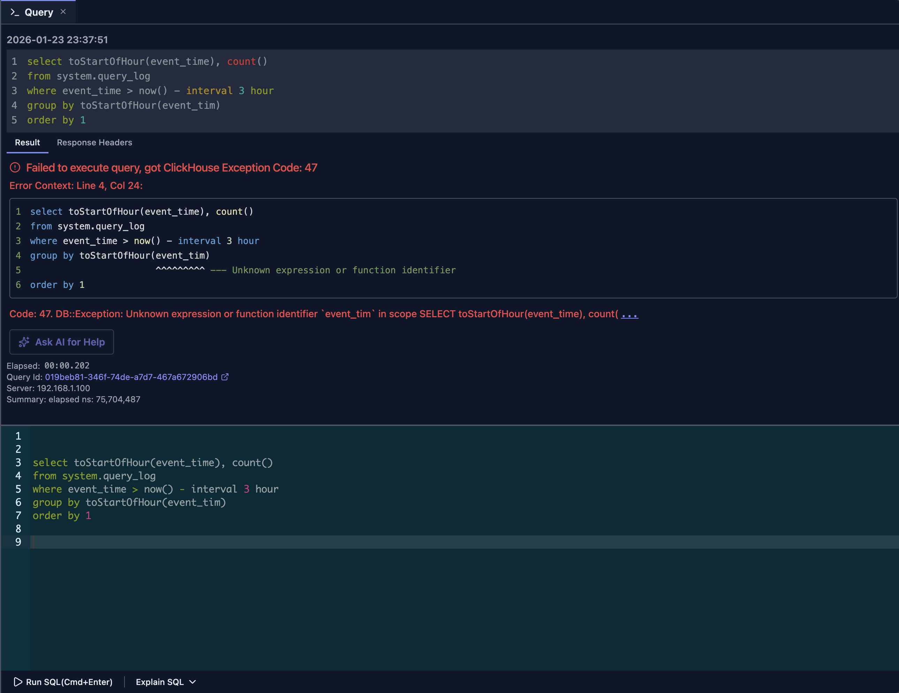

# 错误诊断

DataStoria 提供内置的错误诊断，帮助你快速识别和解决 SQL 查询错误。除了显示 ClickHouse 原始错误信息之外，它还能高亮 SQL 中的确切错误位置，并且（可选）让你向 AI 求助。

## 概览

当查询失败时，DataStoria 的错误诊断系统提供：

- **详细的错误信息**：ClickHouse 原始错误信息（错误码、消息和上下文）
- **错误位置高亮**：带行/列上下文的行内指针，精确定位出错的部分
- **AI 驱动的修复建议**：当错误不明显时，提供“Ask AI for Fix”的快捷入口

## 错误位置高亮

ClickHouse 的错误信息可能冗长且难以处理——对于较长查询中的语法错误和标识符错误尤其如此。为此，DataStoria 会解析常见的 ClickHouse 错误模式，并在你的 SQL 中直接渲染**行内错误指针**，让你立即看到需要修复的地方。

下面是一个示例：



相比只显示一条如下所示的冗长错误信息：

```text
Code: 47. DB::Exception: Unknown expression or function identifier `event_tim` in scope SELECT toStartOfHour(event_time), count() FROM system.query_log WHERE event_time > (now() - toIntervalHour(3)) GROUP BY toStartOfHour(event_tim) ORDER BY 1 ASC. Maybe you meant: ['event_time']. (UNKNOWN_IDENTIFIER) (version 25.6.2.5 (official build))
```

DataStoria 会在原始查询中精确定位错误位置并以内联方式展示：

```sql
select toStartOfHour(event_time), count() 
from system.query_log
where event_time > now() - interval 3 hour
group by toStartOfHour(event_tim)
                       ^^^^^^^^^ --- Unknown expression or function identifier
order by 1
```

借助这一内联上下文，你可以立即修复 SQL，而无需通读完整的 ClickHouse 错误文本。

> 注意
>
> 错误位置高亮**不是** AI 功能，也**不会**消耗 token。
> 

### 示例

DataStoria 支持多种 ClickHouse 错误模式。以下是另外几个示例：

```sql
select toStartOfHour(event_time), count() 
from clusters('default', system.query_log)
     ^^^^^^^^ --- Unknown table function clusters.
where event_time > now() - interval 3 hour
group by toStartOfHour(event_tim)
order by 1
```

```sql
select toStartOfHour(event_time), count() 
from cluster('default', system.query_log)
              ^^^^^^^ --- Requested cluster 'default' not found
where event_time > now() - interval 3 hour
group by toStartOfHour(event_tim)
order by 1
```

```sql
select toStartOfHou(event_time), count()
       ^^^^^^^^^^^^ --- Function with name `toStartOfHou` does not exist
from system.query_log
where event_time > now() - interval 3 hour
group by toStartOfHour(event_tim)
```

```sql
select toStartOfHour(event_time), count()
from system.query_log
where event_time > now() - 3 hour
                             ^ --- Syntax error
group by toStartOfHour(event_tim)
order by 1
```

## AI 驱动的修复建议

对于需要更多上下文的错误（权限、集群配置、函数用法、与性能相关的设置等），你可以使用集成的 AI 功能 **Ask AI for Fix**。

> **了解更多**：参见 [Ask AI for Help](../02-ai-features/ask-ai-for-help.md)，详细了解 AI 驱动的错误辅助以及如何一键获得即时修复。


## 限制

- **基于启发式**：错误位置高亮基于模式分析。在某些情况下它可能指向错误的位置。如果发生这种情况，请提交一个[脱敏后的 issue](https://github.com/CCweixiao/datastoria-server/issues)，其中不要包含凭据或生产行数据。


## 后续步骤

- **[查询执行](./query-execution.md)** —— 学习如何执行查询并处理结果
- **[SQL 编辑器](./sql-editor.md)** —— 精通 SQL 编辑器的各项功能
- **[查询优化](../02-ai-features/query-optimization.md)** —— 优化查询以获得更好的性能
