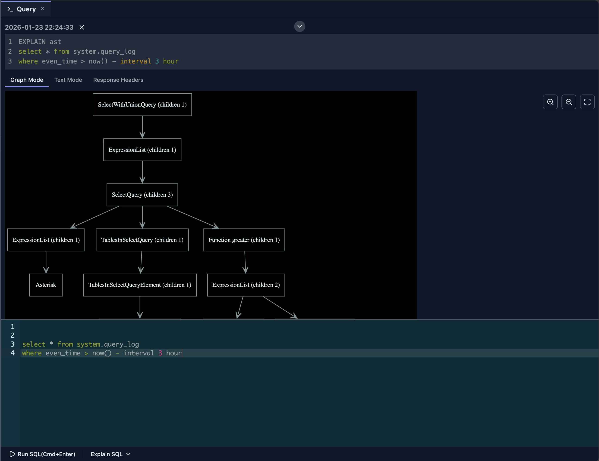
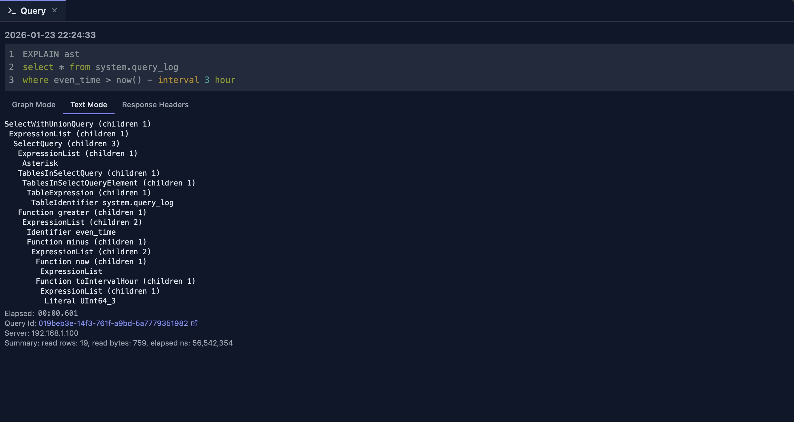
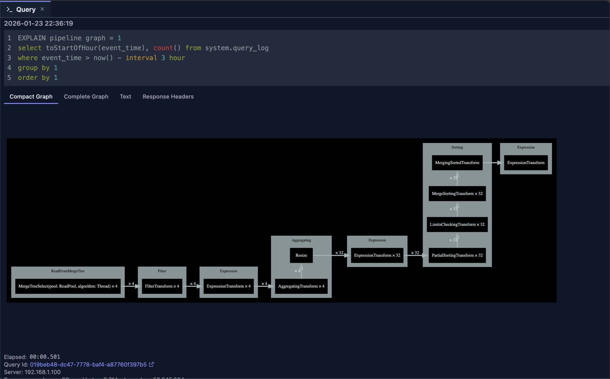
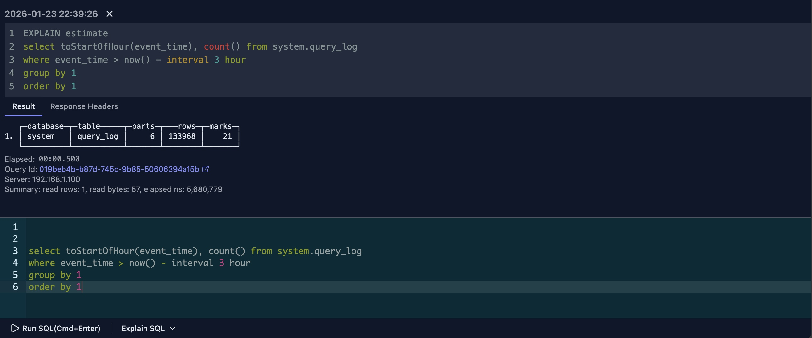

# Query Explain

Query Explain 功能通过提供详细的执行计划、Pipeline 可视化以及抽象语法树（AST）表示，帮助你理解 ClickHouse 如何执行你的查询。这些洞察对于优化查询性能和调试执行问题至关重要。

## 概览

Query Explain 提供多种方式来理解查询执行：

- **EXPLAIN SYNTAX**：显示语法检查的结果
- **EXPLAIN PLAN**：显示统一的执行计划，包含图、树、索引和动作细节
- **EXPLAIN PIPELINE**：将执行 pipeline 可视化
- **EXPLAIN AST**：显示抽象语法树
- **EXPLAIN ESTIMATE**：提供将要读取数据的简化统计信息

该功能集成了图形化视图，帮助你更直观地理解结果。

## 使用方法

### 解释编辑器中的全部文本

如果编辑器中只包含一条 SQL 语句：

1. 点击命令栏中的 **'Explain SQL'** 按钮
2. 从下拉菜单中选择你要执行的 EXPLAIN 功能
3. 点击所选选项运行解释

系统会自动为你的查询添加适当的 `EXPLAIN` 语句，因此你无需手动输入。

### 解释部分 SQL 文本

只解释查询的一部分：

1. 在编辑器中选中你想要解释的文本
2. 点击命令栏中的 **'Explain SQL'** 按钮
3. 从下拉菜单中选择 EXPLAIN 功能
4. 点击执行

选中的部分将被独立于查询其余部分进行解释。

> **注意**：你无需手动在 SQL 语句中添加 `EXPLAIN xxxx`。编辑器会自动处理。

## EXPLAIN AST



`EXPLAIN AST` 主要是面向数据库开发者的工具，显示解析后 SQL 查询的抽象语法树（AST）格式。默认情况下，DataStoria 提供 AST 的图形化树视图，让查询结构更易于理解。

如果你愿意，可以切换到 **'Text Mode'**（文本模式）查看传统的基于文本的 AST 输出。



### 使用场景

- **语法校验**：验证查询是否被正确解析
- **查询结构分析**：理解 ClickHouse 如何解释你的查询
- **调试**：定位解析问题或意外的查询变换
- **学习**：研究 SQL 语句的内部结构

## EXPLAIN SYNTAX

`EXPLAIN SYNTAX` 是另一个主要供数据库开发者使用的工具。它显示语法检查的结果，展示 ClickHouse 如何解释并规范化你的 SQL 查询。

该功能适用于：
- **语法规范化**：查看 ClickHouse 如何规范化你的查询语法
- **查询变换**：理解你的查询在内部如何被变换
- **语法校验**：验证查询语法是否正确

更详细的信息，请参阅 [ClickHouse 官方文档](https://clickhouse.com/docs/en/sql-reference/statements/explain#explain-syntax)中关于该功能的部分。

## EXPLAIN PLAN

`EXPLAIN PLAN` 功能会向 ClickHouse 发送以下语句：

```sql
EXPLAIN PLAN json=1, indexes=1, actions=1
```

这一统一的计划响应合并了原先分散在独立 indexes 视图和 actions 视图中的信息。它可以帮助你分析：

- **主键与索引**：主键及其他索引如何影响 part 与 granule 的选择
- **读取范围**：ClickHouse 将读取多少 part 和 granule
- **执行流程**：ClickHouse 将执行的逻辑算子，从读取到聚合、投影、排序等
- **表达式细节**：表达式节点使用的输入、输出、别名与动作步骤
- **聚合细节**：键、聚合函数与合并行为
- **原始计划数据**：用于调试和售后支持的确切 JSON 计划

这是掌握查询优化、编写高效 SQL 语句的强大工具。

### 计划视图

统一渲染器提供三种互补的方式来检查同一个计划：

- **Graph**：一个 React Flow 图，展示算子树、扫描指标与索引摘要
- **Text**：结构化树视图，便于自上而下阅读计划，同时保留相同的节点级细节
- **Raw JSON**：原始 `EXPLAIN PLAN` 负载的格式化 JSON 视图

点击图视图或文本视图中的任何节点，可打开包含以下内容的详情面板：

- **概览**：节点类型、描述、键与来源信息
- **读取统计**：part、granule、读取类型，以及选中数与初始数的对比
- **索引**：索引类型、条件、选中的 part 与选中的 granule
- **表达式**：输入、输出、位置与动作
- **聚合**：聚合名称、函数、参数与合并标志

### 关键洞察

- **索引使用**：验证索引是否被有效利用
- **分区裁剪**：检查是否跳过了不必要的分区
- **优化机会**：识别可以通过索引提升性能的地方
- **执行流程**：理解 ClickHouse 如何从存储读取一直到最终投影逐步变换查询

更多信息，请参阅 [ClickHouse 官方文档](https://clickhouse.com/docs/en/sql-reference/statements/explain#explain-plan)中关于该语句的部分。

## EXPLAIN PIPELINE

`EXPLAIN PIPELINE` 以可视化 pipeline 图的形式展示执行计划。该工具帮助你理解：

- **Pipeline 连接**：不同处理阶段之间如何衔接
- **并行度**：哪些步骤可以并行运行
- **数据流**：数据如何流经执行 pipeline
- **处理阶段**：应用于数据的变换序列



### 可视化的好处

图形化表示让你更容易：

- **定位瓶颈**：发现可能拖慢执行的阶段
- **理解并行度**：查看哪些操作可以并发运行
- **优化查询**：为查询结构做出有依据的决策

## EXPLAIN ESTIMATE

`EXPLAIN ESTIMATE` 可以看作 `EXPLAIN PLAN` 的简化视图。它提供查询将要读取内容的简要摘要：

- **Data Parts**：将要读取的数据 part 数量
- **Rows**：预计要处理的行数
- **Marks**：将要读取的 mark（索引条目）数量

> **性能提示**：通常这些值越小，查询性能越好。



### 何时使用

这一简化视图适用于：

- **快速评估**：快速了解查询复杂度
- **对比**：一眼比较不同的查询方案
- **学习**：无需详细分析即可了解查询的资源需求

### 局限

由于它不提供完整的算子树、节点级动作或详细的索引分解，其结果有时不如完整的 `EXPLAIN PLAN` 输出有洞察力。可将其作为快速参考，但全面分析请查看详细计划。

## 最佳实践

### 定期分析

1. **先解释再优化**：优化前务必对查询进行解释（尤其是 `EXPLAIN PLAN`）
2. **对比计划**：比较变更前后的计划
3. **跟踪变化**：关注计划变化对性能的影响
4. **记录模式**：将常见的计划模式文档化

### 优化工作流

1. **运行 EXPLAIN**：从 EXPLAIN PLAN 或 PIPELINE 开始
2. **定位问题**：查找全表扫描、缺失索引等
3. **进行修改**：修改查询或添加索引
4. **重新解释**：在计划中验证改进效果
5. **测试性能**：测量实际的性能提升

### 理解输出

1. **自上而下阅读**：执行流自上而下
2. **关注扫描**：全表扫描往往是瓶颈
3. **检查索引使用**：验证索引是否被使用
4. **审视 Join**：确保采用高效的 join 策略

## 限制

- **估算值**：计划展示的是估算值，而非实际执行
- **复杂度**：非常复杂的查询可能有复杂的计划
- **版本差异**：计划格式可能因 ClickHouse 版本而异
- **实时性**：计划在解释时生成，而非执行时
- **可视化入口**：`EXPLAIN AST` 和 `EXPLAIN PIPELINE` 的图形化可视化仅能通过命令栏的 **'Explain SQL'** 下拉菜单访问。直接以 SQL 执行这些命令只会显示文本输出。

## 后续步骤

- **[查询优化](../02-ai-features/query-optimization.md)** —— 使用 AI 优化你的查询
- **[Query Log Inspector](./query-log-inspector.md)** —— 分析实际查询性能
