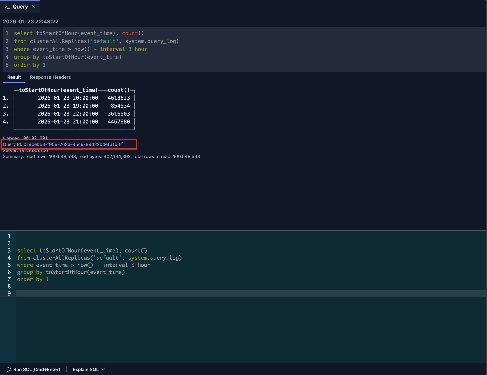
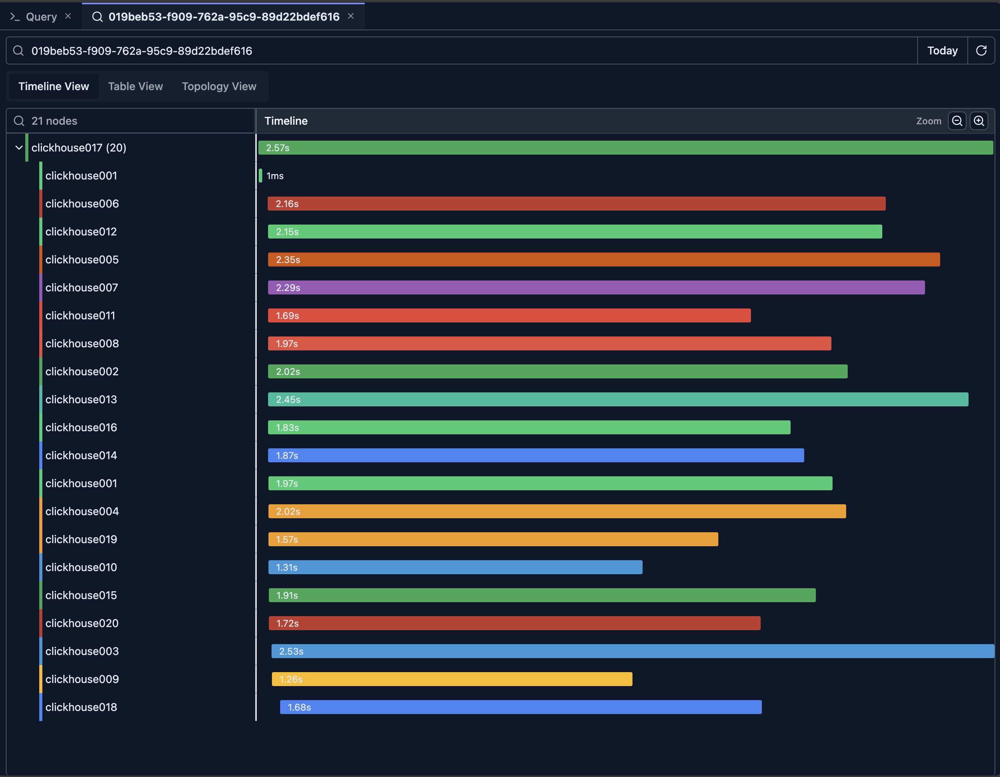
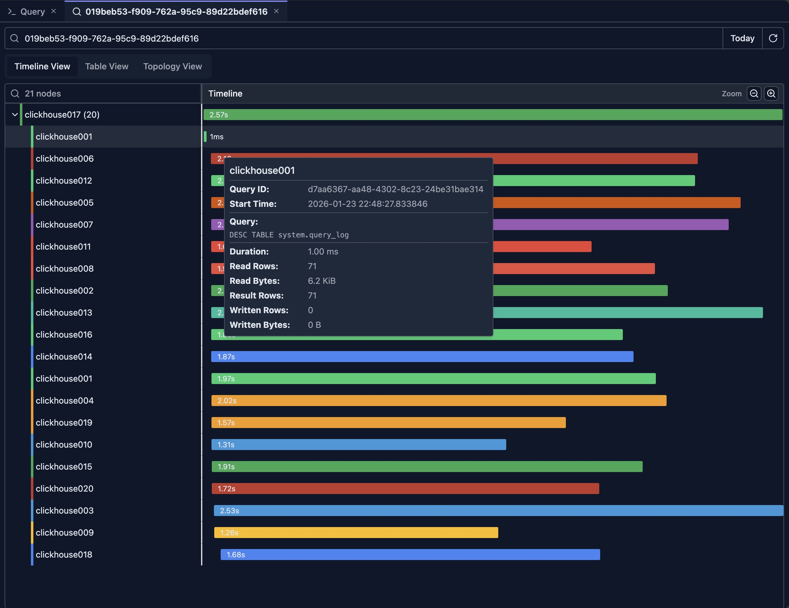
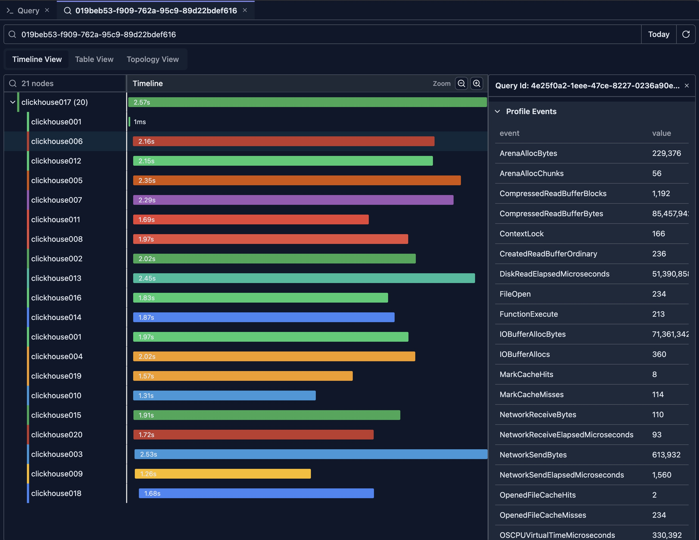
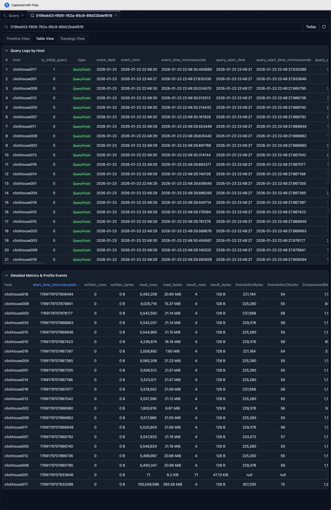
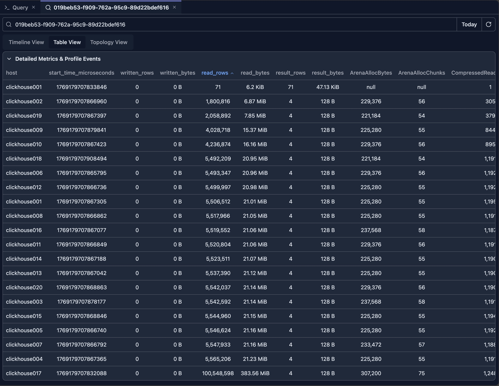
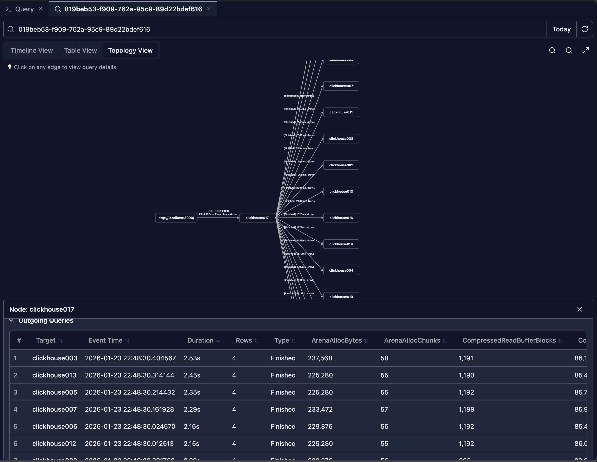

# Query Log Inspector

Query Log Inspector 是分析查询性能、理解查询执行模式以及调试 ClickHouse 集群问题的最强大工具之一。

它提供多种可视化模式，包括时间线视图、拓扑图和详细的表格视图，帮助你深入洞察查询工作负载。

## 概览

Query Log Inspector 允许你：

- **搜索查询**：按 Query ID 查找特定查询
- **时间线可视化**：随时间查看查询执行情况
- **拓扑图**：将查询关系与依赖可视化
- **性能分析**：分析查询性能指标
- **执行指标**：理解资源使用与执行细节
- **时间范围过滤**：按时间段过滤查询

## 前置条件

使用 Query Log Inspector 需要：

- **系统表访问权限**：对 `system.query_log` 表的读取权限
- **已启用查询日志**：你的 ClickHouse 服务器上应启用 `log_queries` 设置
- **相应权限**：你的用户必须拥有查询系统表的权限

> **注意**：如果你没有系统表访问权限，请联系管理员。

该检查器主要面向 ClickHouse 集群模式设计。对于单副本的 ClickHouse 实例，你仍可以将其作为一个更好的查询日志指标可视化工具来使用，但从 Timeline 或 Topology 视图中获得的收益有限。

## 从查询页签访问 Query Log Inspector

查询在查询页签中执行完成后，会在响应下方把 Query ID 显示为可点击的链接。

只需点击 Query ID 链接，即可为该查询打开检查器。

## 时间线视图

检查器打开后，会从集群中的所有节点加载给定 Query ID 的查询日志，并默认显示时间线视图。

上图展示了一条在 20 节点 ClickHouse 集群上执行的查询的结果。

### 理解时间线

时间线视图将查询执行展示为一条水平时间线，内容包括：

- **查询时长**：条形长度代表执行时间
- **时间轴**：水平轴表示时间顺序
- **查询关系**：父子查询关系
- **并发查询**：同时运行的查询，按查询日志事件时间从早到晚排序

### 时间线功能

#### 缩放与导航

- **放大**：点击放大按钮或使用鼠标滚轮
- **缩小**：点击缩小按钮
- **平移**：拖动以移动时间线视图
- **重置视图**：恢复默认缩放级别

#### 查询详情

- **悬停**：将鼠标悬停在查询条上可查看快速概要

    例如，视图中有一条在 clickhouse001 节点上执行的查询，仅耗时 1ms。你可以把鼠标移到上面，快速查看执行的是什么查询。

    

- **点击**：点击查询可在详情面板中查看完整详情

    详情面板显示在时间线视图的右侧。它展示所选条目的完整查询日志，包括扁平化的 ProfileEvents，其中包含该查询的全部指标。

    

### 读懂时间线

#### 查询条

- **长度**：代表执行时长
- **颜色**：指示不同的节点
- **位置**：显示查询开始的时间

#### 父子关系

- **嵌套条**：子查询嵌套显示在父查询之下
- **缩进**：视觉层级展示查询关系
- **分布式查询**：展示跨集群节点的查询

一般而言，对于分布式查询，树中的根节点代表从客户端发出的初始查询。树中的子节点是从初始节点发往集群中其他节点的子查询。

#### 并发执行

- **重叠的条**：同时运行的查询
- **资源使用**：识别查询负载较高的时段
- **瓶颈**：发现大量查询排队的时间点

## 表格视图

时间线视图全面展示了查询在集群中的执行方式：哪些节点参与了执行、哪些节点耗时最长。

然而，它并未提供一种简单的方式来跨节点比较查询指标。表格视图通过以可排序的表格形式呈现指标，解决了这一问题。

### 详细查询列表

表格视图提供包含以下内容的完整查询列表：

- **Query ID**：每个查询的唯一标识
- **时间戳**：查询执行的时间
- **时长**：以毫秒计的执行时间
- **状态**：成功、错误或已取消
- **用户**：执行该查询的用户
- **查询文本**：SQL 查询文本
- **指标**：性能指标（读取行数、读取字节数等）

**Detailed Metrics & Profile Events** 表是跨节点比较指标时最具洞察力的视图。你可以点击表头，将指标按降序或升序排序。

例如，点击 'read_rows' 列，可以看到 clickhouse002 节点读取的行数最少（注意：第一行执行的是一个 DESC 子查询，其查询模式不同，分析时应排除在外）。

在多副本的 ClickHouse 集群中，这可能表明数据分布不均匀。基于这一观察，你可以进一步排查确认。

## 拓扑视图

### 理解拓扑

拓扑视图以图的形式展示查询执行，内容包括：

- **查询节点**：每个查询作为图中的一个节点
- **关系**：连接相关查询的边
- **执行流向**：查询执行的方向
- **集群拓扑**：跨节点的分布式查询执行

### 拓扑功能

#### 图导航

- **缩放**：在图上放大/缩小
- **平移**：拖动以在图中移动
- **节点选择**：点击节点查看详情
- **布局**：自动布局并支持手动调整

#### 节点信息

- **查询详情**：点击节点查看完整查询信息
- **节点颜色**：颜色编码指示集群中的不同节点
- **节点大小**：可能代表查询时长或重要程度
- **标签**：Query ID 或其他标识符

#### 关系可视化

- **边**：连接相关查询的线
- **边方向**：箭头指示执行流向
- **边标签**：可能显示关系类型
- **高亮**：选中时高亮相关查询

### 拓扑视图的使用场景

- **理解查询依赖**：查看查询之间如何关联
- **分布式查询分析**：将跨集群节点的查询可视化
- **查询链分析**：追踪查询执行链
- **瓶颈识别**：找出阻塞其他查询的查询

## 性能分析

### 关键指标

Query Log Inspector 跟踪重要的性能指标：

#### 执行指标

- **时长**：总执行时间
- **读取行数**：从表中读取的行数
- **读取字节数**：读取的数据量
- **写入行数**：写入的行数（针对 INSERT 查询）
- **写入字节数**：写入的数据量
- **结果行数**：（子）查询返回的行数
- **结果字节数**：（子）查询返回的数据量
- **内存使用**：峰值内存消耗
- **CPU 时间**：使用的 CPU 时间

#### 资源使用

- **峰值内存**：执行期间使用的最大内存
- **线程数**：使用的线程数量
- **读操作**：执行的 I/O 操作
- **网络流量**：通过网络传输的数据（针对分布式查询）

### 性能洞察

#### 识别慢查询

- **按时长排序**：按 duration 排序找出最慢的查询
- **阈值告警**：识别超出时间阈值的查询
- **模式分析**：找出一直运行缓慢的查询

#### 资源分析

- **内存密集型**：找出使用过多内存的查询
- **I/O 密集型**：识别读写操作频繁的查询
- **CPU 密集型**：发现 CPU 消耗大的查询

#### 优化机会

- **高频查询**：识别运行频繁的查询
- **高开销查询**：找出资源消耗大的查询
- **优化候选**：能够从优化中受益的查询

## 最佳实践

### 定期监控

1. **每日检查**：定期查看查询日志以发现问题
2. **性能趋势**：持续关注性能随时间的变化
3. **异常检测**：寻找不寻常的模式
4. **容量规划**：利用指标进行容量规划

### 查询优化

1. **识别慢查询**：使用时长排序
2. **分析模式**：寻找经常变慢的查询
3. **对比指标**：比较优化前后的指标
4. **跟踪改进**：监控优化结果

### 故障排查

1. **错误分析**：定期审查失败的查询
2. **性能问题**：排查慢查询
3. **资源问题**：识别资源消耗大的查询
4. **用户活动**：监控用户的查询模式

## 限制

- **查询日志保留期**：取决于 ClickHouse 服务器配置
- **性能影响**：查询大规模查询日志可能较慢

## 后续步骤

- **[Query Explain](./query-explain.md)** —— 理解查询执行计划
- **[查询优化](../02-ai-features/query-optimization.md)** —— 使用 AI 优化你的查询

