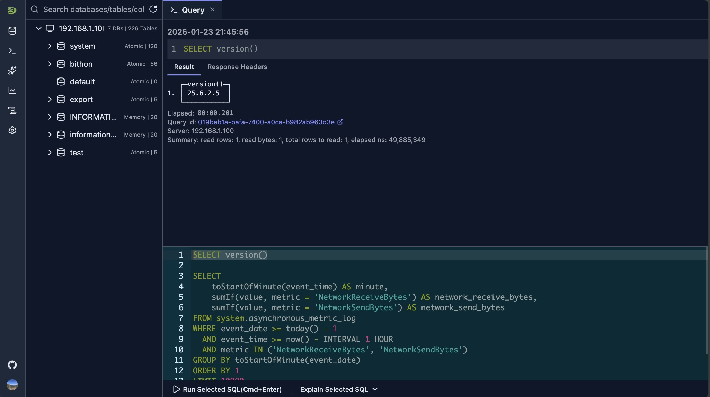
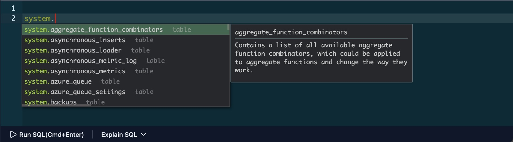
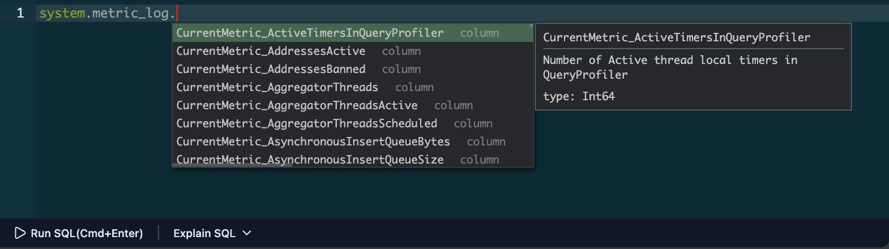
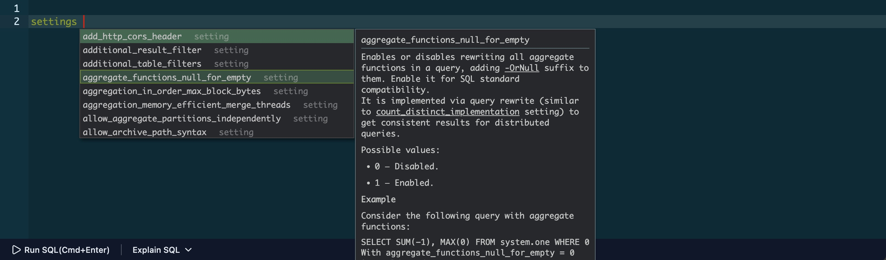
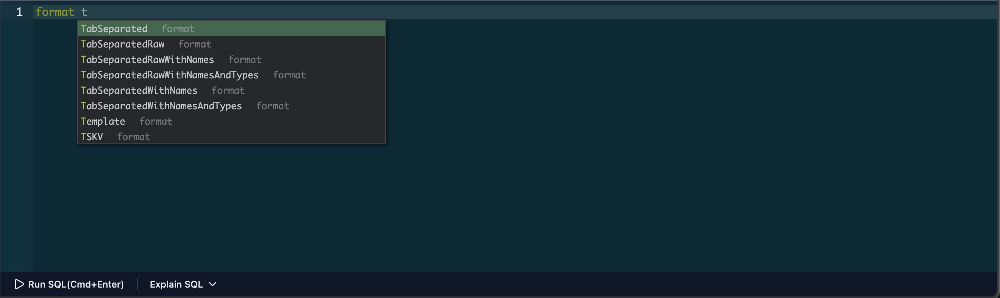
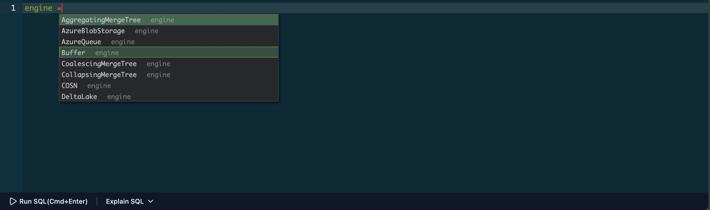
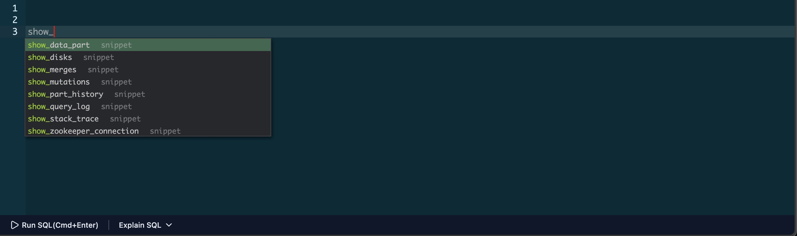

# SQL 编辑器

DataStoria 的 SQL 编辑器为编写和编辑 ClickHouse 查询提供了一个强大且功能丰富的环境。它基于 Ace Editor 框架构建，提供语法高亮、智能自动补全和便捷的快捷键，提升你的工作效率。

## 概览

SQL 编辑器是在 DataStoria 中编写和执行查询的主要界面。它提供：

- **语法高亮**：带颜色编码的 SQL 语法，提升可读性
- **自动补全**：针对表、列、SQL 关键字、设置（settings）、格式（formats）与引擎（engines）的智能建议
- **快捷键**：快速执行常用操作
- **查询片段（Query Snippets）**：可复用的常用操作代码模板
- **本地存储**：自动保存你的工作内容

## 布局

SQL 编辑器显示在 Schema 树的右侧。它采用类终端的界面：你在查询页签的下半部分输入 SQL 查询。查询请求与响应显示在编辑器区域上方，并且随着新结果的到来，响应区域会自动滚动。

## 语法高亮

编辑器会自动以颜色编码方式高亮 SQL 语法：

- **关键字**：SQL 保留字（SELECT、FROM、WHERE 等）
- **字符串**：单引号或双引号中的文本字面量
- **数字**：数值
- **注释**：单行（`--`）与多行（`/* */`）注释
- **函数**：ClickHouse 内置函数

编辑器会适配你的主题偏好（浅色或深色模式），以获得最佳可视效果。

## 自动补全

在你输入时，编辑器会提供智能自动补全建议：

### SQL 关键字补全

编辑器识别 ClickHouse SQL 语法，并建议：

- SQL 关键字（SELECT、INSERT、CREATE 等）
- ClickHouse 特有函数
- 数据类型
- 查询修饰符

### 表和列建议

当你输入表名或引用某个数据库时，编辑器会建议：

- 当前数据库中可用的表
  

- 当前表的列
  

### ClickHouse 设置（Settings）建议

当你输入 `SETTINGS`、`SET` 或 `settings`（不区分大小写）时，编辑器会自动建议所有可用的 ClickHouse 设置，并附带其当前值和描述。

### ClickHouse 输入/输出格式建议

当你输入 `FORMAT` 或 `format`（不区分大小写）时，编辑器会建议你的 ClickHouse 实例支持的所有输入和输出格式。

### ClickHouse 表引擎

当你在 `ENGINE` 关键字后输入 `=` 时，编辑器会建议你的 ClickHouse 实例支持的所有表引擎。

### ON CLUSTER

如果你的连接配置为集群模式，在你输入时，编辑器会建议 `ON CLUSTER {your_cluster_name}` 以及你的集群名称，让编写集群级操作更加轻松。

### 触发自动补全

- **自动**：输入时即会出现建议
- **手动**：按 `Alt + Space`（Windows/Linux）或 `Option + Space`（Mac）触发建议
- **导航**：使用方向键浏览建议，使用 Enter/Tab 选中

## 快捷键

### 查询执行

- **执行查询**：`Ctrl + Enter`（Windows/Linux）或 `Command + Enter`（Mac）
  - 执行当前查询或选中的文本
  - 如果选中了文本，则只执行选中的部分

> **另请参阅**：[错误诊断](./error-diagnostics.md)获取语法错误方面的帮助；[Query Explain](./query-explain.md)了解查询性能。

## 查询片段

编辑器内置了针对常用操作的查询片段，并支持自定义片段：

### 使用片段

1. 输入片段名称，在自动补全中触发片段建议
2. 从建议中选择一个片段
3. 按 `Tab` 或 `Enter` 插入片段
4. 按需修改插入的 SQL

> **了解更多**：参见 [SQL 片段](./sql-snippets.md)指南，详细了解如何高效地创建、管理和使用片段。

## 本地存储

编辑器会自动保存你的工作内容：

- **自动保存**：查询会随你的输入自动保存
- **持久化**：保存的查询在浏览器会话之间持久保留

## 技巧与窍门

### 选择并执行部分查询

- **选择文本**：高亮你想要测试的那部分查询
- **执行选中内容**：按 `Ctrl + Enter`（Windows/Linux）或 `Command + Enter`（Mac），仅执行选中的部分
- **适用场景**：非常适合测试复杂查询的各个部分，而无需运行整个查询

### 多行编辑

- **创建多个光标**：使用 `Alt + Click`（Windows/Linux）或 `Option + Click`（Mac）放置多个光标
- **同时编辑**：一次性编辑多行
- **批量修改**：非常适合重命名变量、添加前缀，或在多行上做一致的修改

### 快速导航

- **跳转到某行**：按 `Ctrl + G`（Windows/Linux）或 `Command + G`（Mac）跳转到指定行号
- **查找文本**：按 `Ctrl + F`（Windows/Linux）或 `Command + F`（Mac）在查询内搜索
- **查找和替换**：按 `Ctrl + H`（Windows/Linux）或 `Command + H`（Mac）查找并替换文本

### 高效使用自动补全

- **使用 Tab 补全**：输入几个字符后，按 `Tab` 接受第一个建议
- **浏览建议**：当存在多个选项时，使用方向键浏览建议
- **上下文感知**：建议会根据你当前的输入上下文（表名、列名等）自适应调整

### 查询组织

- **多个页签**：打开多个查询页签，同时处理不同的查询
- **自动保存**：查询会自动保存，因此不会丢失工作内容
- **清理工作区**：从结果面板中删除已完成的查询，保持工作区整洁

## 限制

- 非常大的查询（10,000 行以上）可能出现性能下降
- 自动补全建议依赖于 schema 元数据的可用性
- 部分高级编辑器功能可能并非在所有浏览器中都可用

## 后续步骤

- **[SQL 片段](./sql-snippets.md)** —— 创建和管理可复用的 SQL 查询模板
- **[查询执行](./query-execution.md)** —— 了解如何执行查询并查看结果
- **[错误诊断](./error-diagnostics.md)** —— 了解如何诊断和修复查询错误
- **[自然语言 SQL](../02-ai-features/natural-language-sql.md)** —— 使用 AI 从自然语言生成查询

