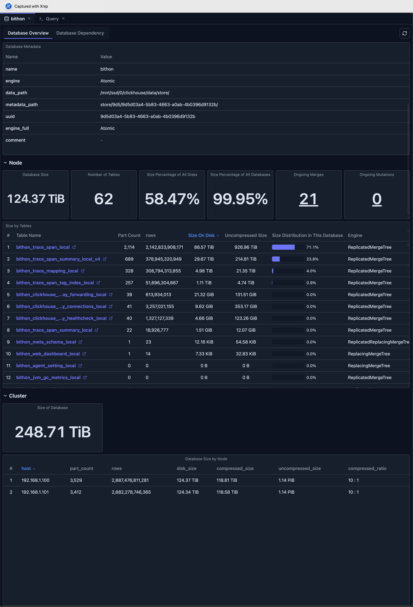

# 数据库视图（Database View）

数据库视图提供 ClickHouse 数据库的全面概览，包括统计信息、表信息和依赖可视化。它是理解数据库结构、性能与健康度的中心枢纽，助力高效的数据库监控与管理。

## 概览

数据库视图将多个视角整合到统一界面中：

- **数据库概览标签页（Database Overview）**：统计信息、指标和表信息
- **数据库依赖标签页（Database Dependency）**：数据库内表依赖关系的可视化图

## 访问数据库视图

在 ClickHouse Console 中访问数据库视图：

1. **导航到数据库**：点击 Schema Explorer 侧边栏中的数据库名
2. **打开数据库标签页**：数据库视图自动在新标签页中打开
3. **查看概览**：默认显示数据库概览标签页，展示全面的数据库统计信息和指标

## 数据库概览标签页

数据库概览标签页提供关于 ClickHouse 数据库的全面统计信息和详情，帮助你监控数据库健康度、跟踪性能指标，并一目了然地了解数据库结构。

### 数据库元数据

查看关键数据库信息：

- **数据库名**：数据库的名称
- **引擎类型**：数据库引擎（如果适用）
- **元数据**：来自 `system.databases` 的所有元数据字段

### 关键统计信息

概览展示重要指标：

#### 数据库大小

- **总大小**：数据库中所有表的总大小
- **磁盘大小**：实际占用的磁盘空间
- **未压缩大小**：压缩前的大小
- **大小占比**：占用总磁盘空间的百分比

#### 表信息

- **表数量**：数据库中表的总数
- **表列表**：详细的表信息，包括：
  - 表名
  - 引擎类型
  - 行数
  - 磁盘大小
  - 未压缩大小
  - 大小分布占比
  - Part 数量
  - 元数据修改时间
  - 数据修改时间

#### 大小分布

- **占所有磁盘的大小比例**：该数据库使用了多少总磁盘空间
- **占所有数据库的大小比例**：该数据库与其他数据库的对比
- **表大小分布**：按表可视化拆解大小

### 进行中的操作

监控活跃的数据库操作：

#### 进行中的 Merge

- **Merge 数量**：活跃 Merge 操作的数量
- **Merge 详情**：点击查看详细的 Merge 信息：
  - 表名
  - 结果 Part 名称
  - 正在被合并的 Part 数量
  - 已耗时间
  - 进度百分比
  - 内存使用
  - 读/写字节数
  - 读/写行数

#### 进行中的 Mutation

- **Mutation 数量**：活跃 Mutation 操作的数量
- **Mutation 详情**：点击查看详细的 Mutation 信息：
  - 数据库和表
  - Mutation ID
  - 正在执行的命令
  - 剩余 Part
  - 失败信息（如果有）

### 表大小分析

查看详细的表大小信息：

- **可排序表格**：按大小、行数或修改时间排序
- **快速访问**：点击表名打开表详情
- **大小可视化**：通过百分比条查看大小分布
- **引擎信息**：查看表引擎类型
- **修改时间**：跟踪元数据和数据的最近修改时间

### 集群模式功能

连接到集群时，可以使用更多指标：

#### 集群级统计

- **聚合数据库大小**：所有节点上的总大小
- **节点拆解**：按节点的大小分布
- **压缩比**：各节点的压缩统计
- **Part 数量**：Part 在集群中的分布

#### 节点对比

对比各集群节点的数据库大小和统计信息：

- **主机名**：集群中的每个节点
- **Part 数量**：每个节点的 Part 数量
- **行数**：每个节点的总行数
- **磁盘大小**：每个节点的磁盘大小
- **压缩/未压缩大小**：存储指标
- **压缩比**：压缩效率

## 数据库依赖标签页

数据库依赖标签页以可视化图的形式展示数据库内所有表的依赖关系。它是理解表之间关系、跟踪数据血缘，以及识别物化视图和其他数据库对象依赖的强大工具。

### 功能

- **完整依赖图**：所有表及其关系，包括：
    - Distributed 表及其本地表
    - 物化视图（Materialized View）的源与目标
    - Dictionary
    - MySQL 表引擎与 MySQL 服务器
    - Kafka 表与 Kafka 服务器
- **交互式导航**：点击节点查看表详情
- **上游/下游视图**：查看依赖方向
- **表详情面板**：查看表 DDL 语句和元数据

关于依赖视图的详细信息，参见[依赖视图](./dependency-view.md)。

## 限制

使用数据库视图时，请注意以下限制：

- **系统表访问**：需要对 ClickHouse 系统表（`system.databases`、`system.tables`、`system.parts` 等）的读权限
- **数据保留期**：指标取决于 ClickHouse 系统表的保留策略，可能不会显示超出保留期的历史数据
- **性能影响**：查询包含大量表的大型数据库可能较慢，尤其是在加载全面统计信息时
- **实时准确性**：部分指标基于系统表快照而非实时数据，可能有轻微延迟
- **版本兼容性**：部分功能依赖特定的系统表列和功能，在较旧的 ClickHouse 版本中可能不可用

## 最佳实践

### 定期监控

- **安排审查**：定期查看数据库统计信息
- **跟踪趋势**：随时间监控大小和操作趋势
- **设置告警**：利用指标尽早发现问题

### 性能优化

- **识别大表**：将优化重点放在大表上
- **监控操作**：跟踪 Merge 和 Mutation 性能
- **均衡资源**：利用集群指标均衡负载

### 维护规划

- **规划维护**：利用统计信息规划维护窗口
- **跟踪变更**：通过修改时间跟踪变更
- **优化存储**：利用大小信息优化存储

## 与其他功能的集成

- **Schema Explorer**：从概览导航到具体表
- **表视图（Table View）**：从表列表打开详细的表视图
- **依赖视图（Dependency View）**：通过依赖标签页访问依赖可视化
- **Cluster Dashboard**：与集群级指标对比
- **Query 编辑器**：编写查询时使用数据库信息

## 下一步

- **[依赖视图](./dependency-view.md)** —— 探索表依赖和关系
- **[表视图](./table-view.md)** —— 查看详细的表信息
- **[Cluster Dashboard](../05-monitoring-dashboards/cluster-dashboard.md)** —— 监控集群级指标
- **[Node Dashboard](../05-monitoring-dashboards/node-dashboard.md)** —— 查看单节点性能
- **[Schema Explorer](./schema-explorer.md)** —— 浏览数据库结构
