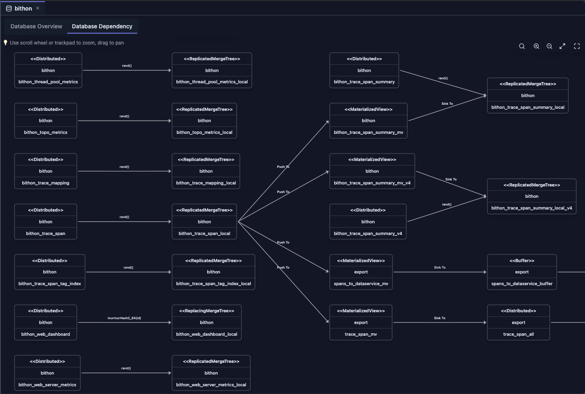

# 依赖视图（Dependency View）

依赖视图为 ClickHouse 数据库中的表依赖提供交互式图可视化。它帮助你理解表之间的关联、跟踪数据血缘，并识别物化视图、视图及其他数据库对象的依赖。

## 概览

依赖视图自动分析你的 ClickHouse 结构，构建全面的依赖图，展示：

- **表依赖**：哪些表依赖其他表
- **物化视图依赖**：物化视图与其源表之间的关系
- **视图依赖**：普通视图的依赖
- **上游依赖**：某张表所依赖的表
- **下游依赖**：依赖某张表的表
- **交互式导航**：点击节点查看详细的表信息

## 示例

以下示例展示了一个数据库依赖图的可视化。

依赖图可视化以下关系：

- **Distributed 表连接**：展示每个 Distributed 表与其对应本地表之间的关系
- **物化视图依赖**：展示物化视图的源表和目标表，说明数据流向
- **表的表示**：每个表用一个 UML 类图风格的矩形表示，便于识别
- **分片键信息**：Distributed 表与本地表之间的边标签展示分片键，让你快速判断该 Distributed 表使用随机分片还是基于特定列的分片
- **物化视图数据流**：
  - **入边**（标记为 *Push To*）：表示数据来源的源表
  - **出边**（标记为 *Sink to*）：表示处理后数据写入的目标表
- **交互式详情**：点击任意表节点会在右侧面板展示完整的 DDL（数据定义语言）语句，提供完整的表结构信息

## 访问依赖视图

在 ClickHouse Console 中可以从两个位置访问依赖视图，各自提供不同的表依赖视角：

### 从数据库标签页

1. **打开数据库标签页**：点击 Schema Explorer 中的数据库名
2. **选择依赖标签页**：点击"Database Dependency"标签页
3. **查看图**：展示数据库中所有表的依赖图，呈现数据库内完整的依赖网络

### 从表标签页

1. **打开表标签页**：点击 Schema Explorer 中的表名
2. **选择依赖标签页**：点击"Dependencies"标签页
3. **查看聚焦图**：依赖图被过滤为仅展示与所选表相关的依赖，提供聚焦的上游和下游关系视图

## 功能

### 交互式图可视化

依赖图展示：

- **节点**：表示表、物化视图和其他数据库表对象
- **边**：表示依赖关系（箭头指示方向）
- **节点分类**：不同的表类型使用不同颜色或样式
- **缩放与平移**：轻松浏览大型依赖图
- **节点高亮**：悬停或点击节点查看详情

### 上游与下游分析

查看特定表的依赖时：

- **上游依赖**：展示所选表依赖的所有表（什么在为它供给数据）
- **下游依赖**：展示依赖所选表的所有表（它在为什么供给数据）
- **完整上下文**：在单一视图中同时包含上游和下游

### 表详情面板

点击图中的任意节点可打开详细面板，展示：

- **表元数据**：数据库、表名、引擎类型
- **表查询**：CREATE TABLE 语句
- **依赖**：该表依赖的表列表
- **元数据信息**：最近修改时间和其他元数据

## 使用场景

### 理解数据血缘

- **跟踪数据流**：查看数据如何从源表流入物化视图
- **影响分析**：理解修改某张表会影响哪些对象
- **文档化**：将数据库架构可视化

### 结构重构

- **安全变更**：在修改或删除表之前识别所有依赖
- **迁移规划**：在重构结构时理解各对象之间的关系
- **风险评估**：查看结构变更的下游影响

### 性能优化

- **瓶颈识别**：找出下游依赖众多的表
- **优化目标**：识别可能受益于优化的高频使用表
- **物化视图分析**：理解物化视图的依赖以便优化

### 问题排查

- **错误调查**：查询失败时追踪依赖
- **数据质量**：针对质量问题理解数据血缘
- **调试**：调试复杂查询时可视化各对象关系

## 图导航

### 缩放控制

- **放大**：使用鼠标滚轮或缩放控件
- **缩小**：向外滚动或使用缩放控件
- **适应视图**：自动调整以展示所有节点

### 节点交互

- **点击节点**：打开详细的表信息面板
- **悬停**：高亮相连的边
- **选择**：聚焦特定表的依赖

### 面板管理

- **调整面板大小**：拖动面板边框调整尺寸
- **关闭面板**：点击关闭按钮隐藏面板
- **面板内容**：查看表元数据、查询和依赖

## 限制

使用依赖视图时，请注意以下限制：

- **系统表**：部分系统表可能无法正确展示依赖，因为它们具有特殊的结构和关系
- **Kafka 表**：Kafka 引擎表的依赖信息可能有限，因为其依赖基于外部 Kafka topic 而非数据库对象
- **外部表**：URL 及其他外部表引擎可能不展示依赖，因为它们引用外部资源而非数据库对象
- **复杂查询**：包含嵌套表达式或高级特性的非常复杂的 CREATE TABLE 查询可能无法正确解析所有依赖
- **性能**：包含大量表的大型数据库构建依赖图可能耗时，尤其是在分析复杂关系时
- **实时更新**：依赖图反映加载时的结构，结构发生变更时不会自动更新；执行结构修改后请刷新视图

## 最佳实践

### 定期更新

- **变更后刷新**：结构变更后刷新依赖视图
- **监控变更**：使用依赖视图跟踪结构演进
- **文档化**：使用依赖图进行架构文档化

### 性能考虑

- **大型数据库**：对于包含大量表的数据库，建议查看特定表的依赖
- **缓存**：依赖数据会被缓存以提升性能
- **按需查看**：使用针对特定表的依赖视图进行聚焦分析

## 与其他功能的集成

- **Schema Explorer**：从依赖图导航到表
- **表标签页**：从依赖节点查看详细的表信息
- **数据库标签页**：访问数据库级的依赖概览
- **Query 编辑器**：编写查询时使用依赖信息

## 下一步

- **[数据库视图](./database-view.md)** —— 探索数据库概览和统计信息
- **[表视图](./table-view.md)** —— 查看详细的表信息和元数据
- **[Schema Explorer](./schema-explorer.md)** —— 浏览数据库结构
- **[Cluster Dashboard](../05-monitoring-dashboards/cluster-dashboard.md)** —— 监控集群级指标
