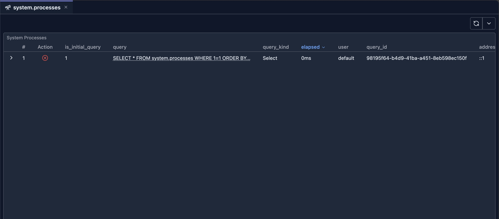

# system.processes 内省

进程内省工具提供对 ClickHouse 集群上所有正在运行查询的实时可见性。它以完整的表格展示活跃进程及每个查询的详细信息，并允许你直接从 UI 终止有问题的查询。

## 前置条件

> **注意**：使用该内省工具需要对 `system.processes` 表的读权限，以及执行 `KILL QUERY` 命令的权限。请确保你的用户具备必要的系统表权限。

## UI

进程内省工具展示一个表格，其中包含来自 `system.processes` 的所有活跃查询。每一行代表一个当前正在运行的查询及其执行状态的详细信息。

## 功能

### 实时进程监控

该工具展示 `system.processes` 表的所有列，包括：

- **查询信息**：Query ID、查询文本和查询开始时间
- **用户信息**：发起查询的用户
- **资源使用**：内存使用、读/写的行数和字节数
- **执行指标**：查询耗时、已运行时间
- **连接详情**：客户端信息、接口类型

### Kill Query 操作

每行都包含一个带"Kill"按钮的操作列，允许你终止正在运行的查询：

1. **点击 Kill 按钮**：在你想终止的查询所在行的 Action 列中点击红色的"Kill"按钮
2. **确认操作**：将弹出确认对话框，要求你确认终止操作
3. **执行查询**：确认后，系统将执行：
   - 单节点模式：`KILL QUERY WHERE query_id = 'xxx'`
   - 集群模式：`KILL QUERY WHERE query_id = 'xxx' ON CLUSTER 'cluster_name'`
4. **结果通知**：操作完成后，你将收到成功或错误的通知

### 表格功能

- **排序**：点击列头按任意列排序（默认：query_start_time 降序）
- **分页**：分页浏览结果（每页 100 行）
- **行详情**：展开行以转置视图查看完整的查询详情
- **自动刷新**：使用刷新按钮手动更新进程列表
- **紧凑模式**：以紧凑的表格布局查看更多信息

## 何时使用

### 监控长时间运行的查询

1. **识别慢查询**：按 `query_duration_ms` 排序，找出已运行很久的查询
2. **监控资源使用**：检查 `memory_usage`，识别内存消耗大的查询
3. **跟踪查询进度**：监控 `read_rows` 和 `read_bytes`，了解查询执行进度

### 管理有问题的查询

1. **终止挂起的查询**：终止看起来卡住或无响应的查询
2. **释放资源**：终止消耗过多内存或 CPU 的查询
3. **紧急终止**：快速停止引发性能问题的查询

### 集群管理

1. **查看所有节点**：在集群模式下，查看集群中所有节点的进程
2. **集群级终止**：必要时在整个集群范围内终止查询
3. **监控集群负载**：总览集群上所有活跃的查询

## 安全注意事项

- 只有具备 `KILL QUERY` 权限的用户才能终止查询
- 你只能终止你的用户有权终止的查询
- 终止操作是立即生效且无法撤销的
- 终止查询前务必确认，尤其是在生产环境中

## 下一步

- **[system.query_log 内省](./system-query-log.md)** —— 分析已完成的查询和查询历史
- **[系统日志内省](./system-log-introspection.md)** —— 所有系统日志工具概览
- **[Query Log Inspector](../03-query-experience/query-log-inspector.md)** —— 分析具体查询的执行详情
- **[system.zookeeper 内省](./system-zookeeper.md)** —— 浏览 ZooKeeper 数据
