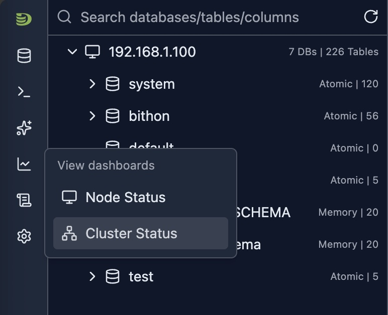
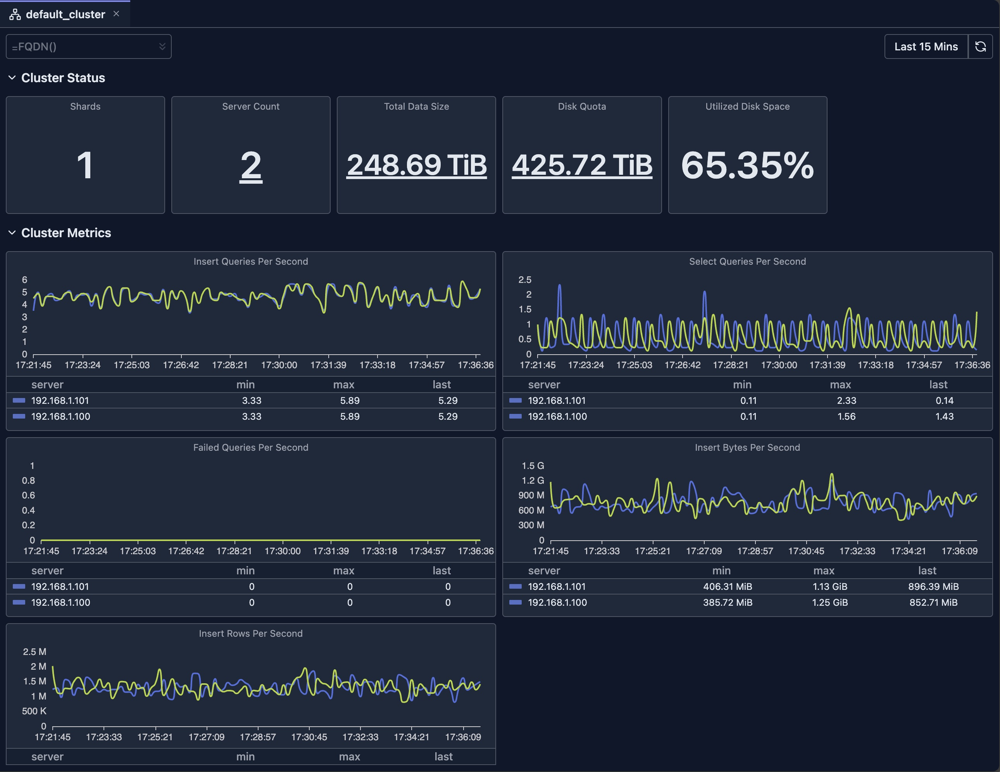

# Cluster Dashboard（集群仪表盘）

Cluster Dashboard 提供对整个 ClickHouse 集群的高层概览，展示所有节点的聚合指标。

## 概览

Cluster Dashboard 是一个无需任何配置的预置监控视图。它会自动：

- **聚合指标**：从所有节点的 ClickHouse 系统表收集数据
- **可视化性能**：以图表、仪表和表格展示指标
- **支持过滤**：允许按时间范围、主机名等维度过滤
- **提供下钻**：点击指标查看详细的拆解
- **实时更新**：自动或手动刷新以查看最新数据

## 前置条件

你的数据库连接必须配置为集群模式。

## 打开 Cluster Dashboard

1. **打开集群标签页**：点击侧边栏中的集群名称，或导航到集群视图
2. **查看 Dashboard**：集群 Dashboard 自动显示

## Cluster Dashboard 概览

## Dashboard 功能

### 时间范围选择

Dashboard 支持灵活的时间范围选择：

- **预定义范围**：最近 15 分钟、最近 1 小时、今天、本周等
- **自定义范围**：选择具体的开始和结束时间
- **自动刷新**：按间隔自动刷新数据（在支持的情况下）

### 过滤

- **主机名过滤器**：按特定节点过滤

### 图表类型

Dashboard 使用多种可视化类型：

- **Stat 卡片**：带下钻的单值指标
- **折线图**：含多条时间序列的数据
- **柱状图**：分布与对比数据
- **仪表盘**：百分比和阈值指示器
- **表格**：支持排序和分页的详细数据

### 下钻

许多指标支持下钻功能，可查看原始指标的拆解。

### 刷新与自动刷新

- **手动刷新**：点击刷新按钮更新数据
- **自动刷新**：启用自动更新（在支持的情况下）

## 限制

- **系统表访问**：需要对 ClickHouse 系统表的读权限
- **数据保留期**：指标取决于 ClickHouse 系统表的保留设置
- **可用性**：要求 ClickHouse 节点可用
- **版本兼容性**：部分指标在较旧的 ClickHouse 版本中可能不可用
- **性能影响**：查询较大的时间范围可能较慢，并消耗 ClickHouse 集群的资源

> **深入了解**：探索[系统日志内省](../04-cluster-management/system-log-introspection.md)，对系统表进行详细分析。

## 下一步

- **[Node Dashboard](./node-dashboard.md)** —— 查看单个节点的详细指标
- **[Query Log Inspector](../03-query-experience/query-log-inspector.md)** —— 分析具体查询性能
- **[Schema Explorer](../04-cluster-management/schema-explorer.md)** —— 探索数据库结构
- **[系统日志内省](../04-cluster-management/system-log-introspection.md)** —— 深入了解查询和 Part 日志
