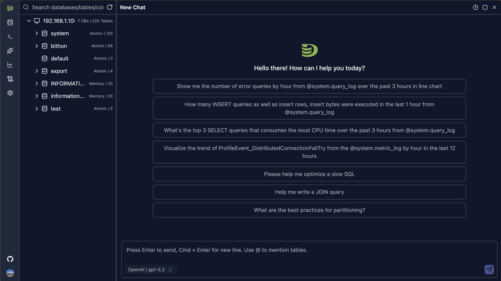
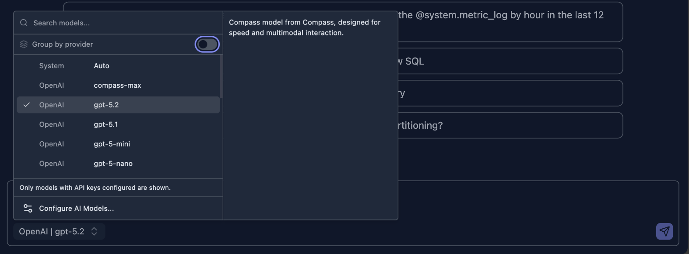
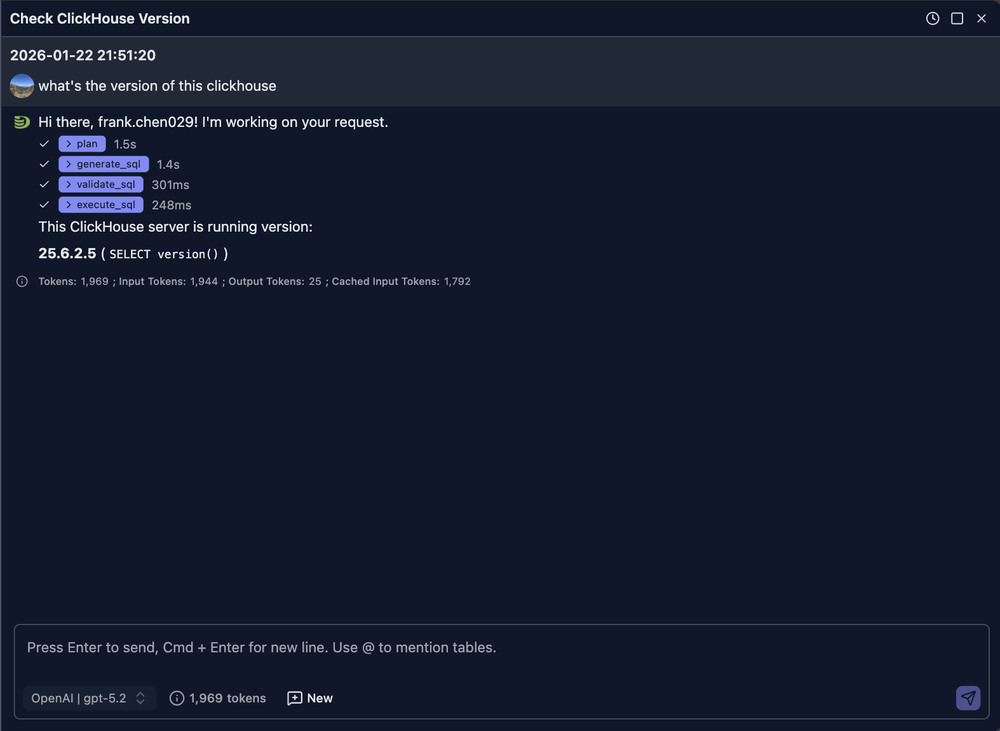
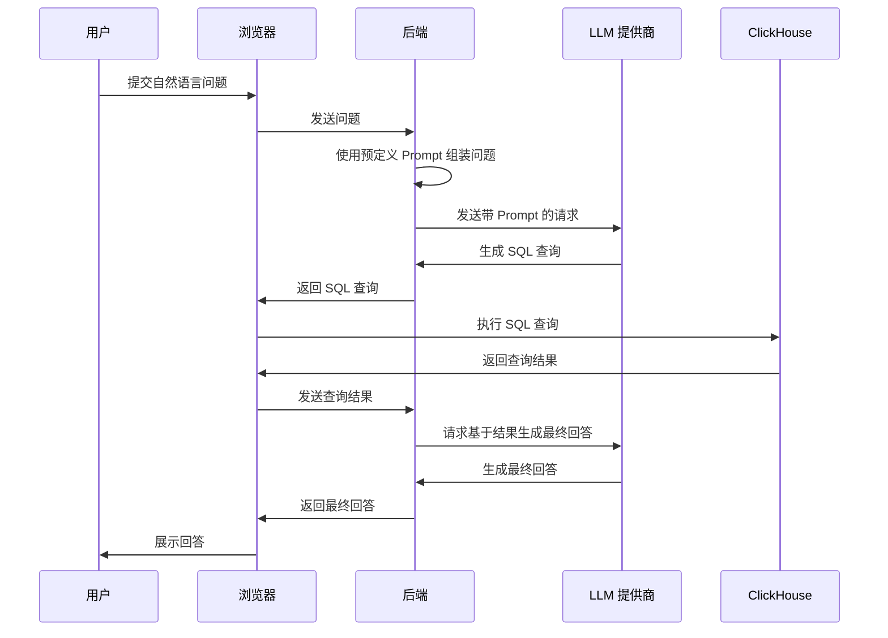
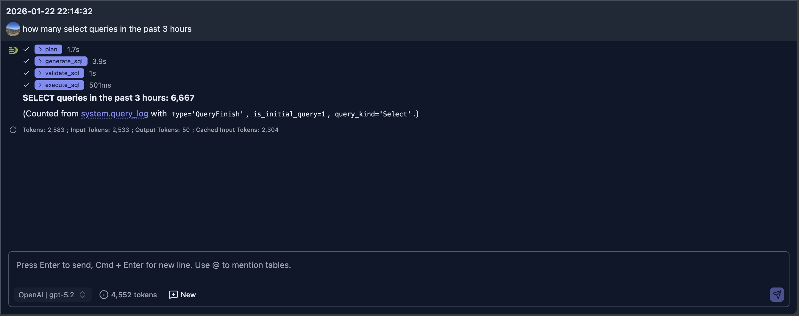
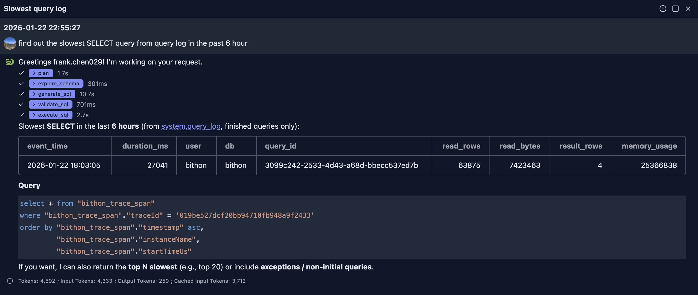
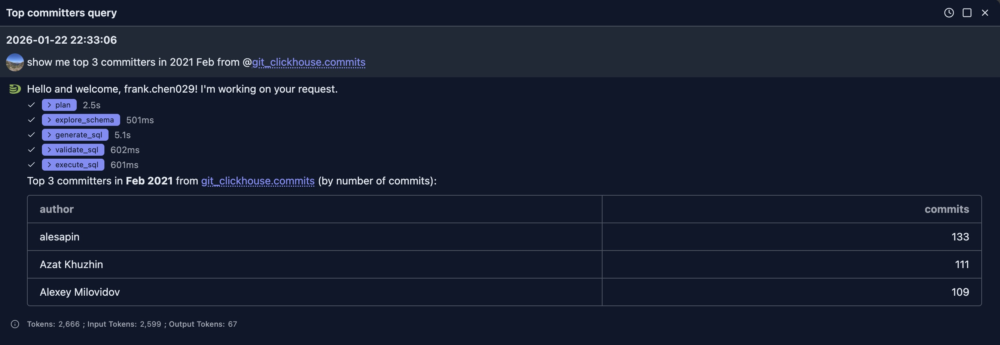
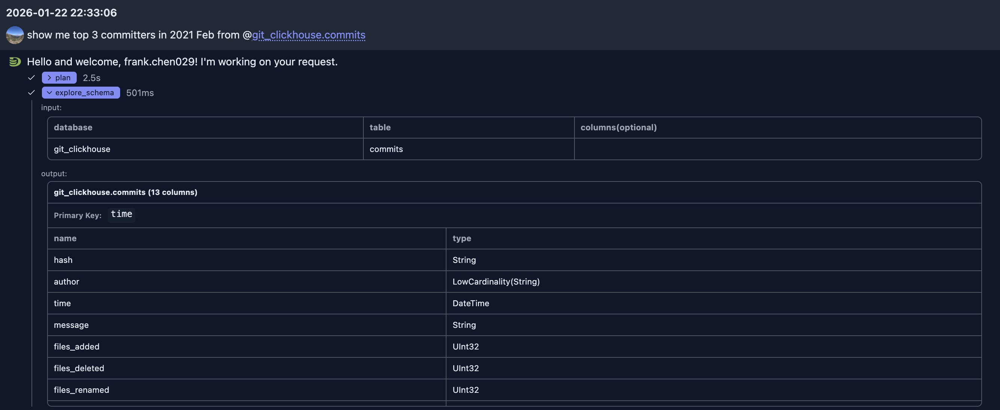
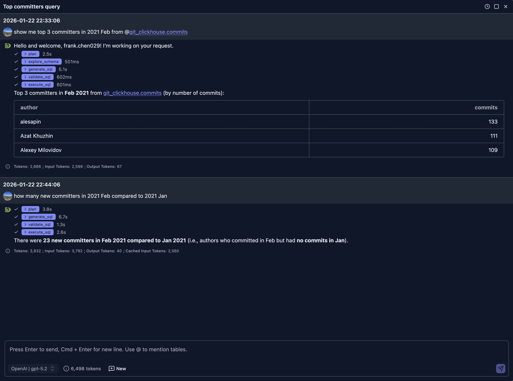

# 自然语言数据探索

DataStoria 的自然语言数据探索功能允许你用日常英语描述数据需求，并即刻获得经过优化的 ClickHouse 查询。无需记忆复杂的 SQL 语法——只需自然地提问。

## 概述

自然语言数据探索功能使用先进的 AI 模型来理解你的意图并生成准确的 ClickHouse SQL 查询。它会分析你的数据库结构（schema）、理解上下文，并生成语法正确且经过性能优化的查询。

## 使用方法

### 访问功能

1. **打开聊天界面**：点击侧边栏中的聊天图标，打开一个聊天标签页


面板提供了若干示例问题，帮助你快速上手。

2. 在 INPUT 区域的模型选择列表中选择一个模型


1. **输入你的问题**：在 INPUT 中用自然语言描述你想了解的数据

2. **提交问题**：点击发送按钮提交问题，或直接按 ENTER 提交。AI 将根据你的问题生成响应

3. **执行或修改**：你可以直接执行查询，也可以要求进一步修改

### 示例

让我们发送一个问题，询问当前运行服务器的 ClickHouse 版本。

> What's the version of this ClickHouse

下面的截图展示了 AI 的回答：



### 工作原理

当问题提交后：

1. 前端将你的问题连同所选模型一起发送到后端服务器
2. 后端将你的问题与一些预定义的 Prompt 组装，并向所选模型发送请求以获取响应
3. AI 会生成一条查询 ClickHouse 版本的 SQL
4. Java AgentScope 运行时通过所选的服务端 ClickHouse 连接执行所需的 SQL。
5. 工具结果保留在后端 Agent 运行过程中，并作为运行事件流式传输到浏览器。

下面的时序图说明了这一过程：



你可以在界面上展开各个步骤，进一步了解 LLM 的输出。例如，在本例中生成的 SQL 是：

```sql
SELECT version() AS clickhouse_version LIMIT 1
```

> 注意：
>
> 即使在相同模型下，同一个问题生成的 SQL 也可能不同。
>

## 使用场景

使用自然语言获取数据可以节省编写复杂查询的时间。以下是一些典型的使用场景。

### 场景 1 - ClickHouse 服务器性能诊断

我们可以利用自然语言从系统表中查找数据，用于问题诊断。

> 注意：
>
> 为此，你的数据库用户名必须已被授予对这些 *system.\** 表的访问权限。
>
> 如果你没有相应权限，可以联系管理员寻求帮助。

#### 示例 1 - 统计一段时间内的 SELECT 查询数量

**用户问题：** how many select queries in the past 3 hours



生成的查询 SQL 如下：

```sql
SELECT count() AS select_queries_last_3h
FROM system.query_log
WHERE event_date >= toDate(now() - INTERVAL 3 HOUR)
  AND event_time >= now() - INTERVAL 3 HOUR
  AND type = 'QueryFinish'
  AND is_initial_query = 1
  AND query_kind = 'Select'
SETTINGS log_queries = 1
```

#### 示例 2 - 找出最慢的查询

**问题：** find out the slowest SELECT query from query log in the past 6 hour



### 场景 2 - 业务分析

在本例中，我们使用 [ClickHouse Playground](https://play.clickhouse.com) 的 git_clickhouse.commits 表进行演示。

你可以在 DataStoria 中配置该 Playground 连接，尝试下面类似的问题。

**问题 1：** show me top 3 committers in 2021 Feb from @git_clickhouse.commits



在本例中，由于 LLM 并不知道表结构，它首先使用 `explore_schema` 工具检查表结构，以决定 SQL 中要使用哪些列。我们可以展开该工具查看其输入和输出。



在了解表结构后，它将问题中的"committer"对应到 `author` 列。生成的 SQL 如下：

```sql
SELECT
  author,
  count() AS commits
FROM git_clickhouse.commits
WHERE time >= toDateTime('2021-02-01 00:00:00')
  AND time < toDateTime('2021-03-01 00:00:00')
GROUP BY author
ORDER BY commits DESC, author ASC
LIMIT 3
```

当响应返回给 LLM 后，它以表格形式输出结果。

> 注意：
>
> LLM 并不总是使用表格形式展示结果，这取决于你的请求以及返回给 LLM 的数据。
>

**问题 2：** How many new committers in 2021 Feb compared to 2021 Jan

这个问题是同一个聊天会话中对上面问题的追问，因此我们没有告诉 LLM 应该使用哪张表。LLM 能够推断出应查询同一张表。
而且表结构信息已经存在于上下文中，LLM 无需再次获取表信息，而是直接生成满足需求的 SQL。



这次它使用 CTE 生成了一条稍显复杂的 SQL：

```sql
WITH
  jan_authors AS (
    SELECT DISTINCT author
    FROM git_clickhouse.commits
    WHERE time >= toDateTime('2021-01-01 00:00:00')
      AND time <  toDateTime('2021-02-01 00:00:00')
  ),
  feb_authors AS (
    SELECT DISTINCT author
    FROM git_clickhouse.commits
    WHERE time >= toDateTime('2021-02-01 00:00:00')
      AND time < toDateTime('2021-03-01 00:00:00')
  )
SELECT
  '2021-02 vs 2021-01' AS period,
  count() AS new_committers_in_feb
FROM feb_authors
WHERE author NOT IN (SELECT author FROM jan_authors)
LIMIT 1
```

从生成到执行再到得到最终回答，整个过程耗时不到 15 秒，比人工快得多。

## 最佳实践

### 编写有效的 Prompt

1. **具体明确**：包含相关细节，如时间范围、过滤条件和聚合方式
   - ✅ 好："Show me daily active users for the last 7 days, grouped by country"
   - ❌ 模糊："Show me users"

2. **提及表名**：如果你知道表，请提及具体的表或列
   - ✅ 好："Get the average order value from the orders table for customers in the US"
   - ❌ 欠清晰："Get average orders"

3. **指定聚合方式**：清楚说明你需要的计算
   - ✅ 好："Calculate the total revenue and average order size by month"
   - ❌ 含糊："Show me revenue"

4. **包含时间范围**：明确日期范围和时间区间
   - ✅ 好："Show me sales from January 1st to March 31st, 2024"
   - ❌ 不清晰："Show me sales"

### 修改生成的查询

如果初始查询不符合你的需求：

1. **要求修改**："Can you add a filter for status = 'active'?"
2. **要求换一种聚合**："Instead of sum, use average"
3. **更改时间范围**："Make it last 90 days instead of 30"
4. **调整排序**："Sort by date ascending instead of descending"

### 理解 Schema 上下文

AI 会自动利用你的数据库 Schema 来：

- 校验表名和列名
- 建议合适的数据类型
- 推荐高效的查询模式
- 应用 ClickHouse 特有的优化

## 获得更好结果的技巧

1. **从简单开始**：先从简单的查询入手，逐步增加复杂度
2. **执行前先审查**：始终审查生成的查询，尤其是写操作
3. **使用追问**：结合上下文追问，在先前查询的基础上继续构建
4. **善用 Schema 信息**：AI 了解你的 Schema——自然地使用表名和列名即可
5. **多轮迭代**：放心地多次修改查询，直到完全获得你需要的结果

## 局限性

- AI 基于你的 Schema 生成查询，但可能不了解所有业务逻辑
- 复杂的多步操作可能需要手动完善 SQL
- 非常庞大或复杂的查询在生成后可能仍需优化
- 在生产数据上运行前，请务必验证查询

## 隐私与安全

- 你的自然语言 Prompt 会发送到你配置的 LLM 提供商
- 生成的查询由 Spring Boot 通过持久化的服务端 ClickHouse 连接执行。
- 查询结果不会被发送到外部服务
- 隐私细节请参见 [AI 模型配置](./ai-model-configuration.md)

## 后续步骤

- **[查询优化](./query-optimization.md)** — 了解 AI 如何帮助你优化查询
- **[智能可视化](./intelligent-visualization.md)** — 用自然语言生成图表
- **[AI 模型配置](./ai-model-configuration.md)** — 配置你的 LLM 提供商 API Key
