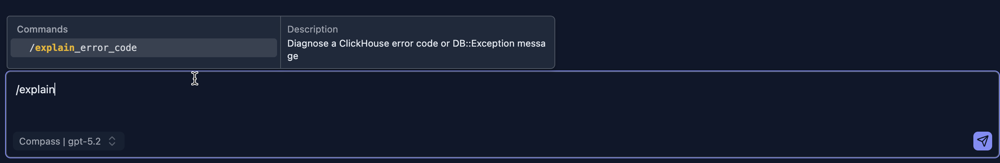

# Slash Commands（斜杠命令）

Slash Commands（斜杠命令）让你可以直接在聊天输入框中调用专门的 AI 工作流。无需编写完整的 Prompt，只需输入 `/` 浏览可用命令，选择一条，AI 便会按照为该任务定制的精确工作流执行。



## 工作原理

1. 点击聊天输入框并输入 `/`。
2. 命令面板随即打开，展示所有可用命令及其描述。
3. 使用方向键或鼠标选择一条命令，然后按 **Enter**。
4. 在命令名之后添加任何相关细节（错误消息、SQL 等）。
5. 按 **Cmd+Enter**（或 **Ctrl+Enter**）发送。

命令会在到达 AI 之前在服务端展开——你在聊天历史中看到的是原始的 `/command`，而 AI 收到的是完整的结构化 Prompt。

## 可用命令

### `/explain_error_code`

使用专用的错误手册诊断 ClickHouse 错误码或 `DB::Exception` 消息。AI 会查找与该错误码相关的确切函数签名、设置名或内存配置，并给出针对性的修复方案。

**用法：**

```
/explain_error_code error code: 42
error message: DB::Exception: Number of arguments for function toDate doesn't match
sql:
SELECT toDate(event_time, 'UTC') FROM events
```

**支持的错误码包括：**

| 错误码 | 符号名 | 描述 |
|------|--------------|-------------|
| `42` | `NUMBER_OF_ARGUMENTS_DOESNT_MATCH` | 传给函数的参数数量错误 |
| `115` | `UNKNOWN_SETTING` | 无法识别的 ClickHouse 设置名 |
| `241` | `MEMORY_LIMIT_EXCEEDED` | 查询超出配置的内存限制 |

对于不支持的错误码，AI 会退回到其通用 ClickHouse 知识，尽力提供诊断。


## 键盘快捷键参考

| 按键 | 操作 |
|-----|--------|
| 输入起始处的 `/` | 打开命令面板 |
| `↑` / `↓` | 在命令间导航 |
| `Enter` | 选中高亮的命令 |
| `Escape` | 关闭面板且不选择 |
| `Cmd+Enter` / `Ctrl+Enter` | 发送消息 |

## 后续步骤

- **[Ask AI for Help](./ask-ai-for-help.md)** — 从查询编辑器一键获取错误帮助
- **[Agent Skills](./skills.md)** — 了解 Slash Commands 所调用的 Skills
- **[错误诊断](../03-query-experience/error-diagnostics.md)** — 了解 ClickHouse 错误如何被解析和展示
