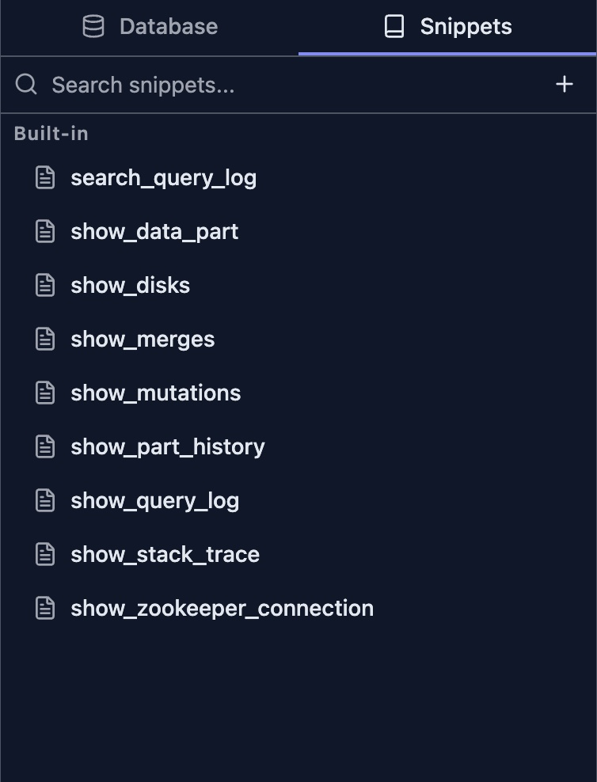
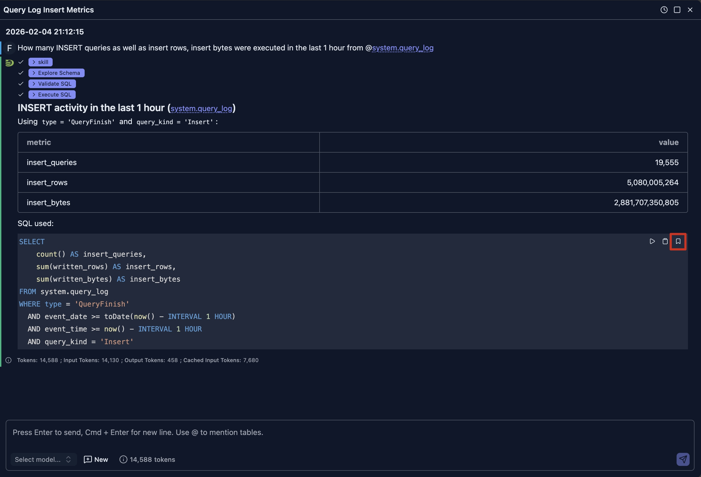

# SQL 片段

DataStoria 的 SQL 片段（SQL Snippets）功能允许你保存、组织和复用常用的 SQL 查询。无论你是在处理常见的查询模式、复杂的分析查询，还是标准操作，片段都能帮助你更快、更一致地完成工作。

## 概览

SQL 片段提供：

- **内置片段**：针对常见 ClickHouse 操作预配置的模板
- **自定义片段**：创建并保存你自己的可复用查询
- **快速访问**：通过自动补全或侧边栏即时插入
- **片段管理**：编辑、克隆并组织你的片段库
- **自动补全集成**：片段会出现在 SQL 编辑器的自动补全建议中

## 访问片段

### 侧边栏面板

可以从左侧边栏面板访问片段：

1. **打开片段面板**：点击左侧边栏中的片段图标
2. **浏览片段**：查看按字母顺序组织的所有可用片段
3. **搜索片段**：使用搜索框按名称过滤片段
4. **悬停预览**：将鼠标悬停在任意片段上查看其完整 SQL 代码

### 自动补全

片段已集成到 SQL 编辑器的自动补全中：

1. **开始输入**：在编辑器中输入片段名称
2. **查看建议**：片段会出现在自动补全下拉列表中，并带有 "snippet" 标签
3. **选择并插入**：选择一个片段，将其插入到光标位置

## 使用片段

### 在光标处插入片段

要在当前光标位置插入片段：

1. **悬停在片段上**：在片段面板中，将鼠标悬停到你想要使用的片段上
2. **点击插入按钮**：点击片段预览卡片中的箭头（→）按钮
3. **按需编辑**：片段会被插入到光标位置，随时可以自定义

### 在新页签中运行片段

要在新的查询页签中立即执行片段：

1. **悬停在片段上**：在片段面板中，将鼠标悬停到你想要运行的片段上
2. **点击运行按钮**：点击片段预览卡片中的播放（▶）按钮
3. **查看结果**：会打开一个新的查询页签，填入该片段并自动执行

## 内置片段

DataStoria 针对常见的 ClickHouse 操作内置了若干片段。

> **注意**：
> 内置片段不允许删除/修改。

### 查询分析

- **search_query_log**：在 system.query_log 中搜索和过滤查询，支持按数据库、表、查询类型和执行状态自定义过滤
- **find_slow_queries**：按规范化查询哈希分组识别慢查询，分析查询性能，展示执行时间、内存使用和频率

### 系统诊断

- **show_stack_trace**：显示来自 system.stack_trace 的 demangle 后的堆栈信息，用于调试和性能分析
- **show_disks**：查看所有集群节点的磁盘使用情况，展示剩余空间、总空间和利用率

### 数据管理

- **show_data_part**：列出 system.parts 中的活跃数据 part，支持按数据库和表可选过滤
- **show_part_history**：查看 system.part_log 中的数据 part 操作历史，包括 merge 操作、时长和大小信息
- **show_merges**：监控进行中的 merge 操作，包括进度、内存使用和性能指标
- **show_running_mutations**：跟踪活跃的表 mutation 及其状态、命令和失败信息

### 集群操作

- **show_zookeeper_connection**：显示所有集群节点的 ZooKeeper 连接状态

## 创建自定义片段

### 从片段面板创建

1. **打开片段面板**：点击左侧边栏中的片段图标
2. **点击添加按钮**：点击片段面板顶部的 "+" 按钮
3. **填写详情**：
   - **Name**：为片段起一个具有描述性的名称（例如 "daily_active_users"）
   - **SQL**：输入你想要保存的 SQL 查询
4. **保存**：点击 "Save" 将片段加入你的片段库

### 从查询编辑器控制栏创建

控制栏中有一个 'Save' 按钮，允许你保存查询编辑器中选中的文本，或者（在未选中文本时）编辑器中的全部文本。

### 从 AI 生成的 SQL 创建

你还可以在聊天视图中点击 SQL 代码块上的书签图标，保存 AI 助手生成的 SQL 查询，如下所示。

然后填写片段名称并点击 'Save'。

### 片段命名的最佳实践

- **使用描述性名称**：选择能清楚描述片段用途的名称
- **使用下划线**：用下划线分隔单词（例如 `user_activity_report`）
- **避免特殊字符**：只使用字母数字字符和下划线
- **保持简洁**：短名称更易输入和记忆
- **使用前缀**：用共同前缀为相关片段分组（例如 `report_`、`admin_`）

## 管理片段

### 编辑片段

要修改现有的自定义片段：

1. **悬停在片段上**：在片段面板中，将鼠标悬停到你想要编辑的片段上
2. **点击编辑按钮**：点击片段预览卡片中的铅笔（✏）按钮
3. **修改详情**：更新名称和/或 SQL 查询
4. **保存更改**：点击对勾（✓）按钮保存你的更改

> **注意**：内置片段无法直接编辑。请使用克隆功能创建一份可编辑的副本。

### 克隆片段

要创建片段的副本（对内置片段或创建变体很有用）：

1. **悬停在片段上**：在片段面板中，将鼠标悬停到你想要克隆的片段上
2. **点击克隆按钮**：点击片段预览卡片中的复制按钮
3. **编辑副本**：克隆的片段会以编辑模式打开，名称末尾附加 "\_copy"
4. **自定义**：按需修改名称和 SQL
5. **保存**：点击对勾（✓）按钮保存新片段

### 删除片段

要移除一个自定义片段：

1. **悬停在片段上**：在片段面板中，将鼠标悬停到你想要删除的片段上
2. **点击删除按钮**：点击片段预览卡片中的垃圾桶（🗑）按钮
3. **确认删除**：在确认对话框中点击 "Delete"

> **警告**：删除片段是永久操作，无法撤销。内置片段无法删除。

## 片段自动补全

片段会自动集成到 SQL 编辑器的自动补全系统中：

### 触发片段建议

- **自动**：随着你的输入，匹配的片段会出现在自动补全下拉列表中
- **手动**：按 `Alt + Space`（Windows/Linux）或 `Option + Space`（Mac）显示全部建议
- **过滤**：继续输入以缩小建议范围

### 识别片段

在自动补全下拉列表中，片段的标识包括：

- **标签**：建议旁边的 "snippet" 标记
- **图标**：区别于其他建议的独特图标
- **预览**：悬停在建议上可查看完整 SQL 代码

### 从自动补全插入

1. **选择片段**：使用方向键导航到目标片段
2. **插入**：按 `Tab` 或 `Enter` 在光标处插入片段
3. **编辑**：按需自定义插入的 SQL

## 限制

- **不支持文件夹**：片段无法组织到文件夹中（可改用命名前缀）
- **不支持共享**：片段无法直接与其他用户共享
- **不支持导入/导出**：目前不支持批量导入/导出片段
- **仅限当前浏览器**：片段按浏览器分别存储，不会同步

## 使用场景

### 开发团队

- **标准查询**：在整个团队中共享常见的查询模式
- **最佳实践**：将团队约定沉淀为可复用的片段
- **新人上手**：借助预置的查询模板帮助新成员快速入门

### 数据分析师

- **报表模板**：保存常用的报表查询
- **数据探索**：快速访问常见的探索性查询
- **性能监控**：用于系统健康检查的标准查询

### 数据库管理员

- **维护任务**：常见的管理操作
- **健康检查**：系统监控与诊断
- **故障排查**：针对常见问题预置的查询

## 后续步骤

- **[SQL 编辑器](./sql-editor.md)** —— 了解 SQL 编辑器的功能与能力
- **[查询执行](./query-execution.md)** —— 理解如何执行查询并查看结果
- **[错误诊断](./error-diagnostics.md)** —— 获取查询错误与调试方面的帮助
