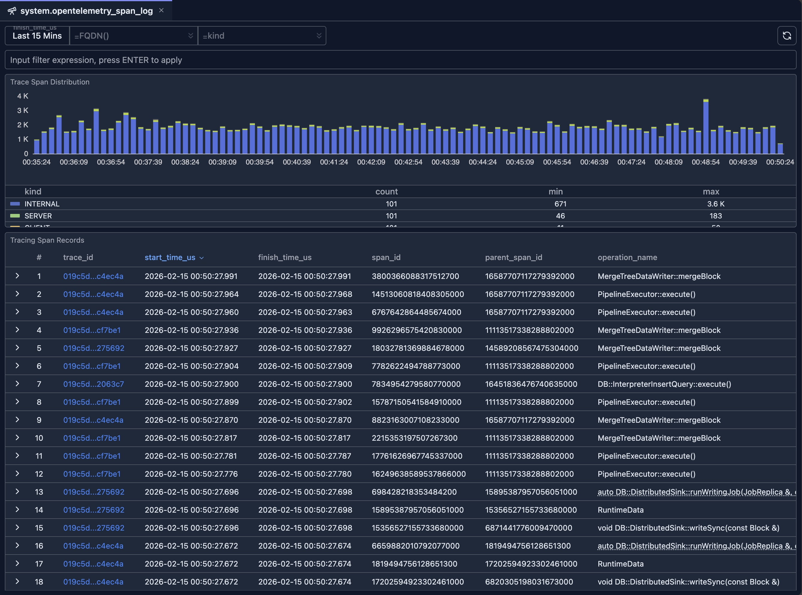

# system.opentelemetry_span_log 内省

OpenTelemetry Span 日志内省工具让你能够分析存储在 ClickHouse `system.opentelemetry_span_log` 表中的 Span。用它来检查 Trace Span 随时间的分布、按主机或 Span Kind 过滤，并通过可点击的 Trace ID 探索单条 Span 记录，进行更深入的分析。

## 概览

当 ClickHouse 配置为产生 [OpenTelemetry](https://opentelemetry.io/) Trace 数据时，Span 事件会被写入 `system.opentelemetry_span_log`。该内省 UI 提供：

- **基于时间的分析** —— 为所有图表和表格选择时间范围（默认：最近 15 分钟）。
- **Trace Span 分布图** —— Span 数量随时间的堆叠柱状图，按 Span `kind` 分组（如 server、client、internal）。
- **Tracing Span 记录表** —— 分页、可排序的 Span 行列表，含 Trace ID 链接、开始/结束时间、Span ID 和可选的行详情。

你可以组合使用时间范围、主机名（FQDN）和 Span Kind 过滤器，聚焦特定节点或 Span 类型。

## 前置条件

- ClickHouse 已配置为将 Tracing 数据写入 `system.opentelemetry_span_log` 表。
- 对 `system.opentelemetry_span_log` 表的读权限。

## UI

如果点击 `trace_id` 列，将打开一个新标签页，让你检查给定 Trace 的 Span 日志详情，演示见以下视频。

<Video src="/v1.1.0/manual/04-cluster-management/img/system-opentelemetry-span-log-inspector.webm" alt="system.opentelemetry_span_log 检查器" />

## 何时使用该工具

### 分布式追踪与调试

1. **按时间查找 Trace**：设置时间范围并在表格中扫描缓慢或失败的操作。
2. **按主机过滤**：使用 FQDN 只查看你关心的节点上的 Span。
3. **按 Kind 过滤**：使用 Span Kind 聚焦 server Span、client 调用或 messaging Span。
4. **追踪一条 Trace**：点击 Trace ID，在检查器中打开完整 Trace。

### 可观测性与容量

1. **随时间变化的量**：使用分布图查看 Span 吞吐以及哪些 Kind 占主导。
2. **对比节点**：切换 FQDN 过滤器，对比各副本间的 Span 数量或 Kind。
3. **按表达式收窄**：使用输入过滤器构造自定义条件（如按 service 或 attribute）。

### 与其他工具的集成

- **Span 日志检查器**：使用表中的 Trace ID 链接跳转到单条 Trace 的时间线与拓扑视图。
- **其他系统表**：在将查询与 Trace 关联时，可与 [system.query_log](./system-query-log.md) 或 [system.query_views_log](./system-query-views-log.md) 交叉引用。

## 相关文档

- **[系统日志内省](./system-log-introspection.md)** —— 所有系统日志内省工具概览
- **[Query Log Inspector](../03-query-experience/query-log-inspector.md)** —— 单个查询或 Trace 的时间线与拓扑
- **[Schema Explorer](./schema-explorer.md)** —— 探索数据库和表，包括 `system.opentelemetry_span_log`
- **[Node Dashboard](../05-monitoring-dashboards/node-dashboard.md)** —— 节点级指标与健康状态
