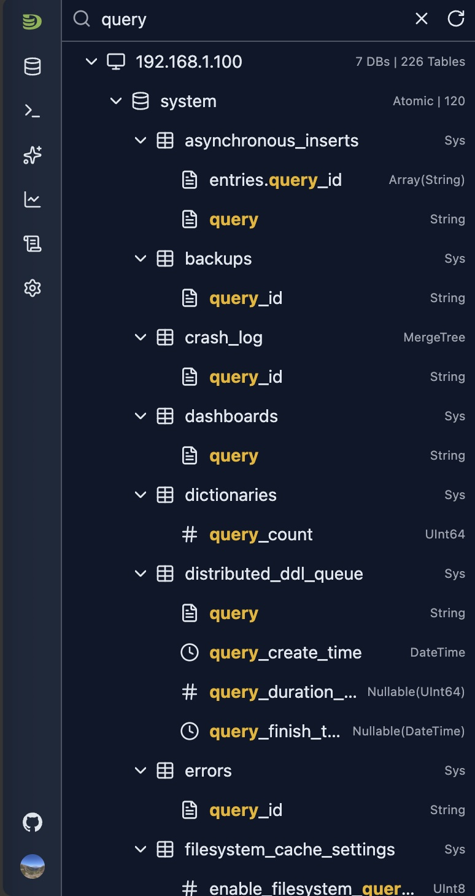
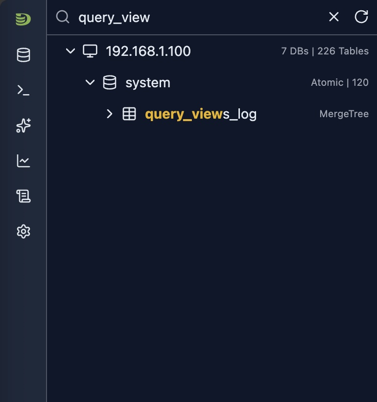
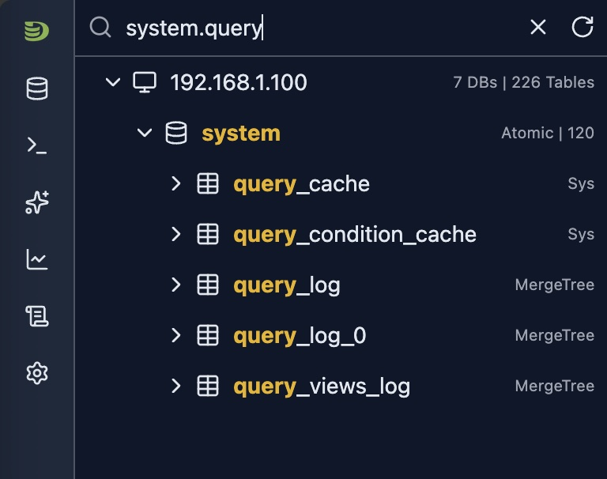

# Schema Explorer（结构浏览器）

Schema Explorer 提供了一个直观的树形界面，用于浏览 ClickHouse 的数据库、表、列和元数据。它是 DataStoria 中的中心导航枢纽，让你能够快速访问和探索数据库结构。

## 概览

Schema Explorer 将 ClickHouse 结构展示为可展开的树形结构，包括：

- **数据库（Database）**：ClickHouse 实例中的所有数据库
- **表（Table）**：每个数据库中的所有表
- **列（Column）**：表的列及其数据类型和元数据
- **注释（Comment）**：数据库、表和列的注释（如果有）
- **表引擎（Table Engine）**：每张表的引擎类型
- **集群节点（Cluster Node）**：在集群模式下，显示各节点及其结构

## 访问 Schema Explorer

Schema Explorer 位于 DataStoria 界面的**左侧边栏**。连接到 ClickHouse 实例后会自动加载。

### 初始加载

- **自动加载**：连接后自动加载结构
- **进度指示**：首次获取结构时显示加载进度
- **错误处理**：结构加载失败时显示错误信息

## 树形结构

### 层次关系

结构树遵循以下层次：

```
Host/Cluster
  └── Database
      └── Table
          └── Column -- Data Type
```

### 节点类型

#### 主机/集群节点（Host/Cluster Node）

- **单节点**：显示返回结构树信息的主机名
- **集群模式**：显示返回结构树信息的主机名，并提供一个包含集群中所有节点的选择列表
- **操作**：刷新结构、切换节点（集群模式下）


## 导航功能

### 搜索功能

Schema Explorer 提供强大的搜索功能，可以在数据库/表/列中进行搜索。

#### 搜索行为

- **实时过滤**：搜索在本地执行，输入时结果即时更新
- **模糊匹配**：按名称查找部分匹配项，精确匹配请参见下文的点号（dot）模式

  - 在模糊匹配下，可以搜索数据库/表/列。匹配到的条目会按其所属数据库/表的层次结构展示

- **不区分大小写**：搜索不区分大小写
- **搜索范围**：覆盖数据库、表和列
- **点号（dot）模式**

    默认情况下，搜索会覆盖所有数据库、表和列。但如果输入了点号（`.`），第一个点号之前的文本将被视为对数据库名的精确匹配，第一个点号与第二个点号之间的文本将被视为精确的表名。

    一旦输入点号且匹配到数据库，匹配的数据库会自动展开其下的表。表的精确匹配同理。

#### 示例

- 搜索包含 'query' 的数据库/表/列



- 搜索表



- 搜索指定数据库下的表（点号模式）



### 右键菜单

右键点击任意节点即可打开上下文菜单选项。

## 操作与快捷方式

### 打开节点 Dashboard 标签页

- **方式**：点击主机名
- **展示内容**：在标签页中打开节点 Dashboard


### 打开数据库标签页

- **方式**：点击数据库名
- **展示内容**：数据库概览，包括表、统计信息和表依赖关系

### 打开表标签页

- **方式**：点击表名
- **展示内容**：表详细信息，包括：
  - 表元数据
  - 列信息
  - 数据抽样
  - 分区（Partition）
  - 查询历史
  - 依赖关系


## 限制

- **实时更新**：结构变更需要手动刷新
- **性能**：首次加载时间取决于结构规模
- **权限**：结构的可见性取决于用户权限

### 与其他功能的集成

- **Query 编辑器**：将表名从结构树拖拽到查询编辑器（如果支持）
- **表标签页**：在独立标签页中打开多张表

## 下一步

- **[SQL 编辑器](../03-query-experience/sql-editor.md)** —— 查询你发现的表
- **[自然语言查询](../02-ai-features/natural-language-sql.md)** —— 用自然语言向数据提问
- **[Cluster Dashboard](../05-monitoring-dashboards/cluster-dashboard.md)** —— 监控集群级指标
- **[Node Dashboard](../05-monitoring-dashboards/node-dashboard.md)** —— 监控单节点性能
