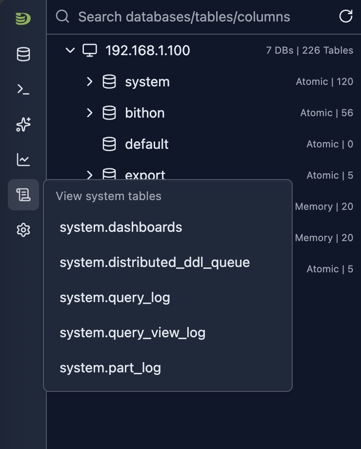

# 系统日志内省（System Log Introspection）

DataStoria 提供强大的系统日志内省工具，让你能够详细分析 ClickHouse 系统表。这些工具帮助你理解查询模式、识别性能问题、调试错误，并监控集群中的数据 Part 操作。

## 概览

目前支持以下系统表：

- **[system.ddl_distribution_queue](./system-ddl-distributed-queue.md)** —— 监控跨集群节点的分布式 DDL 操作
- **[system.opentelemetry_span_log](./opentelemetry-span-log.md)** —— 检查 OpenTelemetry Span 日志，含 Trace 分布与 Trace ID 链接
- **[system.query_log](./system-query-log.md)** —— 分析查询执行日志，支持过滤、图表和 AI 驱动的洞察
- **[system.query_views_log](./system-query-views-log.md)** —— 监控查询视图执行，包括物化视图和 Live 视图
- **[system.part_log](./system-part-log.md)** —— 监控 Part 级操作，包括 Merge、Mutation 和下载
- **[system.zookeeper](./system-zookeeper.md)** —— 以树表界面浏览和检查 ZooKeeper 数据
- **system.dashboard** —— Dashboard 配置和元数据

你可以通过侧边栏的图标按钮访问这些内省工具，如下图所示：

## 可用的系统表

### system.opentelemetry_span_log

OpenTelemetry Span 日志内省工具分析 `system.opentelemetry_span_log` 中的 Span。可按时间和 Kind 查看 Trace Span 分布，按主机名（FQDN）和 Span Kind 过滤，并通过 Trace ID 链接打开单个 Trace，用于分布式追踪与可观测性。

**[了解更多关于 system.opentelemetry_span_log →](./opentelemetry-span-log.md)**

### system.query_log

Query 日志内省工具提供对 ClickHouse 集群上所有已执行查询的深度洞察。它包括全面的过滤、分布图表和 AI 驱动的优化建议。

**[了解更多关于 system.query_log →](./system-query-log.md)**

### system.query_views_log

Query 视图日志内省工具提供对 ClickHouse 集群上所有查询视图执行的洞察。它跟踪物化视图、Live 视图及其他视图类型的执行情况，包括其性能指标、读/写模式和错误信息。

**[了解更多关于 system.query_views_log →](./system-query-views-log.md)**

### system.part_log

Part 日志内省工具跟踪 ClickHouse 集群中的所有 Part 级操作，包括 Merge、Mutation、下载和删除。监控 Merge 活动、跟踪 Part 创建并识别 Mutation 模式。

**[了解更多关于 system.part_log →](./system-part-log.md)**

### system.ddl_distribution_queue

DDL 分发队列内省工具提供对 ClickHouse 集群上分布式 DDL 操作的洞察。它跟踪 DDL 语句（CREATE、ALTER、DROP 等）在集群节点上的分发与执行情况，帮助你监控 DDL 操作状态、识别失败并跟踪执行进度。

**[了解更多关于 system.ddl_distribution_queue →](./system-ddl-distributed-queue.md)**

### system.zookeeper

ZooKeeper 内省工具提供树表界面，用于浏览和检查 ClickHouse 集群使用的 ZooKeeper 数据。探索 znode 的层次结构、查看节点值，并检查创建时间、修改时间和子节点数量等元数据。

**[了解更多关于 system.zookeeper →](./system-zookeeper.md)**

## 通用功能

所有系统日志内省工具共享以下通用功能：

- **基于时间的过滤**：灵活的时间范围选择，便于历史分析
- **多维度过滤**：按主机名、数据库、表等进行过滤
- **可视化分析**：用于模式识别的图表和表格
- **服务端排序**：按任意列排序，高效探索数据
- **分页**：高效浏览大型结果集
- **AI 集成**：获取优化建议和错误解释

## 最佳实践

### 定期监控

1. **每日审查**：每天检查查询和 Part 日志
2. **设定基线**：建立正常运行的模式
3. **异常告警**：识别异常模式
4. **跟踪趋势**：随时间监控各项指标

### 性能优化

1. **识别慢操作**：按耗时排序
2. **使用 AI 功能**：善用 AI 优化和错误解释
3. **对比时间段**：使用时间范围选择器对比性能
4. **策略性过滤**：使用过滤器聚焦相关数据

### 问题排查

1. **从宽到窄**：先从较大的时间范围开始
2. **逐步缩小**：使用过滤器聚焦具体问题
3. **借助 AI**：为复杂问题获取 AI 驱动的洞察
4. **交叉引用**：使用 Query ID 链接关联查询日志和 Part 日志

### 安全与合规

1. **用户审计**：按用户过滤以跟踪访问模式
2. **表访问**：监控哪些表被访问
3. **错误审查**：定期审查异常日志
4. **导出日志**：使用表格功能进行合规报告

## 限制

- **系统表访问**：需要对系统表的读权限
- **日志保留期**：数据的可用性取决于 ClickHouse 的日志保留设置
- **性能**：查询较大的时间范围可能较慢
- **版本兼容性**：部分功能可能因 ClickHouse 版本而异
- **集群模式**：部分过滤器仅在集群模式下可用

## 下一步

- **[Cluster Dashboard](../05-monitoring-dashboards/cluster-dashboard.md)** —— 监控集群级指标
- **[Node Dashboard](../05-monitoring-dashboards/node-dashboard.md)** —— 监控单节点指标
- **[Query Log Inspector](../03-query-experience/query-log-inspector.md)** —— 分析具体查询的执行
- **[Schema Explorer](./schema-explorer.md)** —— 探索数据库结构
