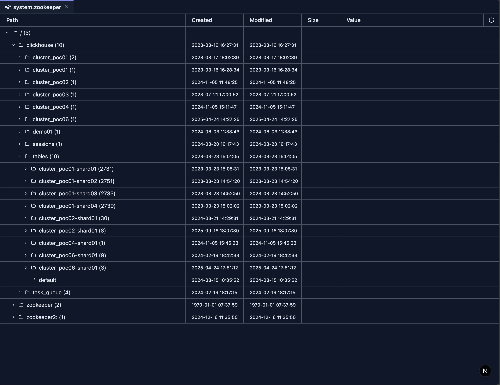

# system.zookeeper 内省

ZooKeeper 内省工具提供树表结构界面，用于浏览和检视 ClickHouse 集群使用的 ZooKeeper 数据。无需针对 `system.zookeeper` 表编写 SQL 查询，即可探索 znode 的层级结构、查看节点值，并检视创建时间、修改时间和子节点数等元数据。

## 前置条件

> **注意**：
>
> 1. 你的 ClickHouse 集群必须已配置 ZooKeeper。
> 2. 使用此内省工具需要对 `system.zookeeper` 表的读取权限。请确认用户具备必要的系统表权限。

## 界面

ZooKeeper 内省工具以树表形式展示以下列：

- **Path** — znode 的层级树。展开节点以加载并查看其子节点。有子节点的节点会显示数量（例如 `clickhouse (5)`）。
- **Created** — znode 的创建时间戳。
- **Modified** — znode 的最近修改时间戳。
- **Size** — znode 的数据长度（为零时隐藏）。
- **Value** — 截断显示的节点值；点击后在对话框中查看完整内容。

顶部的刷新按钮会从根路径重新加载数据。Path 列可以通过拖拽右边缘调整宽度。

## 功能特性

### 树形导航

- **懒加载**：展开节点时才获取子节点，缩短初始加载时间。
- **可展开节点**：有子节点（`numChildren > 0`）的节点显示展开图标；叶子节点不显示。
- **子节点计数**：有子节点的节点在名称后显示数量（例如 `/ (3)`）。
- **虚拟滚动**：通过虚拟化高效渲染大型树。

### 列说明

- **Path**：显示带层级缩进的节点名称。有子节点的节点显示文件夹图标，叶子节点显示文件图标。
- **Created / Modified**：来自 ZooKeeper 元数据的时间戳。
- **Size**：数据长度；仅在非零时显示。
- **Value**：截断显示的文本，点击可展开完整内容。长值使用 truncatedText 格式化器处理。

### 刷新

- 点击顶部的刷新图标从根路径重新加载树。所有展开状态会被重置。

## 使用场景

### 集群协调检视

1. **探索复制元数据**：导航到 `/clickhouse` 等路径，检视复制配置。
2. **校验 Znode 结构**：确认预期的 znode 存在且层级正确。
3. **检查协调状态**：检视 leader 选举、锁和协调数据。

### 故障排查

1. **检视节点值**：点击截断的值，在对话框中查看完整内容。
2. **核对时间戳**：利用 Created/Modified 列发现过期或最近变更的 znode。
3. **识别空节点**：Size 列（显示时）有助于区分承载数据的节点和纯结构节点。

### 复制监控

1. **浏览副本路径**：导航 `/clickhouse` 下与复制相关的 znode。
2. **检查子节点数**：利用显示的子节点计数快速评估结构规模。
3. **变更后刷新**：集群或配置变更后使用刷新按钮查看最新状态。

## 下一步

- **[系统日志内省](./system-log-introspection.md)** — 所有系统日志工具的概述
- **[system.query_log 内省](./system-query-log.md)** — 分析查询执行日志
- **[system.part_log 内省](./system-part-log.md)** — 监控 part 级操作
- **[system.ddl_distribution_queue 内省](./system-ddl-distributed-queue.md)** — 监控分布式 DDL 操作
- **[system.query_views_log 内省](./system-query-views-log.md)** — 监控查询视图执行
