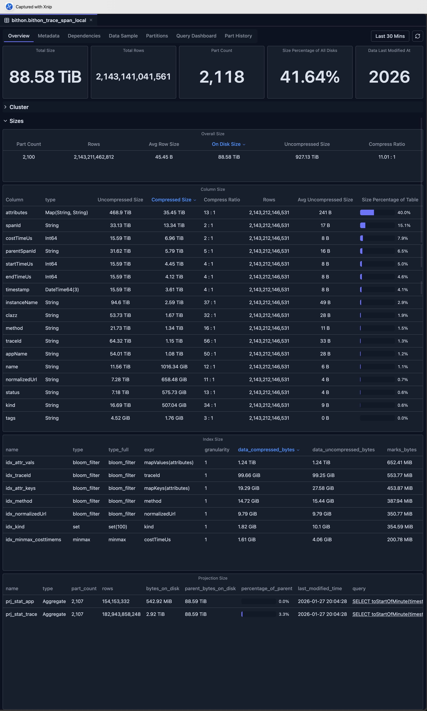
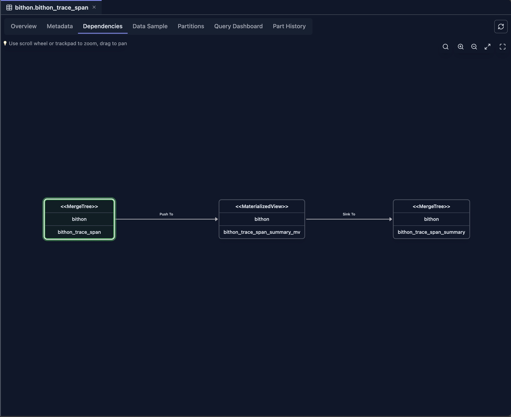
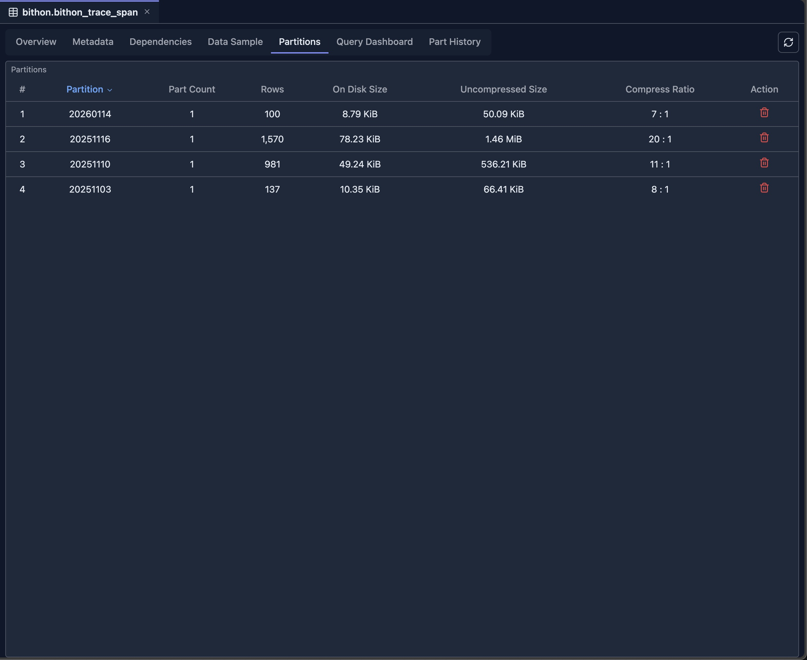
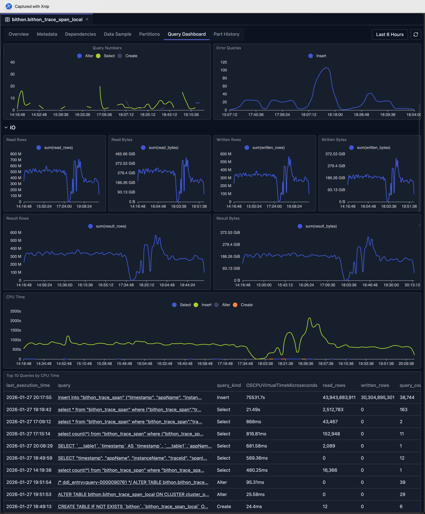
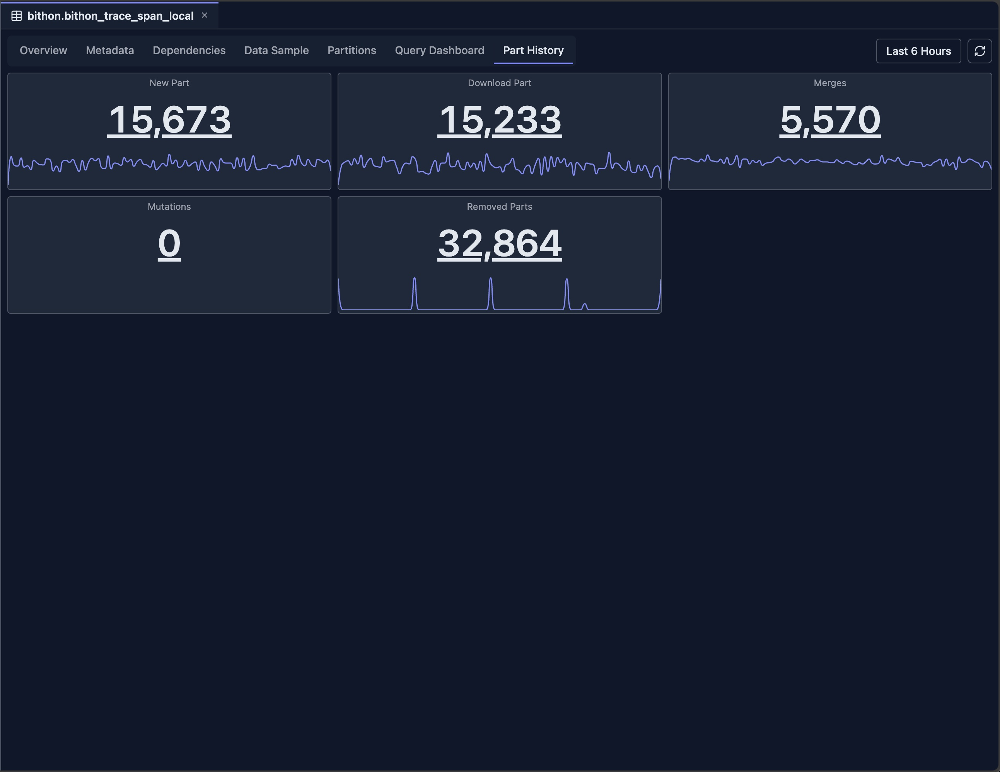

# 表视图（Table View）

表视图提供 ClickHouse 表的全面信息，包括元数据、数据抽样、分区信息、查询历史和依赖关系。它是理解表结构、性能和关系的中心枢纽。

## 概览

表视图将表信息组织到多个标签页中：

- **概览标签页（Overview）**：高层统计信息和性能指标
- **元数据标签页（Metadata）**：表结构、列和 CREATE TABLE 语句
- **依赖标签页（Dependencies）**：表依赖关系的可视化图
- **数据抽样标签页（Data Sample）**：表中的示例行
- **分区标签页（Partitions）**：分区信息和大小分布
- **查询 Dashboard 标签页（Query Dashboard）**：查询历史和性能指标
- **Part 历史标签页（Part History）**：历史 Part 信息与变更

## 访问表视图

在 ClickHouse Console 中可以从多个位置访问表视图：

### 从 Schema Explorer

1. **导航到表**：点击 Schema Explorer 侧边栏中的表名
2. **打开表标签页**：表视图自动在新标签页中打开
3. **查看概览**：默认显示概览标签页（如果该表引擎类型支持）

### 从数据库视图

1. **打开数据库视图**：点击 Schema Explorer 中的数据库名
2. **点击表名**：点击数据库表列表中的任意表名
3. **打开表标签页**：表视图在新标签页中打开，展示所选表的信息

## 可用标签页

可用的标签页取决于表引擎类型。部分引擎的功能有限：

| 表引擎 | 概览 | 元数据 | 依赖 | 数据抽样 | 分区 | 查询 Dashboard | Part 历史 |
|--------------|----------|----------|--------------|-------------|------------|------------------|--------------|
| **MergeTree 家族** | ✅ | ✅ | ✅ | ✅ | ✅ | ✅ | ✅ |
| **物化视图（Materialized Views）** | ✅ | ✅ | ✅ | ❌ | ✅ | ❌ | ❌ |
| **Distributed 表** | ❌ | ✅ | ✅ | ✅ | ❌ | ✅ | ❌ |
| **Kafka 表** | ❌ | ✅ | ✅ | ❌ | ❌ | ❌ | ❌ |
| **URL 表** | ❌ | ✅ | ✅ | ❌ | ❌ | ❌ | ❌ |
| **系统表（System Tables）** | ❌ | ✅ | ❌ | ✅ | ❌ | ❌ | ❌ |

### 引擎相关说明

- **MergeTree 家族**：包括 MergeTree、ReplicatedMergeTree、ReplacingMergeTree、SummingMergeTree、AggregatingMergeTree、CollapsingMergeTree、VersionedCollapsingMergeTree 及其他 MergeTree 变体。所有标签页均完整支持。
- **物化视图**：支持概览、元数据、依赖和分区。数据抽样和查询历史不可用，因为它们是视图定义而非数据表。
- **Distributed 表**：支持数据抽样、元数据、依赖和查询 Dashboard。分区和 Part 历史不适用，因为这些表将数据分布到集群节点上。
- **Kafka 表**：仅元数据和依赖可用。这些表从 Kafka 流读取数据，不在本地存储数据。
- **URL 表**：仅元数据和依赖可用。这些表从外部 URL 读取数据，不在本地存储数据。
- **系统表**：支持数据抽样和元数据。系统表不提供依赖和其他高级功能。

## 概览标签页

概览标签页提供 ClickHouse 表的高层统计信息和性能指标，让你快速了解表大小、行数、Part 信息和性能特征。

### 关键指标

- **表大小**：磁盘总大小
- **行数**：总行数
- **Part 数量**：数据 Part 的数量
- **压缩比**：数据压缩效率
- **最近修改**：最近修改时间

### 性能图表

- **大小随时间变化**：表大小趋势
- **行数趋势**：行数随时间的变化
- **查询性能**：查询执行指标
- **Part 操作**：Merge 和 Mutation 活动

### 列大小分析

列大小（Column Size）部分提供表中每列存储大小的详细洞察，帮助你识别哪些列占用最多的磁盘空间并优化存储效率。

### 二级索引信息

本部分展示表使用的每个二级索引（data skipping index）的大小，帮助你监控索引开销并优化查询性能。

### Projection 分析

Projection 部分展示该表使用的每个 PROJECTION 的大小，帮助你理解 Projection 的存储影响及其对查询优化的贡献。

## 元数据标签页

元数据标签页展示表结构的详细信息。

### 表信息

- **数据库名**：表所在数据库
- **表名**：表的名称
- **引擎类型**：ClickHouse 引擎（MergeTree、ReplicatedMergeTree 等）
- **CREATE TABLE 语句**：完整的表定义
- **元数据修改时间**：表元数据最近一次变更的时间

### 列信息

对于每一列，可以查看：

- **列名**：列的名称
- **数据类型**：ClickHouse 数据类型
- **默认表达式**：默认值或表达式
- **注释**：列描述（如果有）
- **Codec**：压缩编解码器（如果指定）
- **TTL**：存活时间表达式（如果指定）

### 表属性

- **Partition Key**：分区表达式
- **Order By**：排序键
- **Primary Key**：主键定义
- **Sample By**：采样表达式（如果指定）
- **Settings**：表级设置和参数

### 引擎相关信息

- **复制设置**：适用于 ReplicatedMergeTree 表
- **Distributed 设置**：适用于 Distributed 表
- **Kafka 设置**：适用于 Kafka 表
- **其他引擎设置**：特定引擎的配置

## 依赖标签页

依赖标签页以可视化图展示当前表的表依赖关系。

### 功能

- **上游依赖**：当前表依赖的表
- **下游依赖**：依赖当前表的表
- **交互式图**：以可视化方式浏览依赖
- **表详情**：点击节点查看表信息

例如，下图展示了一个物化视图与其源表及目标表之间的关系，说明数据如何流经物化视图管道。

关于依赖视图的详细信息，参见[依赖视图](./dependency-view.md)。

## 数据抽样标签页

数据抽样标签页展示表中的示例行。

### 功能

- **示例行**：查看表中的真实数据
- **可配置抽样数量**：调整显示的行数
- **列展示**：所有列均正确格式化显示
- **排序**：按任意列排序
- **过滤**：按列值过滤行
- **导出**：导出抽样数据

### 使用场景

- **数据探索**：了解表内容
- **数据质量**：验证数据正确性
- **结构校验**：确认列类型和取值
- **查询规划**：为查询理解数据结构

## 分区标签页

分区标签页提供当前表的详细分区信息。

### 分区概览

- **分区列表**：表中的所有分区
- **分区键值**：用于分区的值
- **大小信息**：每个分区的大小
- **行数**：每个分区的行数
- **Part 数量**：每个分区的 Part 数量

## 查询 Dashboard 标签页

查询 Dashboard 标签页基于 `system.query_log` 展示查询历史和性能指标。

它提供多个 Dashboard 指标，帮助用户理解当前表上的查询性能，包括执行时间、查询频率和性能趋势。

### 使用场景

- **性能监控**：跟踪查询性能
- **优化**：识别可优化的慢查询
- **使用分析**：了解表的使用方式
- **问题排查**：调试查询性能问题

## Part 历史标签页

Part 历史标签页基于 `system.part_log` 系统表展示表 Part 的历史信息。

在每个面板上，你可以点击数字或在缩略图上拖动来查看详细日志。

## 限制

表视图存在引擎相关和通用两类限制，使用时请注意：

### 引擎相关限制

- **系统表**：系统表功能有限，因为它们与用户表的结构和用途不同
- **Kafka 表**：不提供数据抽样和分区，因为 Kafka 表从流中读取数据，不在本地存储
- **URL 表**：元数据有限且无数据抽样，因为 URL 表按需从外部源获取数据
- **外部表**：功能可能有限，取决于外部表引擎类型及其能力

### 通用限制

- **系统表访问**：需要对 ClickHouse 系统表（`system.tables`、`system.parts`、`system.query_log`、`system.part_log` 等）的读权限
- **数据保留期**：历史数据取决于 ClickHouse 中配置的系统表保留策略
- **性能影响**：查询包含大量 Part 的大表可能较慢，尤其是在加载全面统计信息和历史数据时
- **实时准确性**：部分指标基于系统表快照而非实时数据，可能有轻微延迟
- **版本兼容性**：部分功能依赖较新版本引入的系统表列和功能，在较旧的 ClickHouse 版本中可能不可用

## 与其他功能的集成

- **Schema Explorer**：导航到相关表
- **数据库视图**：访问数据库级信息
- **依赖视图**：探索表依赖
- **Query 编辑器**：编写查询时使用表信息
- **Query Log Inspector**：深入分析查询性能

## 下一步

- **[依赖视图](./dependency-view.md)** —— 探索表依赖和关系
- **[数据库视图](./database-view.md)** —— 查看数据库级统计信息
- **[Query Log Inspector](../03-query-experience/query-log-inspector.md)** —— 分析查询性能
- **[Schema Explorer](./schema-explorer.md)** —— 浏览数据库结构
- **[SQL 编辑器](../03-query-experience/sql-editor.md)** —— 查询你的表
