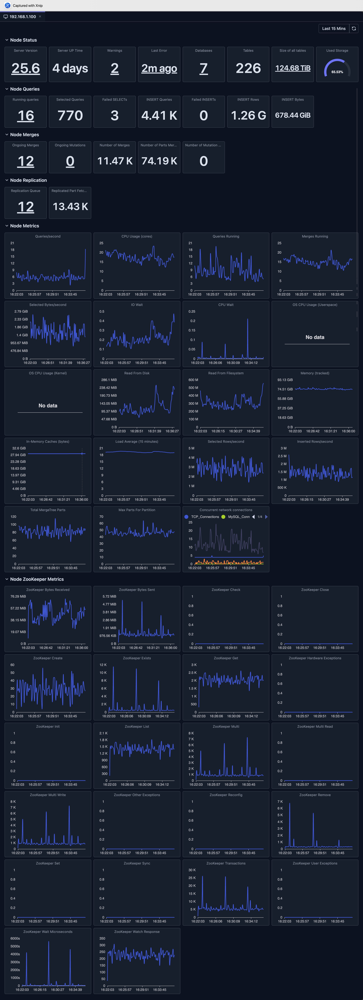

# Node Dashboard（节点仪表盘）

Node Dashboard 提供单个 ClickHouse 节点的详细指标，让你深入洞察节点特定的性能与健康状态。

## 概览

Node Dashboard 是一个无需任何配置的预置监控视图。它会自动：

- **聚合指标**：从 ClickHouse 系统表收集数据
- **可视化性能**：以图表、仪表和表格展示指标
- **提供下钻**：点击指标查看详细的拆解
- **实时更新**：自动或手动刷新以查看最新数据

## 打开 Node Dashboard

1. **选择节点**：点击结构树中的主机名节点，或点击侧边栏 Dashboard 图标下的"Node Dashboard"项
2. **查看 Dashboard**：节点 Dashboard 自动显示

## Dashboard 概览

Dashboard 展示关键的节点健康指标：

- 服务器版本
- 服务器运行时长
- 警告
- 错误
- 查询
- Merge
- Mutation
- 复制状态
- 关键指标

## Dashboard 功能

### 时间范围选择

Dashboard 支持灵活的时间范围选择：

- **预定义范围**：最近 15 分钟、最近 1 小时、今天、最近 7 天等
- **自定义范围**：选择具体的开始和结束时间
- **自动刷新**：按间隔自动刷新数据（在支持的情况下）

### 图表类型

Dashboard 使用多种可视化类型：

- **Stat 卡片**：带下钻的单值指标
- **折线图**：含多条时间序列的数据
- **柱状图**：分布与对比数据
- **仪表盘**：百分比和阈值指示器
- **表格**：支持排序和分页的详细数据

### 下钻

许多 Dashboard 支持下钻功能。

例如，对于"Total Data Size"Stat 面板，点击该面板会打开一个对话框展示数据大小详情，即每个服务器的数据大小，从而让我们了解原始总大小指标的分布。

### 刷新与自动刷新

- **手动刷新**：点击刷新按钮更新数据
- **自动刷新**：启用自动更新（在支持的情况下）

## 限制

- **系统表访问**：需要对 ClickHouse 系统表的读权限
- **数据保留期**：指标取决于 ClickHouse 系统表的保留设置
- **可用性**：要求 ClickHouse 节点可用
- **版本兼容性**：部分指标在较旧的 ClickHouse 版本中可能不可用
- **性能影响**：查询较大的时间范围可能较慢，并消耗 ClickHouse 集群的资源

> **深入了解**：探索[系统日志内省](../04-cluster-management/system-log-introspection.md)，对系统表进行详细分析。

## 下一步

- **[Cluster Dashboard](./cluster-dashboard.md)** —— 查看所有节点的集群级指标
- **[Query Log Inspector](../03-query-experience/query-log-inspector.md)** —— 分析具体查询性能
- **[Schema Explorer](../04-cluster-management/schema-explorer.md)** —— 探索数据库结构
- **[系统日志内省](../04-cluster-management/system-log-introspection.md)** —— 深入了解查询和 Part 日志
