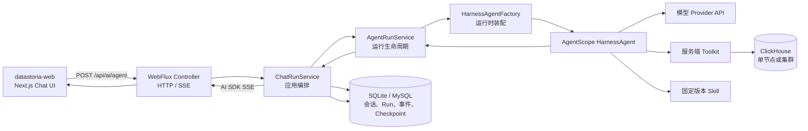
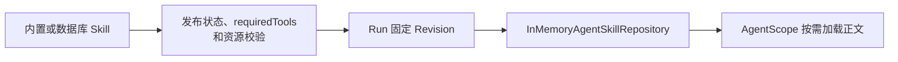
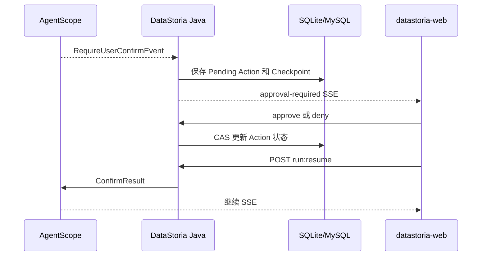
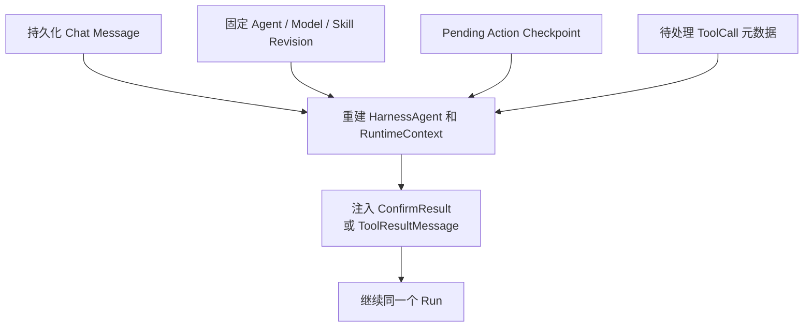
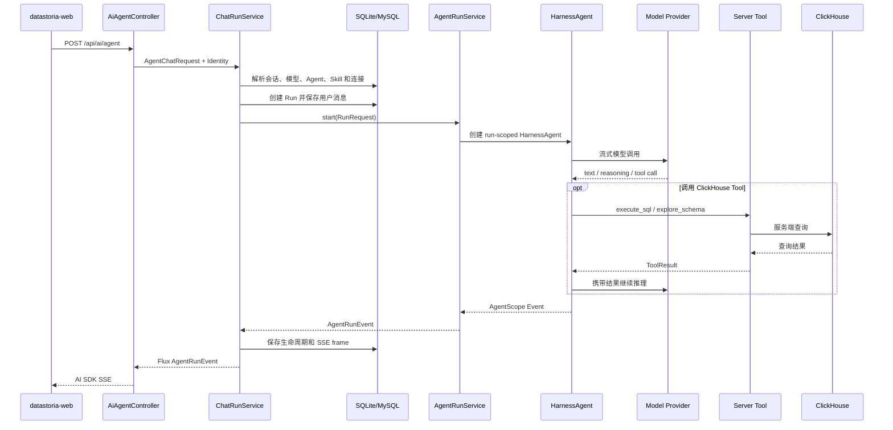

# AgentScope Java AI Agent 架构

本文描述 DataStoria 当前已经落地的 Java AI Agent 运行架构。详细设计约束参见
[Harness Agent 设计](../design/harness-agent.md)，前后端事件格式参见
[AI 流式协议](../api/stream-protocol.md)。

## 1. 架构目标

DataStoria 使用 AgentScope Java 2.0.0 的 `HarnessAgent` 作为单次 Agent 推理运行时，同时由
DataStoria Java 后端掌握身份、模型凭据、数据库连接、Tool、Skill、权限、生命周期、持久化和
恢复执行。

前端只负责：

- 提交消息和经过授权的资源 ID；
- 渲染 AI SDK SSE；
- 展示工具输入、输出和等待操作；
- 提交 approve、deny 或用户回答。

前端不能提交模型 API Key、ClickHouse 密码、系统 Prompt、Tool allowlist 或危险操作策略。

## 2. 总体结构



核心边界是：

> AgentScope 负责一次 Run 内的推理和 Tool 循环；DataStoria 负责运行前后的全部产品与安全语义。

## 3. 模块与代码目录

| Maven 模块              | Agent 相关职责                                                               |
| ----------------------- | ---------------------------------------------------------------------------- |
| `datastoria-common`     | `AgentRun`、`AgentRunEvent`、Checkpoint、Pending Action 等领域对象           |
| `datastoria-dao`        | Run、事件、Checkpoint、Skill、Pending Action 的 Repository、Mapper 和 Entity |
| `datastoria-service`    | ClickHouse 连接、模型配置和其他公共业务服务                                  |
| `datastoria-agent`      | AgentScope 适配、Run 编排、Tool、Skill、HITL、恢复和 SSE 编码                |
| `datastoria-controller` | Chat、Run、Action、Cancel、Resume 和 Replay API                              |
| `datastoria-boot`       | Spring Boot 入口、Profile、运行时 Bean 和基础设施装配                        |
| `datastoria-web`        | Chat UI、SSE 消费、Tool 卡片和用户操作                                       |

`datastoria-agent` 内部的主要职责分布：

```text
io.github.ccweixiao.datastoria.agent
├── application/
│   ├── ChatRunService                 请求解析和 Run 应用编排
│   ├── AgentRunService                Agent 生命周期、取消和资源释放
│   ├── RunLifecycleRecorder           Run、消息和 Pending Action 持久化
│   ├── AgentEventReplayService        精确 SSE frame 记录与重放
│   └── CheckpointStore                安全 Checkpoint 存取
├── runtime/
│   ├── HarnessAgentFactory            创建或恢复 HarnessAgent
│   ├── HarnessRunnableAgent           AgentScope 到 Reactor 的运行适配
│   ├── AgentEventMapper               AgentScope 事件到领域事件
│   ├── AgentToolRegistry              Tool 唯一注册源
│   ├── ConfiguredModelAdapterProvider 服务端模型与凭据解析
│   └── *AgentTools                    ClickHouse、工作流、仓库和 HITL 工具
└── skill/
    ├── BuiltinSkillProvisioner        内置 Skill 发布
    └── SkillToolAvailability          Skill requiredTools 校验
```

只有 `runtime` 适配层允许出现 `io.agentscope.*` 类型。Controller、领域对象和 DAO 不直接依赖
AgentScope，避免运行时升级扩散到协议和数据层。

## 4. Run 创建与执行

### 4.1 客户端请求

主要入口：

```http
POST /api/ai/agent
Idempotency-Key: <client-request-id>
Content-Type: application/json
```

客户端可提交 `sessionId`、`connectionId`、`modelConfigId`、`agentId`、消息和展示上下文。Java
Controller 会拒绝请求体中的 API Key、连接密码或 Token。

### 4.2 服务端解析

`ChatRunService` 在专用 JDBC Scheduler 上解析并固定本次 Run 所需资源：

1. 当前 tenant 和 user；
2. Chat Session、历史消息与附件；
3. Agent Definition 和不可变 Agent Revision；
4. 模型配置、Provider 和服务端密钥；
5. ClickHouse Connection 和访问能力；
6. 当前可见、已发布的 Skill Revision；
7. Tool、权限、超时、最大迭代次数和输出配置；
8. Run ID、Message ID 和幂等键。

浏览器只能选择有权访问的资源 ID，不能覆盖服务端 Prompt、Tool 权限或凭据。

### 4.3 HarnessAgent 装配

`HarnessAgentFactory` 为每个 Run 创建独立 `HarnessAgent`：

- 注入 system prompt 和模型；
- 注册当前 Run 的 Toolkit；
- 注入固定 Skill Revision；
- 设置 AgentScope Permission Context；
- 配置最大迭代次数和 memory compaction；
- 将历史消息、当前消息和图片附件转换成 AgentScope `Msg`；
- 创建 Run 级 `RuntimeContext`；
- 返回 AgentScope-free 的 `RunnableAgent`。

Agent 实例不跨 Run、用户或租户复用。

### 4.4 最小权限

当前运行时明确关闭未授权的 AgentScope 能力：

- 文件系统工具；
- Shell 工具；
- AgentScope memory 工具和 memory hook；
- Workspace context；
- `@path` 展开；
- 默认工作区 Skill；
- 非 DataStoria 注册的工具。

DataStoria 自己提供的 `search_file` 和 `read_file` 仍受服务端 repository root、路径规范化和
Tool policy 约束，不等同于开放 AgentScope 文件系统能力。

## 5. 模型适配

模型边界为：

```text
ConfiguredModelAdapterProvider
        ↓
ModelAdapter
        ↓
AgentScope Model
```

模型配置和 Secret 在服务端数据库中解析、解密并注入，Controller 和前端不接触明文密钥。
当前运行时包含 OpenAI-compatible、Anthropic、Gemini 和专用 Responses API 适配能力。
采用 OpenAI-compatible API 的 GLM、Kimi、MiniMax、百炼、DeepSeek 等供应商通过不同的
Base URL、模型名和能力配置接入。

模型错误在运行时边界映射为稳定、安全的失败码；原始 Provider 错误、Prompt 和凭据不会进入
前端 SSE。

## 6. Tool 与权限

`AgentToolRegistry` 是服务端 Tool 的唯一注册源。Skill 可用性校验和每个 Run 的 Toolkit 都从
这个注册源派生，避免维护两份容易漂移的工具清单。

当前主要分组：

| 分组                | Tool                                                                                                                     |
| ------------------- | ------------------------------------------------------------------------------------------------------------------------ |
| ClickHouse 只读发现 | `get_tables`、`explore_schema`、`validate_sql`                                                                           |
| ClickHouse 扩展分析 | `execute_sql`、`collect_sql_optimization_evidence`、`search_query_log`、`collect_cluster_status`、`collect_rca_evidence` |
| 工作流与交互        | `generate_sql`、`optimize_sql`、`generate_visualization`、`search_file`、`read_file`、`ask_user_question`                |

每个 Run 根据身份、Connection、Agent Revision 和策略构造 `AgentRunCapabilities`，其中包含：

- 固定 Skill 列表；
- Run 级 Tool 实例；
- Permission Context。

ClickHouse Tool 接收的是服务端已经解析和授权的 Connection 上下文，而不是客户端提供的连接
密码。SQL 执行还需要经过分类、只读限制、超时、结果截断和错误脱敏。

## 7. Skill 生命周期



Skill 使用渐进加载：

1. Run 创建时查询当前用户可见的已发布 Skill；
2. 校验 Skill 声明的 `requiredTools`；
3. 将选中的版本写入 Run Skill Pin；
4. 只把固定版本目录提供给本次 Agent；
5. Agent 在需要时加载正文和资源。

Skill 后续发布新版本不会改变已经开始或等待恢复的 Run。

## 8. 事件与前端协议

AgentScope 原生事件不会直接暴露给前端：

```text
AgentScope AgentEvent
        ↓ AgentEventMapper
DataStoria AgentRunEvent
        ↓ AiSdkStreamEncoder
AI SDK UI Message Stream
        ↓
datastoria-web
```

`AgentEventMapper` 负责转换：

- Run start、complete、failed、cancelled；
- text start、delta、end；
- reasoning start、delta、end；
- Tool input、output 和错误；
- token usage；
- approval required；
- question required。

这种适配保证前端依赖稳定的 DataStoria/AI SDK 协议，而不是 AgentScope 内部事件结构。

## 9. 数据与持久化

Agent 相关状态分为三个层次：

| 状态                        | 作用                               |
| --------------------------- | ---------------------------------- |
| Chat Session / Message      | 用户可见的产品会话记录             |
| Agent Run / Event           | 一次执行的生命周期、审计和重放记录 |
| Checkpoint / Pending Action | 暂停和安全恢复所需的控制状态       |

核心表包括：

- `ds_agent_run`
- `ds_agent_event`
- `ds_agent_checkpoint`
- `ds_agent_pending_action`
- `ds_agent_run_skill`
- `ds_chat_session`
- `ds_chat_message`

Checkpoint 不保存 API Key，也不把完整 `HarnessAgent` Java 对象序列化到数据库。产品消息与
恢复控制状态相互分离。

## 10. 用户审批与提问

### 10.1 Tool 审批



### 10.2 用户提问

`ask_user_question` 是服务端 Tool。它触发 AgentScope suspension，而不是要求浏览器执行 Tool：

1. Java 保存问题、ToolCall 元数据和 Checkpoint；
2. Run 进入等待输入状态；
3. 前端显示问题并调用 `:respond`；
4. 前端调用 `:resume`；
5. Java 将回答构造成 `ToolResultMessage`；
6. 新建 HarnessAgent 并继续原 Run 的执行序列。

相关 API：

```http
POST /api/ai/runs/{runId}/actions/{actionId}:approve
POST /api/ai/runs/{runId}/actions/{actionId}:deny
POST /api/ai/runs/{runId}/actions/{actionId}:respond
POST /api/ai/runs/{runId}:resume
```

Action 修改和 Resume 请求都要求幂等键。Pending Action 使用状态和 revision 做并发控制，避免
重复点击造成重复恢复。

## 11. JVM 重启恢复

活动 JVM 中的 AgentScope `AgentStateStore` 是内存状态。JVM 重启后，DataStoria 不尝试恢复
旧 Java 对象，而是安全重建：



该方式有以下安全属性：

- 不持久化 API Key 或 Provider Client；
- 不依赖 AgentScope 私有对象序列化格式；
- 不反序列化任意 JVM 对象；
- 历史消息从 DataStoria 产品数据重建；
- Checkpoint 只承载恢复所需的安全控制状态。

因此，这里的 Checkpoint 是控制面 Checkpoint，不是完整 Agent 内存快照。

## 12. SSE 重放与取消

`AgentEventReplayService` 保存已经编码完成的精确 SSE frame。客户端断线后可发送：

```http
Last-Event-ID: <last-sequence>
Idempotency-Key: <original-request-id>
```

服务端根据租户、用户和原幂等键找到 Run，并从指定序号之后重放。重放已经发送的 frame 不会
重新执行模型或 Tool。

还可查询：

```http
GET /api/ai/runs/{runId}
GET /api/ai/runs/{runId}/events?after=<sequence>
```

取消方式：

```http
POST /api/ai/runs/{runId}:cancel
```

浏览器断开实时 SSE 时，Reactor cancellation 会向上传播并取消模型流，同时调用
`HarnessAgent.interrupt()`。显式取消通过 Run 所有者校验后执行相同的协作式中断。Agent 结束后
从活动注册表移除，并在专用线程释放资源，避免阻塞 Netty event loop。

## 13. 关键执行时序



## 14. 关键实现入口

| 关注点                           | 实现                                                            |
| -------------------------------- | --------------------------------------------------------------- |
| Chat HTTP/SSE                    | `datastoria-controller/.../compat/AiAgentController.java`       |
| Run 查询、Action、Resume、Cancel | `datastoria-controller/.../AgentRunController.java`             |
| 应用编排                         | `datastoria-agent/.../application/ChatRunService.java`          |
| 生命周期和取消                   | `datastoria-agent/.../application/AgentRunService.java`         |
| AgentScope 装配与恢复            | `datastoria-agent/.../runtime/HarnessAgentFactory.java`         |
| Reactor 运行适配                 | `datastoria-agent/.../runtime/HarnessRunnableAgent.java`        |
| Tool 注册                        | `datastoria-agent/.../runtime/AgentToolRegistry.java`           |
| 事件转换                         | `datastoria-agent/.../runtime/AgentEventMapper.java`            |
| SSE 编码                         | `datastoria-agent/.../application/AiSdkStreamEncoder.java`      |
| SSE 持久化与重放                 | `datastoria-agent/.../application/AgentEventReplayService.java` |
| Checkpoint 存取                  | `datastoria-agent/.../application/CheckpointStore.java`         |

## 15. 相关文档

- [系统总体架构](overview.md)
- [Harness Agent 详细设计](../design/harness-agent.md)
- [数据库数据模型](../design/database-data-model.md)
- [AI 流式协议](../api/stream-protocol.md)
- [HTTP API](../api/http-api.md)
- [密钥与敏感信息](../security/secrets.md)
- [datastoria-web 开发与调试](../development/datastoria-web.md)
