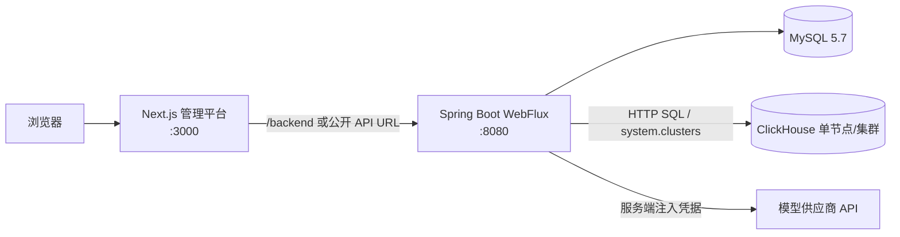
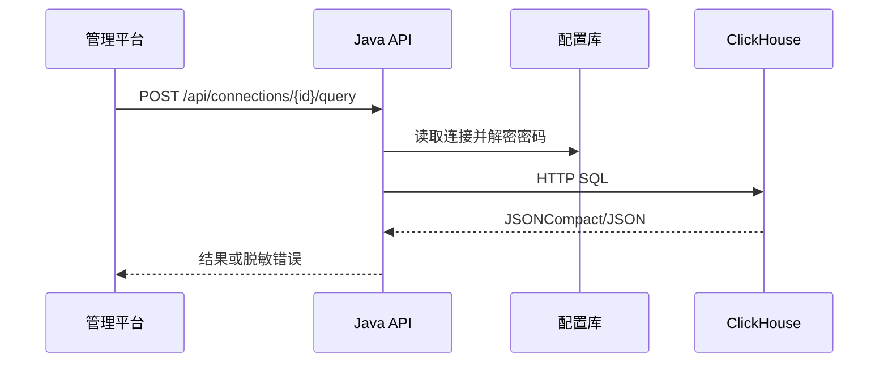
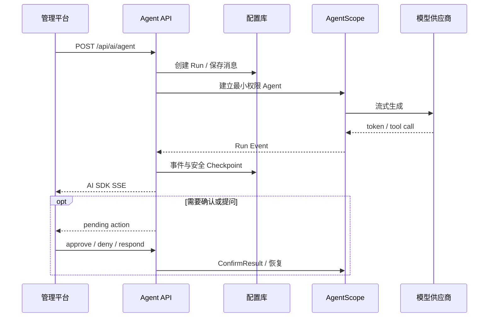
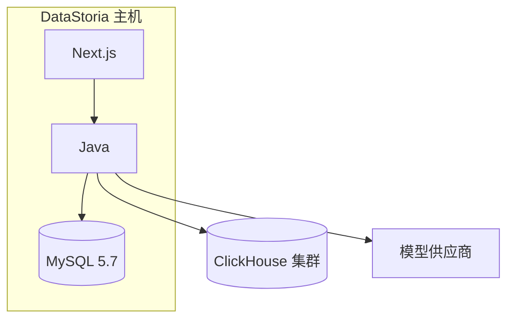

# 系统架构

本文描述整个 DataStoria 系统的顶层结构。Java AI Agent 的运行、Tool、Skill、Checkpoint、
HITL 和 SSE 实现详见 [AgentScope Java AI Agent 架构](agent-runtime.md)。

## 总览

统一部署时 Next.js 与 Java 是同一安装目录中的两个进程。浏览器请求 `/backend/**`，Next.js
Route Handler 转发到内部 Java 地址；前后端分离部署时，构建阶段可写入公开 Java API 地址。

## 后端分层

| Maven 模块              | 根包                                        | 职责                                                   |
| ----------------------- | ------------------------------------------- | ------------------------------------------------------ |
| `datastoria-common`     | `io.github.ccweixiao.datastoria.common`     | 共享领域对象、DTO、身份、错误、加密与通用配置          |
| `datastoria-dao`        | `io.github.ccweixiao.datastoria.dao`        | Repository 契约、MyBatis-Plus Mapper/Entity、Migration |
| `datastoria-service`    | `io.github.ccweixiao.datastoria.service`    | 业务用例、事务边界和外部服务访问                       |
| `datastoria-agent`      | `io.github.ccweixiao.datastoria.agent`      | AgentScope、Run 生命周期、Tool、Skill 与恢复           |
| `datastoria-controller` | `io.github.ccweixiao.datastoria.controller` | HTTP/SSE、请求校验、身份边界与错误映射                 |
| `datastoria-boot`       | `io.github.ccweixiao.datastoria.boot`       | Spring Boot 入口、Profile 和基础设施装配               |

模块层级由低到高为 `common → dao → service → agent → controller → boot`，实际依赖箭头
始终从右向左。上层可以组合多个下层模块，但下层模块不能引用 Controller 或 Boot。只有
`datastoria-boot` 生成可执行
Spring Boot JAR，其余模块生成普通依赖 JAR。

Controller 不直接拼装 SQL 持久化语句；Repository 通过统一 Mapper XML 访问 MySQL。
双方言的结构变化保持相同 Flyway 版本号。

## 关键数据流

### ClickHouse 查询

浏览器只提交连接 ID 和 SQL，不接收已保存的密码。针对集群 Dashboard，Java 可以按拓扑中的
目标节点执行查询；集群汇总查询只允许使用配置中匹配的集群名。

### AI 会话与恢复

Run、事件序列、Checkpoint 和待处理 Action 都是服务端状态。`Last-Event-ID` 用于断线后重放；
Java 重启后从安全 Checkpoint 与会话消息重建运行上下文。Checkpoint 不保存 API Key。

## 数据与租户边界

- `dev` 与 `prod` profile 都使用 MySQL 5.7、同一套 Mapper、Flyway migration 和
  `MysqlAgentStateStore`；
- Profile 只区分开发身份与生产 OAuth，以及各自的连接参数；
- 业务表通过 `tenant_id`、用户标识和显式 Repository 条件隔离；
- 供应商、ClickHouse 等凭据使用 AES-256-GCM 加密后存入 Secret 表；
- Flyway 是运行时唯一 Schema 所有者，`db/schema/` 仅作为人工快照。

## 部署边界

生产环境应把 MySQL、ClickHouse 和模型出口视为独立安全域，并在反向代理或负载均衡层提供
TLS。统一包不强制 Nginx，但不代表公网部署可以省略 TLS、访问控制和审计。
