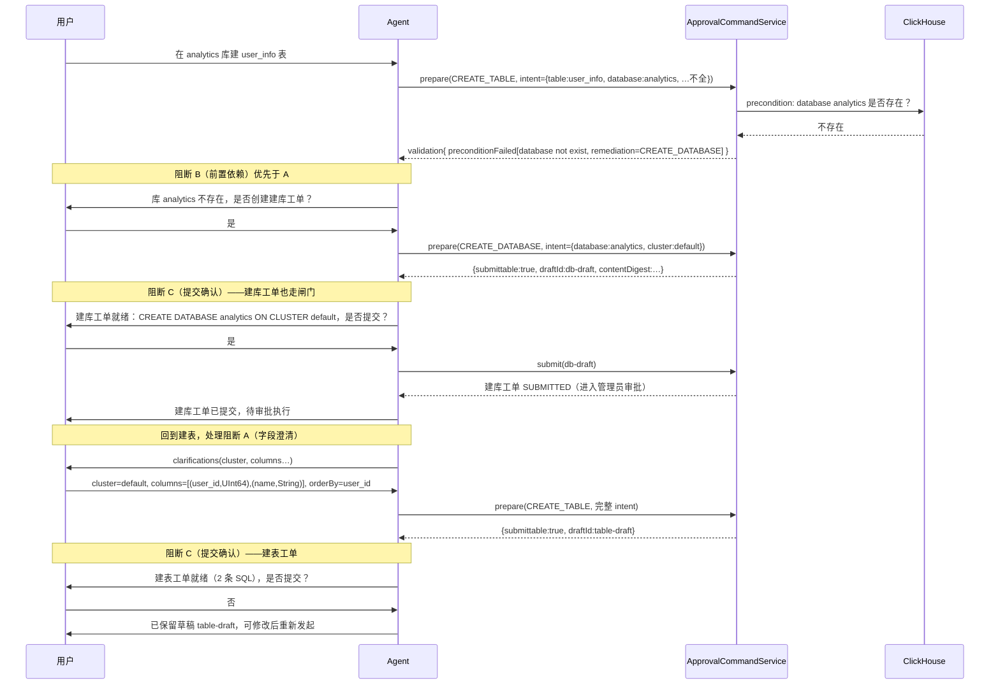

# Agent 驱动的 DDL 工单对话流设计

本文档是 [通用审批与 ClickHouse DDL 工单设计](ddl-approval-workflow.md)（下称**基线**）的演进
补充，不替换基线。基线定义了 prepare / submit / 审批 / 执行 的完整骨架与不变量；本文聚焦其中
一个体验断面——**Agent 如何在一次对话中，把用户的模糊请求收敛成一个或多个合法、可提交的 DDL
工单**，并定义其间必须阻断、等待用户决策的对话节点。

阅读前请先了解基线第 2 节（两套审批机制的边界）、第 6 节（资源与依赖处理）、第 7.5–7.6 节
（Skill / Tool 职责与 prepare/submit 契约）。

## 1. 背景与问题

当前实现已具备完整的工单状态机、资源锁、frozen 快照与 revalidate。但在「Agent 对话侧」存在三
个相互关联的缺口，集中表现为：用户发起「在 analytics 库建 user_info 表」时，`prepare_ddl_approval`
因 `intent` 缺少 `database` 抛出笼统的 `One or more request fields are invalid.`，且 Agent 无从知道
该问用户什么。

| 缺口 | 表现 | 对应基线 |
| ---- | ---- | ---- |
| **intent schema 是隐式知识** | 该传哪些字段只埋在各 `Descriptor.compile()` 的 `requiredText` 调用顺序里；`list_approval_work_order_types` 不返回字段结构；校验失败只报通用 `INVALID_REQUEST` | 基线 7.6 契约声明了 `requiredIntentFields`，但实现未将其落地为 Agent / 前端可消费的声明式数据 |
| **前置依赖一刀切拒绝** | 建表时目标库不存在直接 `APPROVAL_DEPENDENCY_NOT_SUPPORTED`，对话中断，用户无路径继续 | 基线第 6 节**刻意**首期不支持依赖编排；该克制正确，但「库未创建」是最高频的真实场景，需要有限演进 |
| **提交前确认是非结构化的** | `submit_ddl_approval` 是 `readOnly=false`，已触发第一层 HITL confirm，但确认呈现不带工单摘要，且 deny 的语义（是否保留草稿）未明确 | 基线 7.6 已要求「提交需用户确认，授权记录在服务端」；本设计强化其呈现与 deny 语义 |

三个缺口同根：**intent 该长什么样，全系统没有一份声明式、可消费的事实源**。它既是 Agent 盲调的
根因，也是「每加一种 DDL 类型就要新增 `Descriptor` 子类 + `validateSafeRules` 的 `switch` 分支」的
根因。本文以一份声明式 schema 同时治这三个症状，并把对话中必须阻断的节点显式化为**三个对话阻断
点**。

## 2. 设计原则（演进约束）

1. **安全边界仍在 Tool / 服务端**——沿用基线 7.5。声明式 schema 只描述「需要什么」，mandatory
   规则、资源锁、frozen/revalidate 仍在服务端强制，Agent 与用户的确认都不能绕过。
2. **不破坏基线不变量**——`contentDigest`、`revision` CAS、资源 claim、frozen 快照语义保持不变；
   新增 schema 进入 checksum，复用既有 revalidate 路径。
3. **不引入跨工单 DAG 自动编排**——沿用基线第 6 节克制。「级联」仅指**单步前置工单建议**（库
   不存在 → 建议建库工单），不自动链式编排多工单、不自动等待前置完成。
4. **声明式优先**——新增 DDL 类型尽量以「字段 schema + 模板」声明注册，不新增 `switch` 分支；
   过程逻辑特殊的少数类型保留代码兜底（渐进式，见第 7 节）。
5. **补救只覆盖「系统可自足生成 intent」的工单**——建库只需库名 + cluster，可推断；建表需要列
   结构，系统无法替用户推断。因此「表不存在」不自动级联建表，避免过度自动化构成安全风险。

## 3. 设计基石：声明式 intent schema

每个工单类型在 `ds_approval_type_definition` 上新增 `intent_schema_json`，声明字段级元数据：

```json
{
  "fields": [
    {"name": "database",   "type": "identifier",        "required": true, "source": "user-provided",
     "question": {"zh-CN": "要在哪个库建表？", "en": "Target database?"},
     "optionsSource": "databases-of-connection"},
    {"name": "table",      "type": "identifier",        "required": true, "source": "user-provided",
     "question": {"zh-CN": "逻辑表名？（无需 _local/_all 后缀）", "en": "..."},
     "constraint": "notSuffix:_local,_all"},
    {"name": "cluster",    "type": "identifier",        "required": true, "source": "user-provided",
     "optionsSource": "clusters-of-connection"},
    {"name": "columns",    "type": "array<object>",     "required": true, "source": "mixed",
     "items": {"name": "identifier", "type": "columnType"}},
    {"name": "orderBy",    "type": "array<identifier>", "required": true, "source": "agent-derived",
     "constraint": "subsetOf:columns.name", "default": "first-column"},
    {"name": "shardingKey","type": "identifier",        "required": true, "source": "agent-derived",
     "constraint": "memberOf:columns.name"}
  ]
}
```

字段元数据要点：

- **`source` 四值**是整份设计的灵魂，决定字段缺失时由谁补全：
  - `user-provided`——业务知识，Agent 物理上不可能知道（库名、cluster），缺失即触发澄清；
  - `agent-derived`——可从上下文推断（`orderBy`/`shardingKey` 可建议、列类型可语义猜测），缺失时
    Agent 自行推断或带 default，**不打断用户**；
  - `schema-verified`——系统可查证（列是否已存在、key 是否受保护），走 `DdlSchemaInspector`；
  - `mixed`——用户给语义、Agent 推类型（`columns`）。
- **`optionsSource`** 声明动态选项来源（连接的库列表 / cluster 列表），由服务端在 prepare 时查询
  填充，问题选项不硬编码在每种工单里。
- **`constraint`** 把现在散落在 `compile()` 里的 `shardingKey ∈ columns`、表名后缀检查提升为声明。
- **纳入 type checksum**（与 `generation_rule_json` 一起），frozen 时连同 schema 一起冻结。

一份 schema 同时服务三处：① Agent 经 `list_approval_work_order_types` 自助得知该传什么；
② `compile` 基于它做通用字段校验；③ 校验失败时精确报「`intent.database` required」。它也是前端
`/capabilities` 动态表单的单一事实源，消除「前端字段写死 + 后端 Descriptor 隐式」的两份真相。

## 4. 三个对话阻断点

一个工单从模糊请求到提交，最多经过三类必须阻断、等待用户决策的节点。三者按优先级与所处阶段
区分，不混为一谈：

| 阻断点 | 所处阶段 | 触发条件 | 主导方 |
| ------ | -------- | -------- | ------ |
| **B 前置依赖** | prepare | 目标对象不满足前提（库不存在） | 服务端建议、用户决定 |
| **A 字段澄清** | prepare | `user-provided` 字段缺失或非法 | 服务端出题、Agent 转达 |
| **C 提交确认** | submit | 工单已就绪、可提交 | 申请人确认 |

优先级 **B > A**：库都不存在时，先解决前置依赖，再追问列定义。C 独立在 submit 阶段。三类阻断都
不新增审批层，全部落在基线第 2 节定义的「第一层 tool-call HITL」之内或之前；提交之后仍走基线的
「第二层」管理员审批。

### 4.1 字段澄清（A）——服务端主导

`prepare` 不再「compile-or-fail」一次性抛 `INVALID_REQUEST`，而是在校验阶段产出结构化结果：

```json
{
  "submittable": false,
  "draftId": null,
  "validation": {
    "missing": ["database", "cluster", "columns", "orderBy", "shardingKey"],
    "invalid": [],
    "clarifications": [
      {"field": "database", "question": "要在哪个库建表？",
       "options": ["analytics", "logs"], "optionsSource": "databases-of-connection"},
      {"field": "cluster",  "question": "目标集群？",
       "options": ["default"], "optionsSource": "clusters-of-connection"}
    ]
  }
}
```

`clarifications` **只含 `source=user-provided` 的缺失项**；`orderBy`/`shardingKey` 这类
`agent-derived` 字段不出现在澄清里，而是附带提示告诉 Agent「这两项我可以自己推断或给 default」。

闭环：Agent 拿到 `clarifications` → 调 `ask_user_question`（需从「exactly one」放宽到 N，一次问完）
原样转达，**不自行改写或臆测 `user-provided` 字段值** → 用户回答回填 intent → 对 `agent-derived`
字段 Agent 自行推断 → 再次 `prepare`。问题文案与选项均来自服务端 schema，保证服务端是单一事实源、
可复用于前端表单，避免 Agent 凭空编造问题。

### 4.2 前置依赖级联（B）——建库示例

schema 增加 `preconditions` 声明，描述 prepare 阶段的目标对象存在性检查与失败补救：

```json
{
  "preconditions": [
    {"check": "database-exists", "field": "database",
     "onFail": {"action": "suggest-work-order", "type": "CLICKHOUSE_CREATE_DATABASE",
                "intentFrom": {"database": "database", "cluster": "cluster"}}}
  ]
}
```

建表 prepare 时若 `analytics` 库不存在，`validation` 返回：

```json
{
  "preconditionFailed": [
    {"check": "database-exists", "database": "analytics",
     "remediation": {"type": "CLICKHOUSE_CREATE_DATABASE",
                     "suggestedIntent": {"database": "analytics", "cluster": "default"}}}
  ]
}
```

Agent 据此**阻断**询问用户「库 analytics 不存在，是否创建建库工单？」。用户「是」→ Agent 以
`suggestedIntent` 调 `prepare(CREATE_DATABASE)` → 该建库工单同样要经过 4.3 的提交确认闸门 C →
`submit` 进入 `SUBMITTED`。

**关键边界（尊重基线第 6 节克制）**：级联只到「生成 + 提交前置工单」为止。主工单（建表）**不**
与前置工单建立硬依赖、不自动等待其执行完成。两种处理路径：

- **推荐（P4 落地）**：主工单以草稿保留，Agent 明确提示用户「待建库工单审批执行完成后，回来重新
  发起建表」，并在用户返回时由 Agent 重新 `prepare`（届时库已存在，前置检查通过）。
- **未来可选**：Agent 通过 `get_approval_status` 轮询前置工单，`SUCCEEDED` 后主动软提醒继续；仍不
  建立工单间的状态机依赖。

**补救的安全边界（第 2 节原则 5）**：`remediation` 只允许建议「系统有足够信息自动生成 intent」的
工单。建库只需 `database + cluster`，可由主工单 intent 推断；建表需要列结构，系统无法替用户推断，
因此「加列时表不存在」不会自动级联建表。是否提供 `remediation` 由各类型 schema 显式声明，没有
声明 `onFail` 的 precondition 仍退化为基线的 `APPROVAL_DEPENDENCY_NOT_SUPPORTED` 直接拒绝。

`CLICKHOUSE_CREATE_DATABASE` 作为新的内置工单类型，其 intent 仅 `{database, cluster}`、DDL 模板为
`CREATE DATABASE {database} ON CLUSTER {cluster}`，是声明式 schema + 模板化生成的第一个落地场景
（见第 7 节）。

### 4.3 提交确认闸门（C）——强化现有 HITL

`submit_ddl_approval` 已是 `readOnly=false`，提交动作本身已触发基线第一层 HITL confirm。本设计不新
增机制，而是强化其**呈现**与 **deny 语义**：

- **结构化 confirm payload**：确认对话框展示工单编号、有序 SQL、目标对象、风险等级、不可变
  `contentDigest`，而非泛化的「是否允许本次工具调用」。
- **deny = 回草稿**：用户拒绝提交时，工单**不**进入 `SUBMITTED`、**不**删除草稿；用户可修改 intent
  后用 `draftId + expectedRevision` 重新 `prepare` 并再次 `submit`。这复用基线既有的草稿更新路径，
  不引入新状态。
- **明确层级**：此确认是「申请人确认是否提交」，**不是**「管理员审批」。提交后仍按基线第二层由
  管理员 approve/reject。两件不可混淆。

## 5. 完整对话时序

下图把 A / B / C 三个阻断点串成一次「在 analytics 库建表，但库不存在」的完整对话：



注意三个阻断点在对话中**可复用、可嵌套**：建库工单自身也可能先触发 A（澄清 cluster），再触发 C；
主建表工单则完整经历 B → A → C。每个工单独立走自己的 prepare/submit 生命周期，彼此不共享 revision
或 digest。

## 6. 与两套审批机制的关系

基线第 2 节区分了「第一层 tool-call HITL」与「第二层工单业务审批流」。本设计的全部阻断点都落在
第一层之内或之前，**不新增审批层**：

| 节点 | 归属 | 用的机制 |
| ---- | ---- | -------- |
| A 字段澄清 | prepare 阶段，第一层之前 | `ask_user_question`（ToolSuspend） |
| B 前置依赖 | prepare 阶段，第一层之前 | `ask_user_question` 转达补救建议 |
| C 提交确认 | submit 阶段，第一层 | `submit_ddl_approval` 的 HITL confirm（强化 payload） |
| 管理员审批 | submit 之后 | 基线第二层，不变 |

A 与 B 在「prepare 返回结构化 validation」时由 Agent 决定如何转达；C 是 submit 动作自带的 HITL。
三者都不触及 `ApprovalStatus` 的 `APPROVED/REJECTED`——那是管理员专属的第二层。

## 7. 通用化与边界（渐进 C）

声明式 `intent_schema_json` 让新增类型（如 `CLICKHOUSE_CREATE_DATABASE`）以「字段 schema + DDL 模板」
注册，而非新增 `Descriptor` 子类与 `validateSafeRules` 的 `switch` 分支。演进分三步，与基线第 8 节
的接口结构对齐：

1. **基类 schema 引擎**——`AbstractDdlDescriptor` 用通用 `validate(intent, schema)` 替代各类型手写
   的 `requiredText` 链，返回结构化 `ValidationResult`（含 clarifications / preconditionFailed）而非
   直接 throw。`Descriptor.compile()` 前置该通用校验。
2. **Descriptor 瘦身**——简单类型（建库、加列）退化为「schema + 模板」配置，由通用模板化 descriptor
   消费；`compile()` 只剩 DDL 拼装。
3. **复杂类型保留兜底**——`add_index` 的可选 MATERIALIZE 第二语句、`modify/drop_column` 的 key 保护
   是真实的过程逻辑，保留在 `compile()` 代码中。这是渐进 C 的 plugin 点，承认纯数据驱动有上限。

> 诚实边界：不是一切 DDL 都能纯模板化。强求会把可读的过程逻辑压成晦涩的声明，反而更难维护。声明
> 式覆盖「字段定义 + 约束 + 简单模板」，过程逻辑留给代码。

## 8. frozen / revalidate 一致性

`intent_schema_json` 纳入 type checksum，与基线第 5、9.1 节的 frozen 语义对齐：

- 工单 frozen 时连同 schema 一起冻结进 `content_json`；
- execute 前 revalidate 不只重编译 DDL 比对，还要用 **frozen schema** 重新校验 intent——防止管理员
  中途修改 schema 导致老工单语义漂移；
- checksum 比对覆盖 schema，`DDL_REVALIDATION_REQUIRED` 路径不变。

## 9. 落地路径

| 阶段 | 内容 | 收益 |
| ---- | ---- | ---- |
| **P1** | `intent_schema_json` 数据；`prepare` 返回 `validation`（clarifications）；`list_*` 带 schema；`ask_user_question` 放宽到 N；提交确认 payload 结构化 | 根治 `database` 缺失类盲调 bug；打通 A 与 C；前端拿到字段真相 |
| **P2** | 基类 schema 引擎统一字段抽取/校验，`Descriptor` 瘦身 | 消除 `requiredText` 重复链；精确报错 |
| **P3** | DDL 模板化 + 派生声明；`CLICKHOUSE_CREATE_DATABASE` 声明式注册 | 新增类型零 switch |
| **P4** | `preconditions` + `remediation` 机制；级联建库 | 打通 B |

P1 可独立交付、立即止血；级联（B）依赖 P3 的 `CREATE_DATABASE` 类型与 precondition 框架，故排在
P4。各阶段都同步更新 checksum / revalidate / 双语 i18n 文案。

## 10. 待决策项

- **前置工单的软提醒**：主工单草稿是否由 Agent 轮询 `get_approval_status` 在前置工单 `SUCCEEDED`
  后主动提醒继续（当前推荐：不做，由用户返回触发）。
- **clarifications 形态**：合并为单次多字段问询 vs 逐个追问（倾向单次，减少阻断轮次）。
- **`CREATE_DATABASE` 的 precondition**：应检查 cluster 在连接中存在、命名合规与权限，而非「库是否
  存在」（库本就是要建的）。
- **放弃提交后的草稿保留期**：deny submit 不删草稿，需要草稿 TTL / 显式 `interrupt` 清理策略，避免
  无限堆积。
