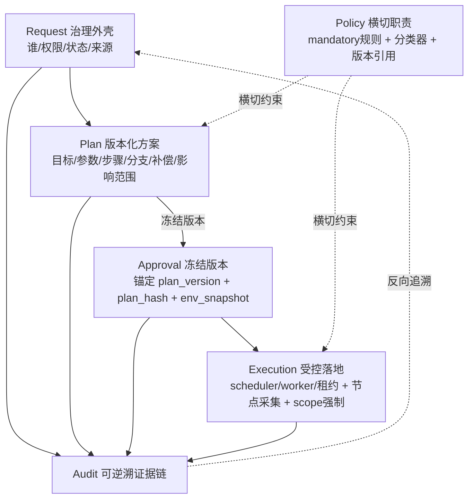
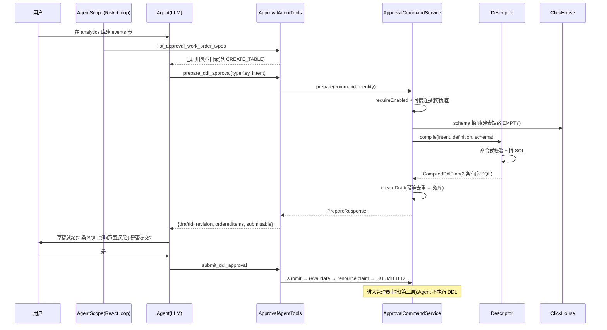
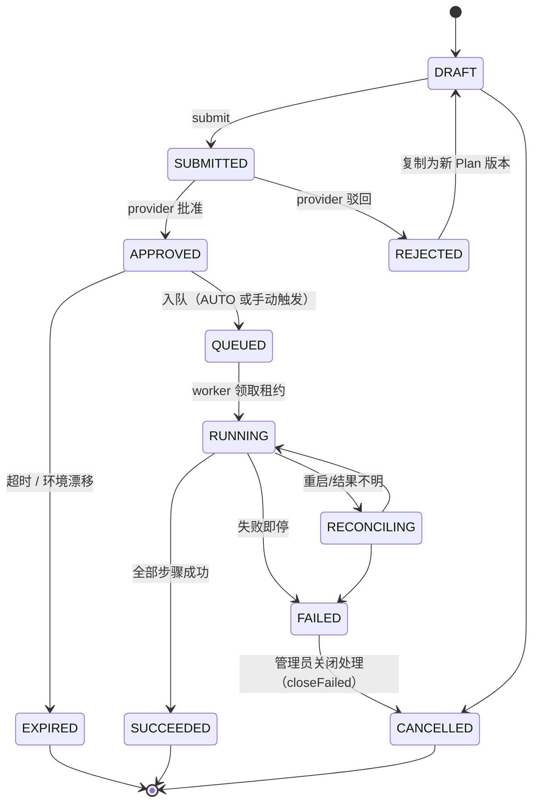

# 计划型工单设计（V3）：以 Plan 为核心的 Agent 审批体系

> **修订说明**：本版在初稿基础上做了**去过度持久化**的简化——砍掉 4 张新增表、延后两个尚未出现需求的抽象，保留全部承重概念。设计质量不降，join 更少、状态更少、分层更清。变更要点见 §0.2 与 §8。

## 0. 定位与阅读顺序

本文是 DDL 审批体系的**第三版**，定位为**承重结构重构**，不替换前两版，而是改变其骨架重心：

| 文档 | 角色 | V3 关系 |
| ---- | ---- | ---- |
| `ddl-approval-workflow.md`（基线 V1） | 通用审批 + ClickHouse DDL 工单完整骨架 | **保留外壳**：状态机 CAS、resource claim、frozen 快照、descriptor 编译、Tool/HITL、七张表方向不变 |
| `ddl-approval-agent-driven-flow.md`（V2） | Agent 对话断面：声明式 intent schema、三个对话阻断点 | **吸收并升级**：声明式 schema 纳入 Plan；阻断对象从「工单」明确为「Plan 版本」 |
| 本文（V3） | **Plan 一等公民化**：Request / Policy / Plan / Approval / Execution / Audit 六层职责分离 | 定义新增与改动 |

阅读前请先了解基线第 2、4、5、6、7、9 节。本文凡写 `保留` 的不变量不再重复论证。

### 0.1 一句话原则

> **Request 记录「谁要什么」，Plan 描述「具体怎么做」，Policy 约束「边界在哪」，Approval 冻结「某个版本」，Execution 受控落地，Audit 全程可逆溯。** 工单只是这条红线的外壳；用户审批的对象永远是 Plan 的一个冻结版本，不是 Agent 的自然语言思考过程，也不是逐条内部执行步骤。

### 0.2 本版的简化决策（相对初稿）

初稿提出了 4 张新表与若干抽象，复审后判定其中多数为**过早持久化 / 过早抽象**。本版的处置：

| 初稿提议 | 本版处置 | 理由 |
| ---- | ---- | ---- |
| `ds_approval_plan` 独立表 | **并入 `ds_approval_request`**（加列），领域模型仍保留 `Plan` record | 当前每工单 1–2 个版本，独立表 + join 不划算；历史版本走 event 日志（V1 模式）。升级触发条件见 §4.1 |
| `ds_approval_env_snapshot` 表 | **降为 request 上的 JSON 字段** | 快照写一次读一次，从不独立查询或 join |
| `ds_approval_policy_version` 表 | **降为引用值列** | 它是 `type_definition_revision + 路由 checksum` 的指针，不是实体 |
| `ds_approval_capability_lease` 表 | **删除**——执行时从冻结 Plan 派生 scope | scope 就是批准 Plan 的对象/动作集合，持久化只是重复；lease 状态复用既有列 |
| `ApprovalProvider` 抽象 | **延后**到第二种 provider 出现 | builtin 管理员审批现在够用；遵循 V1 §13「不为想象中的流程预先造分支」 |
| 路由矩阵（AUTO/MULTI/EMERGENCY + 维度表） | **延后**；首期固化一条最低规则 | 见 §5.3 |
| `SUCCEEDED_BY_PRECONDITION` 状态 | **并入 `SUCCEEDED` + reason** | 是 SUCCEEDED 的口味，用字段表达，不占终态枚举 |

**净效果**：新增表 **0 张**；新增列 3–4 个；复用 2 个既有闲置列；状态枚举净增仅 `EXPIRED`。

---

## 1. 为什么需要 V3

当前实现（基于代码现状，非文档意图）已跑通「5 种工单类型 prepare→submit→approve→手动 execute→finish」闭环，但存在一个**承重结构问题**：

> **Request 和 Plan 两层职责被压扁在同一个聚合里。**

证据（均为代码现状）：

- `ApprovalRequest` 同时承载治理字段与计划内容，没有 `plan_version` / `plan_hash` / 环境快照概念。
- Plan 完全埋在 `contentJson` 内，由 `ApprovalCommandService:563-575` 手工拼装；内容哈希是对**整个 contentJson** 的 SHA-256（`:1109`），粒度过粗，无法支撑「实质性变化才失效」的分类。
- `revalidate`（`:887`）只做「重编译 + schema fingerprint 比对」，**没有**独立环境快照，无法表达「漂移超过阈值」。
- 执行引擎是同步单机骨架：`APPROVED→RUNNING` 直跳（`JdbcApprovalRepository:519`），跳过基线定义却闲置的 `QUEUED`；`execution_lease_until` 列建了从不写；`ds_approval_node_execution` 永远只写一行伪数据（`createNodeExecution:573`）。
- `preconditionJson` 永远写 `null`（`:732`），`idempotencyStrategy` 永远是字面量 `"PRECONDITION"` 却无人消费。
- 没有 `ApprovalProvider` 抽象，`review()` 直连管理员 API。

V3 解决三件事：① Plan 一等公民化 + 版本化；② 环境快照 + 漂移过期；③ 执行引擎换芯。同时明确**不做什么**（§10），防止把确定性的东西做虚。

---

## 2. 设计原则：物理层 vs 逻辑职责

六层中，**只有 5 层需要物理表征（表/结构），Policy 是横切职责，不是表也不是 service**。这是本版最关键的分层澄清：

| 层 | 物理表征 | 逻辑职责 |
| ---- | ---- | ---- |
| **Request** | `ds_approval_request`（治理字段） | 谁（tenant/user）、权限范围、状态、来源 session、当前 Plan 版本、时间戳 |
| **Plan** | **并入** `ds_approval_request`（`content_json` + `plan_version`/`plan_hash` 列） | 结构化、可编辑、可版本化的执行方案 |
| **Policy** | **无表**（横切） | descriptor 强制规则 + change classifier + `policy_version_ref` |
| **Approval** | 决定值在 request + `ds_approval_event` 历史 | 锚定 `(plan_version, plan_hash, env_snapshot, policy_version)` |
| **Execution** | `ds_approval_execution` + `ds_approval_node_execution` | 严格按已批准 Plan 执行，scope 受限 |
| **Audit** | `ds_approval_event` | 从需求→计划变更→审批→节点结果的完整证据链 |

**两条不可逾越的红线**：

1. **自然语言不能驱动高风险工具调用**。Agent 的 NL 解释只是附议；结构化 Plan 是系统执行和审批的**唯一事实源**。
2. **安全边界仍在 Tool / 服务端**（沿用 V1 §7.5）。Policy 规则、resource 锁、frozen/revalidate、执行 scope 强制都在服务端，Agent 与用户的确认都不能绕过。

**落地映射**——六层**不实现成六个 service**，而是少数组件的职责标注：

```text
ApprovalCommandService   ← Request 治理 + Plan 生成编排 + classifier 调用
  ├─ descriptors          ← Policy 的 mandatory 规则（已有）
  ├─ ChangeClassifier     ← Policy 的变更分类（纯逻辑，无表）
  └─ DdlSchemaInspector   ← env 探测（已有，扩 cluster 拓扑）
ClickHouseDdlExecutor     ← Execution + scope allowlist（已有，换芯）
ds_approval_event         ← Audit（V1 已有）
```

Policy 没有自己的 service/表，它**横切在 Plan 生成与执行两个点上**。这样「六层」在代码里是清晰的职责标注，不是六个待理解的子系统。

---

## 3. 六层模型总览



下面六节逐层展开。**Plan（§4）和 Execution（§7）是改动重心**。

---

## 4. Plan 层（核心）

### 4.1 领域模型：一等公民概念，物理同居

Plan 在**领域模型里是一等公民**（独立 record、有自己的版本与哈希），但**物理上并入 `ds_approval_request`**，不单独建表。这是「概念纯粹」与「当前规模不值得 join」的折中。

```java
// 领域模型：Plan 是从 request 列 + content_json 重建的一等 record
public record Plan(
    RequestId requestId,
    int planVersion,                // 同一 request 内从 1 递增
    String planHash,                // 语义内容哈希（见 4.2）
    PlanStatus status,              // DRAFT / FROZEN / SUPERSEDED
    DdlIntent intent,               // 用户原始目标（结构化，非 NL）
    EnvSnapshot envSnapshot,        // 环境快照（JSON 字段，见 4.3）
    PolicyVersionRef policyVersion, // 生成时命中的策略版本引用
    List<PlanStep> steps,           // 有序执行步骤
    List<PlanBranch> branches,      // 声明式条件分支（见 4.5）
    CompensationPolicy compensationPolicy,
    ImpactScope impactScope,        // 影响范围摘要
    RiskSummary riskSummary
) {}

public record PlanStep(
    int ordinal,                    // 从 1 连续
    OperationKind operationKind,    // 稳定领域 code（沿用 V1）
    String sqlText,                 // 供人审批的最终 SQL
    String normalizedSqlDigest,
    List<ObjectRef> objectRefs,
    List<ObjectRef> readDeps,
    StepPrecondition precondition,  // 只读存在性检查（非任意 SQL）
    IdempotencyStrategy idempotency,
    List<Integer> dependsOn,
    SuccessCriteria successCriteria,
    FailureStrategy failureStrategy,
    Timeout timeout,
    RetryPolicy retryPolicy
) {}

public enum PlanStatus { DRAFT, FROZEN, SUPERSEDED }
```

物理存储（详见 §8）：`ds_approval_request` 增加 `plan_version`、`plan_hash` 列；`content_json` 持有冻结的 Plan 结构化快照（intent/steps/branches/compensation/impact/risk）；旧版本通过 `ds_approval_event` 的冻结快照保留（V1 模式）。

**Request 与 Plan 的边界**：Request 只留治理字段 + `currentPlanVersion`；Plan 的内容细节归 `content_json`。一个 Request 逻辑上有多个 Plan 版本，当前活跃的只有一个；旧版本 `SUPERSEDED`，不删除（审计要求）。

> **何时升级为独立 `ds_approval_plan` 表**：当出现「批量查询历史版本」「Plan 版本对比 UI」「按版本回滚」等需要跨 request 检索多版本的需求时再拆。当前规模不触发，YAGNI。

### 4.2 版本化与 `plan_hash`

`plan_hash` 是对 **Plan 语义内容**的 canonical SHA-256，输入包含：`intent` 规范化字段、`steps` 有序集合（ordinal + operationKind + normalizedSqlDigest + objectRefs + precondition + idempotency + 依赖）、`branches`、`compensationPolicy`、`impactScope` 关键字段。

**明确排除**纯运行时元数据（步骤内部 id、时间戳、重试计数），保证 `plan_hash` 稳定。

与 V1 `content_digest` 的分工（两者并存，各司其职，不是冗余）：

| 哈希 | 范围 | 用途 |
| ---- | ---- | ---- |
| `plan_hash`（V3 新增） | 语义内容（排除运行时元数据） | change classifier 判定 + 审批锚定 |
| `content_digest`（V1 既有） | 整个冻结 content_json（含最终 SQL 字面量） | 执行前逐字节/规范化匹配，防替换 |

`plan_hash` 的三个用途：① 审批锚定；② 驱动 change classifier；③ 区分「实质性变化」与「运行时变化」。

### 4.3 环境快照：JSON 字段，不是表

审批时冻结一份**结构化环境指纹**，作为 request 上的 JSON 字段（`env_snapshot_json`），执行前 diff：

```json
{
  "capturedAt": "...",
  "connectionId": "...",
  "clusterTopology": {"cluster": "default", "nodes": [{"host": "ch1", "port": 9000}]},
  "objects": {
    "databases": ["analytics"],
    "tables": {"analytics.user_info": {"exists": false}},
    "columns": {"analytics.orders": ["user_id", "amount"]}
  },
  "schemaFingerprints": {"analytics.orders": "sha256:..."}
}
```

由 `DdlSchemaInspector`（`system.columns`/`system.tables`）扩展生成，并新增**集群拓扑采集**（`system.clusters`）。漂移检测时机见 §7.4。

### 4.4 变更分类器（change classifier）—— V3 的关键机制

> V3 最有价值的新增**不是某个状态枚举**，而是这个分类器：它把「计划 diff」映射为「是否需要重新审批」。它**合并**了 V1 里 revalidate、resource 预检、contentVersion 比对等散落检查，是减负工具，不是新增负担。

```text
ChangeClassifier
  输入: plan_v(n) [已审批] vs plan_v(n+1) [编辑后] 的结构化 diff
  输出: INVALIDATES_APPROVAL  → 需重新审批（旧 Approval 失效）
        RUNTIME_OK            → Agent 可自主处理，记录执行轨迹即可
```

规则表（声明式，作为 Policy 的一部分）：

| 变化类型 | 判定 | 依据 |
| ---- | ---- | ---- |
| 目标 cluster / database / table 名 | `INVALIDATES` | 目标状态改变 |
| 字段类型 / 引擎 / 分区键 / 排序键 / TTL / 分片键 | `INVALIDATES` | 关键参数改变 |
| 节点范围 / 权限范围 | `INVALIDATES` | 影响范围改变 |
| 新增 `DROP` / `ALTER` / `CREATE_DATABASE` / 数据迁移等风险动作 | `INVALIDATES` | 风险动作新增 |
| 步骤删除或新增实质性动作 | `INVALIDATES` | 计划结构改变 |
| 环境快照关键事实漂移超阈值 | `INVALIDATES` → `EXPIRED` | 环境事实改变 |
| 同依赖等价类内步骤顺序微调 | `RUNTIME_OK` | 不改变语义结果 |
| 重试次数 / 超时 / 重试策略在批准范围内变化 | `RUNTIME_OK` | 运行时参数 |
| 跳过幂等已满足且结构完全一致的步骤 | `RUNTIME_OK` | 见 §7.5 |
| 网络重试 | `RUNTIME_OK` | 运行时 |

运行时机：① 草稿编辑后（改动已审批 Plan → `INVALIDATES` → 新版本重审）；② 执行前（环境漂移超阈值 → `EXPIRED`）。

### 4.5 声明式条件分支

分支**提前声明在 Plan 里**，执行器照办，不回调 Agent。当前 `preconditionJson` 永远为 `null` 的空壳正好从零做对：

```json
{
  "branches": [
    {
      "id": "db-missing",
      "trigger": {"check": "database-exists", "field": "database", "expected": false},
      "action": {"kind": "AUTO_CREATE_DATABASE", "withinScope": true, "visibleInApproval": true},
      "destructive": false
    },
    {
      "id": "same-name-table",
      "trigger": {"check": "table-exists", "object": "analytics.user_info", "expected": true},
      "action": {"kind": "BLOCK"},
      "destructive": false,
      "note": "结构一致由 executor 判定后转 SKIP；不一致停止，不覆盖"
    }
  ]
}
```

**两条硬规则**（防 overshoot，见 §10）：① 破坏性分支（`destructive=true`）action 必须 `BLOCK`，不静默 auto-run；② 低风险完全确定的分支（`IF EXISTS`/`IF NOT EXISTS`/结构一致 SKIP）可 auto-run，但必须在审批页显式列出。

### 4.6 生成链路：Agent 填意图，服务端权威编译

Plan 生成遵循一条铁律分工：**Agent 负责「理解意图 + 填 intent 字段 + 对话澄清」；服务端 Descriptor 负责「权威编译 + 校验」。Agent 从不碰 SQL 拼接。** 即使 Agent 被 prompt injection，也只能传一个非法 intent——descriptor 的命令式校验会拒掉（表名以 `_local`/`_all` 结尾、`shardingKey` 不在 `columns`、列类型含 `--`/`;` 等直接抛 `DDL_RULE_VIOLATION`）。



`prepare_ddl_approval` 的 6 步（`ApprovalCommandService:90-109`）：

| 步 | 动作 | 代码 |
| ---- | ---- | ---- |
| 1 | 类型目录校验（存在且 `ENABLED`） | `catalog.requireEnabled` |
| 2 | 连接可信解析（防伪造，见 §9.5） | `connections.findById(connectionId, identity)` |
| 3 | schema 探测（建表短路 `EMPTY`；改/删列查 `system.columns/tables`） | `schema()` → `DdlSchemaInspector` |
| 4 | **编译**（按 `generatorKey` 选 descriptor，命令式校验 + 拼 SQL） | `compiler.compile` → 具体 Descriptor |
| 5 | 落草稿（幂等键去重 → 事务插 request+items+event） | `createDraft` |
| 6 | 返回轻量安全视图给 LLM（不含内部策略细节） | `DdlApprovalPrepareResponse` |

**幂等**：`prepareIdempotencyKey`（`ApprovalCommandService:694`）按 `sourceRunId+intent` 的 canonical JSON 算 sha256；同一 run 重放命中旧 detail 直接返回，不重编译、不写库（`JdbcApprovalRepository:170`）。

**V3 在这条链上的增量（不改 compile 内核）**：

- 步 3 探测扩 cluster 拓扑（`system.clusters`），冻结成 `env_snapshot_json`；
- 步 4 产出加 `plan_hash`（§4.2）+ `branches`（§4.5）；
- 步 5 后加 change classifier（编辑草稿时判定是否使旧审批失效，§4.4）；
- 步 6 返回升级为 `{planVersion, planHash, envSnapshotSummary, branches, impactScope, riskSummary}`。

### 4.7 生成产物：建表示例

输入 intent：

```json
{
  "database": "analytics", "table": "events", "cluster": "prod_cluster",
  "columns": [{"name":"event_id","type":"String"},{"name":"ts","type":"DateTime"},{"name":"user_id","type":"String"}],
  "orderBy": ["user_id","ts"], "shardingKey": "user_id"
}
```

**(a) 编译出的两条 SQL**（`CreateStandardTableDescriptor:57-88`，分布式表由本地表 AST 派生，非让模型复制列定义）：

```sql
-- ① 本地表（ordinal=1）
CREATE TABLE `analytics`.`events_local` ON CLUSTER `prod_cluster` (
  `event_id` String, `ts` DateTime, `user_id` String
) ENGINE = ReplicatedMergeTree
ORDER BY (`user_id`, `ts`)

-- ② 分布式表（ordinal=2）
CREATE TABLE `analytics`.`events_all` ON CLUSTER `prod_cluster` AS `analytics`.`events_local`
ENGINE = Distributed(`prod_cluster`, `analytics`, `events_local`, `user_id`)
```

**(b) 落库的 `content_json`**（V3 后即结构化 Plan 快照的物理载体）：

```json
{
  "connectionId": "...", "workOrderTypeKey": "CLICKHOUSE_CREATE_TABLE",
  "workOrderTypeRevision": 1, "generatorKey": "create_local_distributed_table",
  "generationRuleChecksum": "<sha256>", "executionMode": "MANUAL_TRIGGER",
  "intent": { "...原始 intent..." },
  "generationRule": {"localSuffix":"_local","distributedSuffix":"_all","requireCluster":true},
  "statements": [
    {"ordinal":1,"operationKind":"CREATE_TABLE","sql":"CREATE TABLE ..._local ...","objectRefs":["analytics.events_local"],"riskLevel":"MEDIUM","warnings":[],"idempotencyStrategy":"PRECONDITION"},
    {"ordinal":2,"operationKind":"CREATE_TABLE","sql":"CREATE TABLE ..._all ...","objectRefs":["analytics.events_all","analytics.events_local"],"riskLevel":"MEDIUM","warnings":[],"idempotencyStrategy":"PRECONDITION"}
  ],
  "ruleSummaries": ["createLocalAndDistributedPair","localSuffix=_local","distributedSuffix=_all"]
}
```

> **现状提醒（V3 要治的「声明与实现两份真相」）**：
>
> - `preconditionJson` 当前永远 `null`（`toItem:732`），`idempotencyStrategy` 永远是字面量 `"PRECONDITION"` 却无人消费——这俩空壳正是 §4.5/§7.5 要填实的；
> - descriptor 编译时**根本不读 `definition.generationRuleJson()`**（除 `AddIndexDescriptor`），规则写死在代码里；`generation_rule_json` 只在管理员改规则时当护栏 + 写进 content_json 做审计快照。V3 §5.2 的「声明式 intent schema」把字段结构声明化，正是要消除这份脱节。

**(c) prepare 返回给 Agent 的安全视图**（有意精简，不含 `objectRefs/idempotencyStrategy/precondition` 等内部细节）：

```text
{ draftId, requestNo, revision, contentDigest,
  orderedItems: [{ordinal, operationKind, sql, riskLevel, warnings}, ...],
  appliedRuleSummary, submittable: true }
```

V3 在此基础上加 `planVersion/planHash/envSnapshotSummary/branches/impactScope`。

---

## 5. Policy 层（横切，无表）

### 5.1 组成

Policy 由三部分组成，**都不需要自己的表**：

- **代码层 mandatory 规则**：descriptor 强制约束（`_local`/`_all` 后缀、本地表先于分布式表、排序/主键/分区键保护等），写死 Java，管理员不可通过 JSON 关闭（沿用 V1 §7.1）。`AbstractDdlDescriptor:13-82` 已有命令式骨架。
- **change classifier**：§4.4 的规则集，纯逻辑。
- **`policy_version_ref`**：一个引用值列，= `type_definition_revision`（`ds_approval_type_definition` 已有）+ 路由规则 checksum。在 Plan 生成时冻结，纳入审批锚定。

`policy_version_ref` 在 Plan 生成时冻结；管理员后续改 Policy 不影响已审批 Plan；重新规划时用当前版本重新校验。

### 5.2 声明式 intent schema（吸收 V2，渐进）

V2 的 `intent_schema_json` 思路纳入：字段结构、`source`（`user-provided`/`agent-derived`/`schema-verified`/`mixed`）、`constraint`、`optionsSource` 声明化。

**落地约束（V2 §7 渐进 C）**：首期把**字段结构**声明化（服务 Agent 自助得知该传什么 + 精确报错），**过程逻辑**（add_index 的 MATERIALIZE、key 保护）仍保留在代码。不强求一步全声明化。

### 5.3 审批路由：首期一条规则，矩阵延后

路由矩阵（`环境×动作×风险×节点数×数据删除×窗口 → AUTO/SINGLE/MULTI/EMERGENCY/REJECT`）**延后**。首期只固化一条最低安全规则，编码为常量/小配置：

```text
默认: SINGLE_APPROVE + 禁止审批本人申请
涉数据删除(DROP/TRUNCATE/DELETE): 至少 MULTI_APPROVE + 禁自批
AUTO_APPROVE / EMERGENCY: 待有审计兜底与真实需求后再开
```

等出现多签/紧急/自动批准的真实场景，再抽路由矩阵表 + `ApprovalProvider` 接口。届时 `policy_version_ref` 的路由 checksum 部分自然生效。

---

## 6. Approval 层

### 6.1 审批锚定四件套（均为列/引用，无新表）

Approval 锚定：

```text
( plan_version, plan_hash, env_snapshot, policy_version_ref )
```

全部是 request 上的列或引用，**不需要新表**。`ApprovalDecision`（沿用 V1 §4.2，单级首期不单独建表）记录：审批人、审批时间、意见、上述四件套、路由结果。

**已审批 Plan 不得原地修改**。任何 `INVALIDATES_APPROVAL` 变化 → 新 `plan_version` → 旧 Approval 失效 → 重新审批。

### 6.2 Provider 抽象延后

`ApprovalProvider` 抽象**延后**到第二种 provider 出现。首期 builtin 管理员审批由 `review()` 直连管理员 API 实现（V1 已有）。**复用**已定义却闲置的 `external_request_id`/`external_event_id` 列（V22），为未来钉钉/飞书/Jira 留位——届时再抽接口 + 回调验签 + `(provider, externalEventId)` 去重，不改 DDL handler/executor。

### 6.3 `EXPIRED` 状态（新增，便宜且必要）

当前状态机（`ApprovalStatus:3-13`）9 个状态无 `EXPIRED`。V3 新增，触发条件：① 审批通过后超过 TTL 未执行（TTL 按 Policy 配置）；② 执行前环境漂移超阈值。

`EXPIRED` ≠ `FAILED`（过期是「事实变了需重新规划」，不是「执行出错」）。过期后可基于新环境重新规划生成新 Plan 版本。revalidate→`FAILED`+`DDL_REVALIDATION_REQUIRED` 路径仍兜底安全；`EXPIRED` 是更准确的状态语义。

---

## 7. Execution 层（换芯）

当前代码**最弱**的一环，V3 工作量最大。对执行路径**接近重建**，但复用既有表结构与列。

**谁执行：Agent 不执行 DDL，执行只有两条路径，都进同一个执行引擎。**

| 路径 | 触发 | 谁跑 |
| ---- | ---- | ---- |
| **A. 自动执行** `AUTO_AFTER_APPROVAL` | 批准事务直接置 `QUEUED` | worker 领取租约执行，无人参与 |
| **B. 手动执行** `MANUAL_TRIGGER` | 批准后停在 `APPROVED`，管理员在工单详情页点「开始执行」→ `QUEUED` | 同一个 worker |

Agent 的 4 个工具是 `list/prepare/submit/get_status`，**刻意没有 `execute`**（V1 §7.6）——执行需要租约、节点采集、审计与执行身份凭据，是高风险能力，不能放进 Agent 可组合工具集（prompt injection 越权路径）。「人工执行」指管理员在**系统内**通过 UI 触发（走同一个引擎、同一个 scope 强制、同一个审计），**不是**把 SQL 复制出去手工跑——那会绕过 frozen 快照、resource claim、节点采集，破坏审计链。

### 7.1 现状问题

- `APPROVED→RUNNING` 直跳（`JdbcApprovalRepository:519`），跳过闲置的 `QUEUED`。
- 同步阻塞在 HTTP 线程的 Reactor 链（`Flux.concatMap`，`ApprovalCommandService:381`），无 scheduler/worker。
- `execution_lease_until` 列建了从不写。
- 节点采集是「伪」的：`createNodeExecution:573` 永远只写一行（解析 connection.url() 单一 host），无 `system.clusters` 查询。

### 7.2 scheduler / worker / 租约（复用闲置列）

启用基线设计但未实现的执行队列（V1 §9.1）：

- `AUTO_AFTER_APPROVAL`：批准事务把工单置 `QUEUED`（**启用闲置的 QUEUED**，不新增 `SCHEDULED`，避免状态膨胀）。
- worker 扫描 `QUEUED`，用 `execution_owner` / `execution_lease_until`（**复用 V22:59 闲置列**，真正写入并续租）领取。
- 服务重启按租约恢复；`RUNNING` 且无终态证据的语句先进 `RECONCILING`，查 ClickHouse 证据后再决定，**不盲目重放**（V1 §12）。

计划级状态机：



> **关于 `SCHEDULED`**：用户清单里列了它，V3 决定**不新增**，把「已分配待执行」语义并入已定义的 `QUEUED`（§10.3 克制）。

### 7.3 真集群节点采集

ON CLUSTER 执行后，执行器：校验 SQL 中 cluster == Plan 冻结的 `clusterName`；设置唯一 `queryId`，查 `system.clusters` + `system.distributed_ddl_queue`（按版本能力探测）关联各 host 状态；**逐节点**写 `ds_approval_node_execution`（替换当前只写一行的伪采集）；`UNKNOWN`/`PARTIAL_FAILED` 时工单按失败处理，不继续下一条 SQL（V1 §9.3）。

### 7.4 漂移检测时机

| 时机 | 动作 |
| ---- | ---- |
| 草稿编辑 | 重算 env fingerprint，与 `intent` 期望比对，驱动 classifier |
| submit | 冻结 `env_snapshot_json` 进 Approval 锚定 |
| 执行前 | 重算 env fingerprint，diff 快照；超阈值 → `EXPIRED` |
| 重启恢复 | `RECONCILING` 时复核 env，决定续跑还是失败 |

### 7.5 步骤执行：诚实而非全能

执行器按 `ordinal` 串行（沿用 V1 §9.2「失败即停」）：持久化语句 `RUNNING` + 确定性 `queryId` → 校验执行 scope（§7.6）→ 求值该步骤的 `branches`/`precondition`（声明式，不回调 Agent）→ 执行单条 SQL → 采集节点状态 → `SUCCEEDED` 后取下一条 → 任一 `FAILED` 或结果不明 → 停止。

**幂等与跳过**（消费当前空壳的 `idempotencyStrategy`）：

- `NATIVE_IF_EXISTS`（`CREATE...IF NOT EXISTS`/`DROP...IF EXISTS`）：原生幂等；
- `PRECONDITION`（`ALTER`）：执行前类型化元数据检查，已达期望状态 → `SUCCEEDED`（reason=`BY_PRECONDITION`）；状态矛盾 → 人工处理；
- `NONE`：结果不明禁止自动重试；
- **绝不**字符串补 `IF EXISTS` 把任意 DDL 宣称幂等（V1 §9.2）。

语句级状态（比当前 `RUNNING/SUCCEEDED/FAILED` 扩展）：`PENDING → RUNNING → SUCCEEDED/FAILED/SKIPPED`。`SKIPPED` 用于幂等已满足 / 分支 SKIP。不再单设 `SUCCEEDED_BY_PRECONDITION`，用 `SUCCEEDED` + reason 表达。

### 7.6 执行 scope 强制（capability lease 属性，无表）

> 用户清单提出「短期、按对象/动作受限的执行令牌」。**ClickHouse RBAC 做不到廉价按单对象签发短 TTL 凭据**（§10.2）。V3 用**执行时从冻结 Plan 派生 scope + AST allowlist** 实现等价安全，**不建 lease 表**。

执行器发出每条 SQL 前：

1. 加载冻结 Plan（`content_json` + items），提取允许的 `(objectRef, operationKind)` 集合——这就是 scope，**派生自批准 Plan，无需持久化**；
2. AST 解析待执行 SQL → 提取其 `(objectRef, operationKind)`；
3. 校验 `(objectRef, operationKind) ∈ scope`；越界 → 拒绝并审计。

lease **状态**（谁持有、何时到期）复用既有 `execution_owner` + `execution_lease_until` 列。Agent 不长期持有高权限 DB 凭据——执行身份仅在租约窗口内由执行器持有，scope 受限。安全边界**留在执行器代码**，不寄托给 DB 凭据。这是 Prompt injection 防线：即使 Agent 被注入，也无法让执行器发出批准范围外的 SQL。

### 7.7 失败处置与重纠正：不回滚，三层显式动作

DDL 基本无法可靠事务回滚（V1 §1）。失败后**不自动回滚**，而是保留现场 + 显式处置：

- **失败即停**：第 N 条失败，第 N+1 条从不发往 ClickHouse（验收 V1 #3）；
- **保留现场**：失败 execution 记录、节点错误、`queryId` 全留存；
- **占用 resource claim**：失败工单在管理员显式「关闭处理」前**仍占用资源锁**，避免现场未处理又重复申请（终态才释放 claim，V1 §6）。

管理员有三个**显式、可审计**动作（V1 §9.2），不是自动魔法：

| 动作 | 含义 | 适用 |
| ---- | ---- | ---- |
| **① 确认已在库端成功**（reconcile） | 结果不明的语句，管理员查 ClickHouse 实际状态 + 提供证据，标记人工确认成功（**不重发 SQL**） | 语句已发出但响应丢失/超时，库端其实成功 |
| **② 从失败语句重试**（retry） | 新建 `attempt`，**跳过之前已确定 SUCCEEDED 的语句**，失败语句经幂等预检查后才执行 | 瞬时失败（网络、节点临时不可用） |
| **③ 关闭处理**（close） | 保留失败记录、释放 resource claim、不伪装成功 | 确认无法自动恢复，需人工介入库端 |

**重纠正的两条路**（呼应 §4.4 change classifier，决定要不要重新审批）：

| 失败原因 | 路径 | 是否重新审批 |
| ---- | ---- | ---- |
| 瞬时/结果不明，**plan 没错** | 运行时纠正：retry 新 attempt，或 reconcile 确认 | 否（属 `RUNTIME_OK`） |
| **plan 本身错**（字段类型/对象冲突/规则违反） | 重新规划：改 intent → classifier 判 `INVALIDATES` → 新 `plan_version` → 重新审批 → 新执行 | 是 |

> 关键原则：**不要为每次失败新建独立工单**。运行时重试在**原工单上新建 attempt**；只有改 plan 才产生新 `plan_version`（同 request 内）。驳回场景：管理员驳回带结构化建议，申请人据此产生新内容版本，也走「重新规划」路径（V1 §4.2）。

### 7.8 幂等重试与 attempt 模型

重试的核心问题：**重复执行不造成副作用**（重复建表、重复加列）。每条语句声明 `idempotencyStrategy`（消费当前空壳的字段）：

| 策略 | 适用 | 重试前检查 | 自动重试 |
| ---- | ---- | ---- | ---- |
| `NATIVE_IF_EXISTS` | `CREATE...IF NOT EXISTS`/`DROP...IF EXISTS` | 原生幂等，无需预检查 | ✅ worker 按 retryPolicy 自动重试 |
| `PRECONDITION` | `ALTER...ADD/MODIFY/DROP COLUMN`、`ADD INDEX` | 查元数据：已达期望状态 → `SUCCEEDED`（reason=`BY_PRECONDITION`）；未达才执行；状态矛盾 → 人工 | ✅ 预检查通过后自动 |
| `NONE` | 无法判定幂等的语句 | 无 | ❌ 结果不明禁止自动重试，只能 reconcile 或 close |

**绝不**通过字符串补 `IF EXISTS` 把任意 DDL 宣称幂等（V1 §9.2）。

**attempt 模型**（防重复执行）：

```text
attempt 1: stmt1 SUCCEEDED ✓ | stmt2 FAILED ✕ | stmt3 (未发出)
                              ↓ 管理员"从失败处重试" 或 worker 自动重试
attempt 2: stmt1 SKIPPED(已成功) | stmt2 幂等预检查→重跑 | stmt3 待执行
```

- `ds_approval_execution` 一行 = 某 `attempt` 中的一条语句；`UNIQUE(tenant_id, request_id, attempt_no, item_id)` 防同一 attempt 重复执行一项（V1 §5）；
- 重试时**跳过之前 attempt 已 SUCCEEDED 的语句**（标 `SKIPPED`），只重跑失败的；
- 每条语句带唯一 `queryId`，可追踪到 ClickHouse 端；
- worker 重启恢复：`RUNNING` 且无终态证据先进 `RECONCILING`，查 ClickHouse 证据再决定（不盲目重放）。

**自动重试 vs 手动重试边界**：

- worker 在租约内，对 `NATIVE_IF_EXISTS`/`PRECONDITION` 类语句，按 `retryPolicy`（次数上限 + 退避）自动重试；
- `NONE` 类或超过自动重试上限 → 停 `FAILED`，等管理员手动 reconcile/retry/close；
- 管理员手动 retry = 新 attempt，同样走幂等预检查。

---

## 8. 数据模型变更（留壳换芯，0 新表）

V3 **不新增任何表**。改动为「加列 + 复用闲置列 + 扩展枚举」。

### 8.1 `ds_approval_request` 加列

| 新列 | 用途 |
| ---- | ---- |
| `plan_version INT NOT NULL DEFAULT 1` | 同 request 内单调递增的 Plan 版本 |
| `plan_hash VARCHAR(64)` | 语义内容哈希（§4.2），驱动 classifier 与审批锚定 |
| `env_snapshot_json` | 环境快照（§4.3），JSON 字段，非表 |
| `policy_version_ref VARCHAR(...)` | 策略版本引用（`type_definition_revision` + 路由 checksum） |

`content_json` 仍持有冻结的 Plan 结构化快照（intent/steps/branches/compensation/impact/risk），是执行的权威内容；`content_digest`（V1 既有）保留为执行前逐字节匹配校验。旧 Plan 版本通过 `ds_approval_event` 的冻结快照保留（V1 模式）。

### 8.2 `ds_approval_execution` 调整

- 复用 `execution_owner` / `execution_lease_until`（V22:59 闲置）承载租约状态——**真正写入并续租**；
- `attempt_no`（V1 表已有，启用）：每次重试递增；`UNIQUE(tenant_id, request_id, attempt_no, item_id)` 防同一 attempt 重复执行一项（§7.8）；
- statement 级 `status` 枚举扩展：`PENDING / RUNNING / SUCCEEDED / FAILED / SKIPPED`；
- 加 `skip_reason`（表达 `BY_PRECONDITION` / `BRANCH_SKIP` 等）；
- 加 `reconcile_evidence` / `manual_confirm_by` / `manual_confirm_note`：人工「确认已在库端成功」时记录证据与操作人（§7.7 ①）。

### 8.3 `ds_approval_item` 落实

`precondition_json` / `idempotency_strategy` 从「永远 null / 字面量」改为由 Plan step 真实填充并被执行器消费。

### 8.4 复用既有闲置项

| 闲置项 | V3 启用 |
| ---- | ---- |
| `ApprovalStatus.QUEUED`（定义未用） | 执行队列入口，`APPROVED→QUEUED→RUNNING` |
| `execution_lease_until`（V22:59） | worker 租约续租 |
| `external_request_id` / `external_event_id`（V22） | 未来 `ApprovalProvider` 回调去重（抽象延后，列就位） |
| `pending_definition_json` / `pending_revision`（V22:11,17） | 类型定义 pending 配置（V1 §7.1 设计，落地启用） |

### 8.5 关键约束（沿用 V1 §5）

- 无数据库外键，逻辑关联由应用事务 + 唯一索引 + 孤儿检测巡检；
- `UNIQUE(tenant_id, request_no)`；状态转换带 `WHERE revision = ?`，成功 `revision + 1`；
- 提交后 Plan 内容（`plan_hash`/SQL/规则/风险）不可原地更新；
- 清理顺序（V1 §5.1）：`node_execution → execution → resource_claim → event → request`，按固定顺序可幂等恢复。

---

## 9. Agent 工具与 HITL 不变量

### 9.1 四个工具不变，返回结构升级

`approval-workflow` tool group（`ApprovalAgentTools:44-112`）四个工具**保留**：`list_approval_work_order_types`（readOnly）、`prepare_ddl_approval`（readOnly=false，只产 DRAFT）、`submit_ddl_approval`（readOnly=false；提交确认的运行时语义见 §9.5）、`get_approval_status`（readOnly）。

**刻意不注册**（沿用 V1 §7.6）：`approve / execute / retry / update_status`——批准、执行、人工处理仅属管理员 API。

`prepare_ddl_approval` 返回结构升级：

```text
prepare_ddl_approval(...)
  -> planVersion, planHash, envSnapshotSummary,
     branches(可见), impactScope, riskSummary,
     appliedRuleSummary, orderedSteps, submittable
```

不再只返回一坨 `contentDigest`。结构化 Plan 是用户确认与系统执行的唯一事实源，Agent 的 NL 解释只是附议。

### 9.2 三个对话阻断点不变（沿用 V2）

A 字段澄清 / B 前置依赖 / C 提交确认保留，但**阻断对象从「工单」明确为「Plan 版本」**：

- A：`user-provided` 字段缺失 → 澄清回填 intent → 新 `plan_version`；
- B：前置依赖（库不存在）→ 声明式分支 `AUTO_CREATE_DATABASE`（审批范围内）或 `BLOCK`；
- C：submit 自带 HITL confirm，呈现 `plan_hash`/有序 SQL/影响范围/风险/补偿摘要；deny = 回草稿（不删、不进 SUBMITTED）。

### 9.3 不变量

- 自动保存只能产生 `DRAFT`；未取得服务端记录的提交授权时，Agent 不能提交审批；
- Tool 调用重试用 `(tenantId, userId, runId, toolCallId)` 幂等键（V1 §7.6）；
- Agent 重放同一 prepare 不重复创建 Plan；过期 `plan_version` 不能覆盖用户页面修改；
- 工具级 HITL 当前被 blanket ALLOW 关闭：`readOnly=false` 实际**不触发阻断**（详见 §9.5）；Agent 真正的运行时暂停点是 `ask_user_question`，业务侧负责持久化与恢复（`RunLifecycleRecorder` / `ChatRunService:292`），V3 不改这条基座。

### 9.4 运行时基座：AgentScope 提供什么，自研什么

| 环节 | AgentScope Java 提供 | 本项目自研（套在上面） |
| ---- | ---- | ---- |
| Agent 推理循环 | ✅ `ReActAgent`（tool 循环、流式） | — |
| 工具注册 + JSON Schema | ✅ `@Tool`/`@ToolParam` 反射（`ReflectiveFunctionTool`） | `AgentToolRegistry`（分组 + 能力过滤，套在 `Toolkit` 上） |
| 工具分发 | ✅ 按 name 查 Toolkit 反射调用 | — |
| 模型适配 | ✅ OpenAI/Anthropic/Gemini 扩展 | `ModelAdapter`（凭证注入缝）+ Copilot/Codex transport |
| 流式事件 | ✅ TextDelta/ToolCallEnd/RequireUserConfirm | `AgentEventMapper`（AS 事件 → 业务 wire 事件） |
| Checkpoint 持久化 | ✅ `AgentStateStore`（MySQL 扩展） | — |
| Skill SPI + 动态加载 | ✅ `AgentSkillRepository` + `SkillLoadTool` | `InMemoryAgentSkillRepository`（DB→AS 桥）+ `BuiltinSkillProvisioner`（classpath→DB）+ `SkillToolAvailability`（安全过滤） |
| 权限引擎 | ✅ `PermissionEngine`（deny/ask/allow/bypass） | **当前给所有工具 ALLOW（关掉工具级 HITL）** |
| HITL 暂停机制 | ✅ `ToolSuspendException` + 事件 | `RunLifecycleRecorder`（off-thread 落 `ds_agent_pending_action`）+ `resume` 回灌 |
| 上下文压缩 | ✅ `CompactionConfig` | — |
| **DDL 领域全部** | ❌ 不参与 | 工单模型、`DdlPlanCompiler`、descriptor、`DdlSchemaInspector`、`ApprovalCommandService`、resource claim、执行器 |

一句话：**AgentScope 提供「Agent 能跑起来」的一切（loop/tool/schema/model/checkpoint/skill/事件）；本项目提供「DDL 审批领域」的一切。两者在 `ApprovalAgentTools`（薄适配层）和 `AgentEventMapper`（事件翻译）两处缝合。**

### 9.5 三个关键澄清（防误解）

**1. 防伪造：可信身份是服务端注入的，不是 tool 参数。**
`prepare_ddl_approval` 的参数只有 `work_order_type_key/title/summary/draft_id/expected_revision/intent`——**没有 tenant/user/connection/session/run**。`Identity`/`RunContext` 的 javadoc 明确「never trusts client-supplied tenantId」，在 `ChatRunService.resolveCapabilities` 里从鉴权 session 注入。LLM 即使想伪造也无参数可填。AgentScope 自己的 `RuntimeContext` 只拿 userId/sessionId 做状态分桶，与业务鉴权无关。

**2. DDL 的「审批」不是 AgentScope 的事——工具级 HITL 当前被关掉了。**
`HarnessAgentFactory.allowRegisteredServerTools` 给所有注册工具发了 `PermissionBehavior.ALLOW`，`readOnly=false` 这一声明在当前配置下**不触发任何阻断**（它只在 EXPLORE/ACCEPT_EDITS 模式下有语义，本项目不设这两个模式）。真正的 DDL 审批是**领域工单流程**：Agent 只能 prepare/submit，批准/执行是管理员在 UI 上点 `@AdminAccess` 端点（`ApprovalController:110`）。这是 V3 红线「自然语言不驱动高风险调用」的落地——AgentScope 完全不参与改库决策。

> 含义：V2 的「C 提交确认」目前由 **SKILL.md 指导 Agent 在 submit 前征询用户**实现（软约束），而非 AgentScope 强制；硬闸门是 submit 之后的领域审批。未来若要对 mutating server tool 开 ASK，`RequireUserConfirmEvent` 路径（`AgentEventMapper:198` / `HarnessAgentFactory.resumeApprovals`）已接好但当前无工具触发，作为扩展点保留。

**3. Agent 真正会「暂停等用户」的 HITL 只有一个：`ask_user_question`。**
`ToolSuspendException`（框架机制）→ `RunLifecycleRecorder.persistQuestion` 落 `ds_agent_pending_action`（自研，15 分钟 TTL）→ run 进 `WAITING_INPUT` → 用户回答 → `:resume` 回灌 `ToolResultMessage`。这正是 V2 三个阻断点里 **A（字段澄清）/ B（前置依赖）** 的运行时载体：Agent 拿到 prepare 返回的 `clarifications` 后，用 `ask_user_question` 一次性问完（V2 要求把 `ask_user_question` 从「exactly one」放宽到 N）。

---

## 10. 诚实边界与克制（防 overshoot）

本版已在 §0.2 通过简化消化了「过早持久化」。以下四项是**长期纪律**，即便清单里提到也不做：

### 10.1 不把 `ROLLING_BACK` / `ROLLED_BACK` 放进核心状态机

DDL 基本无法事务回滚（V1 §1「失败后保留现场、停止、交管理员」）。给每步骤配回滚状态会诱导实现一个对 DDL 不存在的「事务回滚」。补偿是**声明的、可选的独立步骤**，破坏性补偿（DROP 已有数据对象）本身要**单独审批**，不自动跑。失败语义就是 `FAILED` + 保留现场 + 人工 reconcile。`PARTIALLY_SUCCEEDED` 不作顶层状态——它是「`FAILED` 且有部分进度」，语句级结果表已携带。

### 10.2 不追求 DB 级「按对象/动作受限的执行令牌」

ClickHouse RBAC 能按 role/profile 限流，但做不到廉价地「5 分钟内只允许对这一张表 CREATE」。按对象签发 GRANT + 到期回收，每个计划都要建/拆角色，极重。V3 用执行时派生 scope + AST allowlist（§7.6）实现等价安全。

### 10.3 不在只有 5 种操作类型时就上「通用逐步骤状态机」

建表/改列/加索引的真实语义就是「ordinal 串行 + 失败即停」。两层足够：计划级（启用 `QUEUED` + 加 `EXPIRED`）+ 语句级（`PENDING/RUNNING/SUCCEEDED/FAILED/SKIPPED`）。等真出现需要「分支重试/部分成功继续」的操作（带 MATERIALIZE 的多步、数据迁移），再为那一类扩展。`SCHEDULED` 并入 `QUEUED`。

### 10.4 破坏性分支必 `BLOCK`

`db-missing→auto-create` 等于用户预先同意了一次没亲眼看到执行的 CREATE；分支一多，审批页退化为「全部同意」。硬规则：低风险完全确定的分支可 auto-run；**任何破坏性分支（DROP 有数据对象、覆盖、数据迁移）一律 `BLOCK` → 新 Plan 修订 → 重新审批**，绝不静默 auto-run。所有分支及动作在审批页显式列出。

---

## 11. 落地路径（留壳换芯 + 升 Plan）

| 阶段 | 内容 | 收益 |
| ---- | ---- | ---- |
| **P1 升 Plan** | request 加 `plan_version`/`plan_hash`/`env_snapshot_json`/`policy_version_ref` 列；`ChangeClassifier`；Request/Plan 职责分离；`prepare` 返回结构化结果；`content_json` 持有结构化 Plan 快照 | 承重墙就位；审批对象明确为 Plan 版本；散落检查收敛为 classifier |
| **P2 换执行芯** | 启用 `QUEUED` + scheduler/worker + 租约（复用 `execution_lease_until`）；真集群节点采集；语句级状态扩展；执行 scope allowlist（§7.6）；`idempotencyStrategy` 真正消费 | 执行引擎从同步单机升级为可恢复受控队列；Prompt injection 防线就位 |
| **P3 叠能力** | `EXPIRED` + 超时/漂移过期；声明式 branches/precondition 被执行器消费；声明式 intent schema（渐进）；**按需**抽 `ApprovalProvider` + 路由矩阵（当真实需求出现） | 环境漂移优雅过期；分支确定性执行；多签/外部审批按需扩展 |

顺序约束：先升 Plan（决定其余一切怎么绑）→ 再换执行芯 → 再叠分支/过期。三步独立可交付。各阶段同步更新 `plan_hash` checksum、revalidate 路径、双语 i18n 文案。

---

## 12. 验收标准

1. **Plan 是一等概念**：`Plan` 为独立领域 record；`ApprovalRequest` 不携带计划内容细节，仅留治理字段 + `plan_version`；`content_json` 持有结构化 Plan 快照。
2. **0 新表**：本版不新增任何数据库表；所有 Plan/Policy/Approval 信息以列或 JSON 字段承载（§8）。
3. 同一 Request 的多个 Plan 版本可经 `ds_approval_event` 追溯；旧版本 `SUPERSEDED` 不删除。
4. `plan_hash` 仅随语义内容变化，运行时元数据变化不改变 `plan_hash`；`content_digest` 仍用于执行前逐字节匹配。
5. change classifier 正确区分 `INVALIDATES_APPROVAL`（目标/参数/影响范围/风险动作变化）与 `RUNTIME_OK`（顺序微调/重试/跳过幂等步骤）。
6. 已审批 Plan 的任何 `INVALIDATES` 变化都生成新 `plan_version` 并使旧 Approval 失效；`RUNTIME_OK` 变化由 Agent 自主处理并记录轨迹。
7. 审批锚定 `(plan_version, plan_hash, env_snapshot, policy_version_ref)` 四件套；执行前 `content_digest` 不匹配则停止。
8. 环境漂移超阈值或审批超时 → `EXPIRED`，而非 `FAILED`；过期后可基于新环境重新规划。
9. 声明式分支被执行器确定性求值，不回调 Agent；破坏性分支一律 `BLOCK`，不静默 auto-run。
10. 执行队列启用 `QUEUED`：`APPROVED→QUEUED→RUNNING` 走通；worker 用 `execution_lease_until` 租约领取与续租；重启按租约恢复，`RUNNING` 无终态证据先进 `RECONCILING`。
11. ON CLUSTER 执行逐节点写 `ds_approval_node_execution`，支持异常节点置顶与分页（替换只写一行的伪采集）。
12. 执行 scope 从冻结 Plan 派生：执行器仅能对批准范围内 `(object, action)` 发 SQL，越界拒绝并审计；Agent 不长期持有高权限凭据。**无 lease 表**。
13. 首期审批路由：`SINGLE_APPROVE + 禁自批`；涉数据删除至少 `MULTI_APPROVE`。`ApprovalProvider` 与完整路由矩阵**未落地**，但 `external_*` 列就位待用。
14. 四个 Agent 工具不变；`prepare` 返回结构化 Plan 结果；自然语言解释不直接驱动高风险调用。
15. 第 10 节四项纪律被遵守：核心状态机无 `ROLLING_BACK/ROLLED_BACK`/`SCHEDULED`；无 DB 级 per-object token；无预通用逐步骤机；破坏性分支无 auto-run。
16. 审计可从一次数据库变更（resource_claim 对象）反向追溯到对话（`sourceSessionId/RunId`）、Plan 版本、审批人、执行 lease 与每节点结果。
17. **失败即停 + 不回滚**：三条 SQL 中第二条失败时第三条从未发往 ClickHouse；失败工单在管理员「关闭处理」前仍占用 resource claim。
18. **失败三层处置可审计**：确认成功（带证据 + 操作人）/从失败重试（新 attempt）/关闭处理；`NONE` 类语句结果不明时不自动重试，只能人工确认或关闭。
19. **重纠正分两路且不新建独立工单**：运行时纠正（retry/reconcile）不重新审批；改 plan 走 change classifier → 新 `plan_version` → 重新审批；重试在原工单新建 attempt，跳过已成功语句。
20. **幂等重试安全**：`NATIVE_IF_EXISTS`/`PRECONDITION` 重试前做幂等预检查，已达期望状态记 `SUCCEEDED`（reason=`BY_PRECONDITION`）；绝不靠字符串补 `IF EXISTS` 把任意 DDL 宣称幂等。

## 13. 实施进度（分支 `feat/ddl-approval-v3-plan`）

| 阶段 | 状态 | 落地内容（commit） |
| ---- | ---- | ---- |
| **P1 升 Plan** | ✅ 完成 | V25 加 `plan_version`/`plan_hash`/`env_snapshot_json`/`policy_version_ref` 四列；`computePlanHash` 复用 `canonicalJsonDigest`；createDraft 计算 hash/env/version，语义变化自增 `plan_version`；prepare 返回 `planVersion`/`planHash`。单测验证 hash 稳定 + version 自增。 |
| **P2-1 环境漂移检测** | ✅ 完成 | `verifyEnvNotDrifted`：执行前消费冻结 `env_snapshot`，ALTER 类型重查目标表 schema 比对，漂移则阻断 `DDL_REVALIDATION_REQUIRED`；CREATE_TABLE 短路。 |
| **P2-2 失败重试** | ✅ 完成 | `retryExecution`（FAILED→RUNNING 新 attempt）、`findSucceededItemIds`、`createSkippedExecution`（SKIPPED 审计行）；`retry` 复用 revalidate + 漂移检查，**跳过历史 attempt 已 SUCCEEDED 的语句**，只重跑失败的；`POST /admin/approvals/{id}/retry`。 |
| **P2-3 异步执行引擎** | ✅ 完成 | `findClaimableQueuedRequests` + `claimQueued`（CAS QUEUED→RUNNING + `execution_lease_until` 租约，防跨实例重复领取）；`drainOnce` 按租户构造 system 身份执行；`review()` 对 `AUTO_AFTER_APPROVAL` 转 QUEUED；`executionMode` 从类型 `risk_policy_json` 读出（默认 MANUAL）；`ApprovalExecutionWorker` @Scheduled 轮询（busy 防重叠）+ `@EnableScheduling`。AUTO 闭环打通：审批→QUEUED→worker 领取→执行。 |
| **P2 spike** | ✅ 完成 | 集群状态采集设计：`system.distributed_ddl_queue`（每节点一行 status/exception/duration）+ `system.clusters`（期望节点集）；并解除 worker 身份阻断（`connections.query` 仅租户隔离、无 admin 门禁）。见 `ddl-approval-v3-p2-cluster-spike.md`。 |
| **P2 真集群逐节点采集** | ✅ 完成（真实 CH 验证） | `DdlSchemaInspector.nodeStatuses` + `recordNodeStatuses`：执行后从 `distributed_ddl_queue` 取逐节点状态写入 `ds_approval_node_execution`，空则回退单节点。在本地 test_cluster（CH 24.8）实测验证关联键（对象 marker 子串 + 时间窗；`entry≠queryId`、CH 重写 SQL 注入 UUID 故精确匹配不可靠），curl + 真实 JSONCompact 单测 + flow 单测，13 tests 绿。 |

**剩余项（未落地）**：

| 项 | 性质 | 为何暂不落地 |
| ---- | ---- | ---- |
| **P2 RECONCILING 崩溃恢复** | ✅ 已落地 | `RECONCILING` 状态；`executeItem` 按 item 续租约（只让真死的 worker 租约过期）；`reclaimStuck` sweep 把 RUNNING+过期租约→RECONCILING（worker tick 调）；retry/closeFailed 接受 RECONCILING。CAS 冲突跳过，不丢成功/不重复执行。 |
| **P3 EXPIRED/超时** | ✅ 已落地 | `EXPIRED` 终态（释放 claim + finished_at）；`expireStale` 把 >7 天未推进的 APPROVED/QUEUED→EXPIRED（worker tick 调）。 |
| **P3 声明式 branches** | 按需精化 | 当前 `CREATE TABLE` 无 `IF NOT EXISTS`，对象已存在时 **ClickHouse 已拒绝**（不覆盖，安全已有保障）；branches 只是把"CH 报错"升级为"更干净的 BLOCK 提示"，属 UX 精化非安全缺口。最有价值的 db-missing→auto-create 需新增 CREATE_DATABASE 类型 + 级联，是独立特性。 |
| **P3 `ApprovalProvider` 抽象** | 按需（无第二 provider） | builtin 审批的"决策"就是管理员点击动作本身，无可抽的逻辑；接口只在出现外部 provider（钉钉/飞书/Jira）时才有意义。现在抽 = 空仪式（违反本文 §0.2 去过度抽象）。`external_*` 列已就位待用。 |
| **P3 路由矩阵** | 按需（策略决策） | 「禁自批」会反转现有策略（现有测试 `administratorCanApproveOwnSubmittedRequest` 明确允许管理员自批，适合 dev/单管理员）；多签/紧急/按风险路由需要真实多租户需求驱动。当前 SINGLE 审批已可用。 |
| **P3 intent schema 富结构** | 部分已有 | `requiredIntentFields`（字段名列表）已在 `ApprovalWorkOrderTypeResponse` 按 generatorKey 暴露——Agent 已知该传哪些字段。V2 的富结构（type/source/question）是进一步精化。 |

**当前执行能力（全部落地并测试，17 tests 绿，真实 CH 24.8 验证节点采集）**：MANUAL_TRIGGER（管理员同步 `execute`）+ AUTO_AFTER_APPROVAL（审批→QUEUED→`ApprovalExecutionWorker` 异步领取）+ 失败 `retry`（跳过已成功语句）+ 执行前 `env` 漂移阻断 + 真集群逐节点采集 + RECONCILING 崩溃恢复 + EXPIRED 超时清理。

**V3 P1 + P2 已全部落地**；P3 中具 concrete 价值的 EXPIRED 已落地，其余 P3 项（branches/Provider/路由/intent 富结构）经评估为**按需精化或策略决策**——其设计已就绪（spike + §4.5/§5.3/§6.2），但在无真实消费者/需求时落地属于本文 §0.2 与用户「避免过度堆砌」原则所要避免的空抽象。
