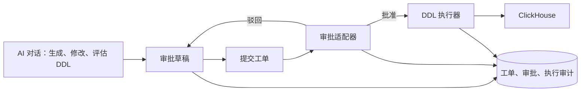

# 通用审批与 ClickHouse DDL 工单设计

## 1. 背景与目标

当前 AI Agent 的 SQL 工具只允许执行只读 SQL。DDL 即使经过用户确认，也不应直接借用一次
Agent Tool 的临时批准能力执行，因为 DDL 需要独立的审批人、审计记录、延后执行、失败处理和
集群节点日志。

本设计增加一个轻量、可扩展的通用审批域，并以 `CLICKHOUSE_DDL` 作为第一个审批类型。首期目标：

- 用户可在对话中反复调整一条或多条 DDL，风险评估通过后由 Agent 创建草稿或提交工单；
- 管理员批准或驳回，驳回时填写结构化建议；
- 多条 SQL 严格按序执行，任一语句失败后立即停止并将工单标记为失败；
- 同时支持系统自动执行和管理员手动确认执行；
- 支持 ClickHouse 单连接、原生 `ON CLUSTER` DDL，并便捷展示语句及节点级执行日志；
- 对执行重试提供明确的幂等保护，不假设任意 DDL 天然幂等；
- 阻止同一资源的重复活跃工单（可以在AI对话列表提醒用户已有该相同审批对象，并指引用户跳转对应的审批页面），并在暂不支持依赖编排时拒绝明显依赖未完成工单的申请；
- 将工单类型与命名、风险等生成规则统一管理，在提交前生成并校验 DDL；
- 核心流程面向接口，不把当前单级审批和未来企业多级审批系统写死在业务代码中。

首期刻意不做多级审批、工单 DAG、跨工单自动编排、通用脚本执行和自动回滚。数据库 DDL 通常
无法可靠地事务回滚，因此失败后保留现场、停止后续语句并交由管理员处理。

## 2. 与现有能力的边界

现有 `ds_agent_pending_action` 表示一次 Agent Run 内的短期提问或工具许可，依赖 checkpoint，适合
“是否允许本次工具调用”。新工单是独立业务实体，可能在 Agent Run 结束、服务重启或审批系统
异步回调后继续存在。



Agent 只可创建和提交当前用户拥有的工单，不能批准工单，也不能绕过审批调用写执行器。DDL 执行
使用服务端解析的 Connection 和专用执行身份，不复用前端传入的凭据。

## 3. 设计原则

1. **通用外壳、类型化内容**：通用工单保存标题、摘要、人员、状态等；DDL 细节由类型处理器负责，
   不把大量可空 DDL 字段塞进通用表。
2. **批准不可变快照**：提交后冻结内容、目标、规则版本和摘要哈希。修改必须撤回到草稿并重新提交，
   已有批准立即失效。
3. **状态机而非布尔值**：所有操作通过命令服务和 CAS revision 转换，禁止 Controller 直接改状态。
4. **顺序确定、失败即停**：按 `ordinal` 串行执行；不使用并发 `flatMap` 执行多个 DDL。
5. **至少一次调度、语句级去重**：任务调度可能重复投递，但执行 attempt、statement 和 query id 可追踪；
   自动恢复不能盲目重放结果不明的 DDL。
6. **结构化日志优先**：原始日志用于展开诊断，列表首先显示语句、节点、状态、耗时与安全错误摘要。
7. **扩展点少而稳定**：审批提供方、审批类型、执行方式和规则引擎各一个主接口，避免为假设中的流程
   预先制造复杂分支。

## 4. 领域模型

### 4.1 通用工单 `ApprovalRequest`

| 字段                             | 说明                                                                         |
| -------------------------------- | ---------------------------------------------------------------------------- |
| `id / tenantId`                  | 工单 ID 与租户隔离键                                                         |
| `requestNo`                      | 租户内可读编号，如 `DDL-20260802-000123`                                     |
| `type`                           | 内部处理器类型，首期为 `CLICKHOUSE_DDL`                                      |
| `workOrderTypeKey`               | 管理员启用的业务工单类型，如 `CLICKHOUSE_CREATE_TABLE`                       |
| `workOrderTypeRevision`          | 生成该工单时使用的类型定义版本                                               |
| `title / summary`                | 标题和摘要；进入审批的是冻结值                                               |
| `applicantUserId`                | 申请用户，不能由客户端代填                                                   |
| `sourceSessionId / sourceRunId`  | 可空，只用于追溯来源对话，不决定工单生命周期                                 |
| `status`                         | 通用审批状态                                                                 |
| `approvalProvider`               | `builtin` 或外部提供方 key                                                   |
| `externalRequestId`              | 外部审批实例 ID，可空                                                        |
| `contentVersion / contentDigest` | 内容版本及 SHA-256，防止批准后被替换                                         |
| `revision`                       | 乐观锁版本                                                                   |
| 时间字段                         | `createdAt / submittedAt / approvedAt / rejectedAt / finishedAt / updatedAt` |

建议状态：

```text
DRAFT -> SUBMITTED -> APPROVED -> QUEUED -> RUNNING -> SUCCEEDED
  |          |            |          |         |
  +->CANCELLED       REJECTED    CANCELLED    FAILED
  ^          |
  +----------+  (驳回后复制为新内容版本或显式 revise，重新提交)
```

`APPROVED` 只表示审批完成；`QUEUED/RUNNING/SUCCEEDED/FAILED` 表示执行阶段。审批提供方返回的
细粒度状态映射到该稳定状态集合，避免外部流程术语扩散到产品核心。

### 4.2 审批记录 `ApprovalDecision`

审批决定在领域层采用不可变对象，但首期不单独建审批决定表：当前批准人、批准时间和意见写入工单
主表，完整操作历史追加到 `ds_approval_event`。首期只有一个 `ADMIN_REVIEW` stage；真正接入多级
外部审批后，再根据查询和合规需要拆出阶段表，不提前增加持久化模型。

驳回建议同时保留：

- 人类可读 `comment`；
- 可选结构化项：`category`（字段错误、命名不合规、索引不合规、风险过高等）、
  `statementOrdinal`、`objectKey`、`message`。

### 4.3 DDL 内容 `DdlApprovalContent`

| 字段                          | 说明                                      |
| ----------------------------- | ----------------------------------------- |
| `connectionId`                | 经服务端鉴权的连接 ID                     |
| `targetMode`                  | `CONNECTION` 或 `NATIVE_CLUSTER`          |
| `clusterName`                 | `NATIVE_CLUSTER` 时必填并由连接元数据校验 |
| `databaseContext`             | 解析未完全限定对象名时使用，提交后冻结    |
| `executionMode`               | `AUTO_AFTER_APPROVAL` 或 `MANUAL_TRIGGER` |
| `workOrderTypeKey / revision` | 管理员启用的业务工单类型及固定版本        |
| `generationRuleChecksum`      | 生成规则快照校验值                        |
| `riskAssessmentJson`          | 风险等级、证据、警告、评估器版本及时间    |
| `statements`                  | 一条或多条有序 DDL 快照                   |

每条 `DdlStatement` 至少包含：

- `ordinal`：从 1 开始且连续；
- `sqlText`：最终供人审批的 SQL，不在执行时由 Agent 再生成；
- `normalizedSqlDigest`：规范化 SQL 哈希；
- `operationKind`：如 `ALTER_TABLE_ADD_COLUMN`；
- `objectRefs`：解析出的目标、读取/前置资源；
- `riskLevel / warnings`；
- `idempotencyStrategy`：`PRECONDITION`、`NATIVE_IF_EXISTS`、`NONE`；
- `precondition`：可选的只读存在性检查定义，而不是任意客户端 SQL。

### 4.4 内部处理器、业务工单类型与 DDL 操作

模型分为三层：

```text
内部处理器 CLICKHOUSE_DDL
  └── 管理员配置的业务工单类型 workOrderTypeKey
       └── 编译后的一条或多条 DDL operationKind
```

- `CLICKHOUSE_DDL` 是代码层内部处理器，复用审批状态机、解析、执行和审计，不直接作为用户选择项；
- 业务工单类型由管理员维护，例如 `CLICKHOUSE_CREATE_TABLE`、`CLICKHOUSE_MODIFY_COLUMN`、
  `CLICKHOUSE_ADD_INDEX`；每种类型同时包含生成规则；
- `operationKind` 是编译后每条 SQL 的技术分类，用于校验、资源分析、幂等和执行，不等同于业务类型。

Agent 只能从当前租户已启用的业务工单类型目录中选择。类型不存在、已停用、Connection 不适用或
当前 ClickHouse 版本不支持时，`prepare_ddl_approval` 返回稳定错误
`APPROVAL_WORK_ORDER_TYPE_UNSUPPORTED`，不能让 Agent 自行构造同类 DDL 绕过目录。

建议首期操作类型：

| 分类       | `operationKind`                                                                                               | 示例                                       |
| ---------- | ------------------------------------------------------------------------------------------------------------- | ------------------------------------------ |
| 表         | `CREATE_TABLE`、`RENAME_TABLE`                                                                                | 创建或重命名表                             |
| 视图       | `CREATE_VIEW`、`CREATE_MATERIALIZED_VIEW`                                                                     | 普通视图、物化视图                         |
| 字典       | `CREATE_DICTIONARY`                                                                                           | ClickHouse Dictionary；UI 可显示“创建字典” |
| 列         | `ALTER_TABLE_ADD_COLUMN`、`ALTER_TABLE_MODIFY_COLUMN`、`ALTER_TABLE_RENAME_COLUMN`、`ALTER_TABLE_DROP_COLUMN` | 增加、修改、重命名、删除列                 |
| 索引       | `ALTER_TABLE_ADD_INDEX`、`ALTER_TABLE_MATERIALIZE_INDEX`、`ALTER_TABLE_DROP_INDEX`                            | 增加、物化、删除跳数索引                   |
| Projection | `ALTER_TABLE_ADD_PROJECTION`、`ALTER_TABLE_MATERIALIZE_PROJECTION`、`ALTER_TABLE_DROP_PROJECTION`             | Projection 生命周期                        |
| 表属性     | `ALTER_TABLE_MODIFY_TTL`、`ALTER_TABLE_MODIFY_SETTING`                                                        | TTL 和表级设置                             |
| 高危操作   | `DROP_TABLE`、`DROP_VIEW`、`DROP_DICTIONARY`、`TRUNCATE_TABLE`                                                | 删除或清空对象，需更严格策略               |

operation kind 是稳定领域 code，不是直接把 SQL 首个关键字拼成枚举。每条 SQL 必须由服务端 AST
分类器得到且只对应一个 operation kind；无法明确分类时返回 `DDL_OPERATION_UNSUPPORTED`，不能
降级成笼统 `OTHER` 后继续执行。

一个业务工单类型可以生成多条、甚至多种 operation kind，但组合必须由该类型的生成规则明确声明。
例如“标准建表”生成两条 `CREATE_TABLE`；未来若需要“建表并建视图”，必须由管理员新增明确的复合
工单类型，不能允许 Agent 临时拼接任意混合 DDL。所有审批项仍要求同一 Connection、同一目标模式，
逐项保留规则结果、风险、资源引用和幂等策略；工单风险取最高值并评估项间顺序。

操作类型通过注册表管理，而不是在 Controller 或 React 页面中写多组 `switch`：

```java
public interface DdlOperationDescriptor {
  DdlOperationKind kind();
  boolean supports(ParsedDdl ast, ClickHouseCapabilities capabilities);
  List<ResourceClaim> resourceClaims(ParsedDdl ast);
  List<RuleResult> validate(ParsedDdl ast, DdlRuleContext context);
  RiskAssessment assessRisk(ParsedDdl ast, DdlRiskContext context);
  IdempotencyPlan idempotencyPlan(ParsedDdl ast);
}
```

简单类型可以使用声明式 descriptor，只有资源分析、风险或幂等语义特殊的类型才实现专用 strategy，
避免每增加一种 DDL 就复制完整审批流程。

## 5. 数据模型建议

首期使用 MySQL 5.7 Flyway migration，收敛为七张表：

| 表                            | 用途                                                 |
| ----------------------------- | ---------------------------------------------------- |
| `ds_approval_type_definition` | 管理员维护的业务工单类型及当前生效生成规则           |
| `ds_approval_request`         | 通用工单、DDL 类型化 JSON、审批结果和当前执行汇总    |
| `ds_approval_item`            | 有序审批内容；DDL 类型下一项对应一条 SQL             |
| `ds_approval_resource_claim`  | 活跃工单占用的规范化资源键                           |
| `ds_approval_execution`       | 每个 attempt 中每条审批项的状态、query id 和安全错误 |
| `ds_approval_node_execution`  | 一条执行记录对应的集群节点状态和安全日志摘要         |
| `ds_approval_event`           | 提交、审批、执行、重试和人工处理的追加式审计时间线   |

不单独建立 `ds_ddl_request`：目标模式、集群、规则版本和风险快照放在
`ds_approval_request.content_json`。不单独建立 `ds_approval_decision`：单级审批当前值放主表，历史写
event。不再拆 execution 汇总和 statement execution：工单主表保存执行汇总，execution 表一行表示
某个 attempt 中的一条审批项。

节点执行表首期保留，不放进 JSON。节点结果天然需要异常置顶、状态筛选、分页和单节点刷新；独立表
可以建立 `(tenant_id, execution_id, status)` 索引，避免读取并反序列化整段节点结果，也为大集群
控制单页数据量。

`ds_approval_type_definition` 将“类型 + 当前生成规则”统一管理，建议字段：

| 字段                                     | 说明                                                      |
| ---------------------------------------- | --------------------------------------------------------- |
| `id / tenant_id / type_key`              | 租户内稳定类型标识，`type_key` 不允许发布后改名           |
| `handler_key`                            | 固定为已注册的 `CLICKHOUSE_DDL`，不能填写任意类名         |
| `name_i18n_json / description_i18n_json` | 管理员维护的中英文名称和说明，按当前 UI language 展示     |
| `generator_key`                          | 服务端已注册的生成器，如 `create_local_distributed_table` |
| `allowed_operation_kinds_json`           | 该类型允许编译出的 SQL 操作集合                           |
| `generation_rule_json`                   | 后缀、引擎、依赖保护、阈值等结构化生成/校验规则           |
| `pending_definition_json`                | 可选的待测试新配置；不影响当前已启用定义                  |
| `applicable_connections_json`            | 可选的 Connection 范围；空表示租户全部授权连接            |
| `risk_policy_json`                       | 是否允许自动提交、最低审批要求等风险策略                  |
| `status`                                 | `DRAFT`、`ENABLED`、`DISABLED`                            |
| `definition_revision / checksum`         | 当前生效定义的版本和校验值                                |
| `pending_revision / pending_checksum`    | 待发布配置的乐观锁版本和校验值                            |
| 审计字段                                 | 创建/更新/启用人员及时间                                  |

唯一约束为 `UNIQUE (tenant_id, type_key)`。`generator_key` 和规则 JSON 必须通过对应
`DdlWorkOrderTypeDescriptor` 的 JSON Schema 校验；管理员只能配置代码中已经注册的生成器，不能仅
凭一段 JSON 创造新的可执行语义。

工单主表保存 `work_order_type_key`、`work_order_type_revision`、`type_definition_checksum`，并在
`content_json` 中冻结生成规则快照。管理员后续修改或停用类型不改变已提交工单；草稿再次 prepare
或 submit 时必须使用当前启用版本重新生成和校验。

`ds_approval_item` 仍保存非空 `operation_kind`，用于逐条 SQL 的规则、风险、资源和幂等处理，但列表
主要按 `work_order_type_key` 筛选，不再把任意 operation kind 组合包装成“混合 DDL”工单。

关键约束：

- `UNIQUE (tenant_id, request_no)`；
- `UNIQUE (tenant_id, type_key)`；
- `UNIQUE (tenant_id, request_id, ordinal)`；
- `ds_approval_execution` 使用
  `UNIQUE (tenant_id, request_id, attempt_no, item_id)`，防止同一 attempt 重复执行一项；
- `ds_approval_node_execution` 使用
  `UNIQUE (tenant_id, execution_id, node_key)`，防止节点状态重复插入；
- `ds_approval_resource_claim` 使用 `(tenant_id, resource_key, active_key)` 唯一约束；活跃时
  `active_key='ACTIVE'`，终态后置空，以兼容 MySQL 5.7 无条件唯一索引；
- 每个状态更新带 `WHERE revision = ?`，成功后 `revision + 1`；
- SQL、规则版本、风险快照和资源引用在 `SUBMITTED` 后不可原地更新；
- 所有审批表不建立数据库外键，包括对 Agent Run、Connection、用户和审批内部主从表的引用。

### 5.1 无外键的逻辑关联和一致性约束

表之间保留逻辑关联，但由应用事务和索引约束，不使用 MySQL `FOREIGN KEY` 或 `ON DELETE CASCADE`：

```text
ds_approval_request.id
  ├── ds_approval_item.request_id
  ├── ds_approval_resource_claim.request_id
  ├── ds_approval_execution.request_id
  │     └── ds_approval_node_execution.execution_id
  └── ds_approval_event.request_id
```

每个关联字段都必须同时携带 `tenant_id`，Repository 查询禁止只按全局 ID。例如读取 item 使用
`WHERE tenant_id = ? AND request_id = ?`。建议索引：

```text
(tenant_id, request_id, ordinal)             approval_item
(tenant_id, request_id, active_key)          approval_resource_claim
(tenant_id, request_id, attempt_no, item_id) approval_execution
(tenant_id, execution_id, status)            approval_node_execution
(tenant_id, request_id, created_at, id)      approval_event
```

无外键后，应用必须承担以下约束：

1. 创建 item、claim、execution、node execution 或 event 前，在同一事务中确认父记录存在且 tenant
   一致；
2. request 与 items、规则快照、审计 event 的创建或提交必须在同一事务完成，任一步失败整体回滚；
3. 状态转换使用 revision/CAS，唯一索引继续负责 request no、ordinal、execution attempt 和资源占用的
   并发兜底；
4. 不提供通用的 `deleteByRequestId` 给业务代码，删除只能经过集中 `ApprovalRetentionService`；
5. 增加定期一致性检查，统计无 request 的 item/event/execution、无 execution 的 node execution，并
   告警而不是静默忽略；
6. Repository contract test 和集成测试覆盖父记录不存在、跨租户 ID、事务回滚和清理中断恢复。

工单默认不物理删除。普通用户删除草稿时优先标记 `CANCELLED` 或 `deleted_at`；已提交、审批、执行和
失败记录按审计保留策略保存。Connection、用户、Agent Session 或工单类型停用/删除时，不联动删除
历史工单，工单自身的类型、人员显示名、Connection 和规则快照用于历史展示。

只有超过租户保留期且处于允许清理终态的工单可以物理清理。清理服务按固定顺序分批执行：

```text
node_execution -> execution -> resource_claim -> event -> item -> request
```

清理任务使用 request 级租约和幂等删除；中途失败后可从剩余子表继续。活跃 claim 必须先由状态机
正常释放，清理任务不得通过删除 claim 绕过仍在运行的工单。类型定义只允许停用，默认不物理删除。

这种设计避免数据库级联误删审计数据，也方便未来拆库；代价是必须把上述事务、清理和孤儿检测作为
正式功能实现，不能只依赖开发约定。

`ds_approval_node_execution` 建议保存 `host`、`port`、`status`、`duration_ms`、`error_code`、
`safe_message`、`raw_log_ref` 和时间字段。表内只保存安全摘要；完整数据库响应若需要长期保存，应
进入有大小、保留期和访问控制的日志存储，不能无限写入 MySQL。

首期也不建立 outbox 表。批准自动执行时，在同一事务中把工单改为 `QUEUED`；worker 扫描队列并
使用 `execution_owner / execution_lease_until` 领取。状态扫描不会丢任务，租约让服务重启后可恢复。
以后引入 MQ、跨服务事件或企业审批回调投递时，再增加 transactional outbox。

## 6. 重复资源和“不支持依赖”的处理

提交前由 `DdlResourceAnalyzer` 将 AST 转为规范化资源键，例如：

```text
clickhouse/{connectionId}/database/{db}
clickhouse/{connectionId}/table/{db}.{table}
clickhouse/{connectionId}/column/{db}.{table}.{column}
clickhouse/{connectionId}/index/{db}.{table}.{index}
```

`ON CLUSTER` 工单还包含规范化 `clusterName`，但同一 Connection 下的逻辑对象仍需冲突，不能通过
切换目标模式规避占用。

提交事务依次执行：

1. 解析全部 SQL；无法可靠解析、包含多语句片段或不是允许的 DDL 类型则拒绝；
2. 校验同一工单内没有重复定义或自相矛盾的资源；
3. 查询当前数据库元数据，验证前置对象已存在；
4. 如果前置对象不存在，且它正由另一个活跃工单创建，返回稳定错误
   `APPROVAL_DEPENDENCY_NOT_SUPPORTED`，并给出冲突工单编号；
5. 为变更目标写入 resource claim；若唯一键冲突，返回 `APPROVAL_RESOURCE_CONFLICT`；
6. 冻结内容、将状态改为 `SUBMITTED`，并追加一条审计 event；以上操作与 resource claim 在同一
   事务提交。

例如“添加 A 字段”的工单未完成时，再提交“为 A 字段建索引”的工单：当前元数据中 A 不存在，
且活跃 claim 表明它由另一工单创建，因此直接拒绝，而不是建立 A → B 的依赖边。首期终态工单释放
claim；失败工单在管理员明确“关闭处理”前仍占用资源，避免现场未处理又重复申请。

资源冲突判断由类型处理器提供，不在通用审批 Service 中硬编码 ClickHouse 对象层级。

## 7. 工单类型规则、生成和风险评估

### 7.1 类型和生成规则统一管理

每个可生成的业务工单类型在 `ds_approval_type_definition` 中只有一条当前定义，类型元数据和生成规则
不再拆成 policy set/revision/binding 三组表。管理员启用什么类型，Agent 才具备什么工单生成能力：

| `type_key`                 | `generator_key`                  | 典型生成结果                               |
| -------------------------- | -------------------------------- | ------------------------------------------ |
| `CLICKHOUSE_CREATE_TABLE`  | `create_local_distributed_table` | `_local` 本地表 + `_all` 分布式表          |
| `CLICKHOUSE_CREATE_VIEW`   | `create_view`                    | 一条 `CREATE VIEW`                         |
| `CLICKHOUSE_MODIFY_COLUMN` | `modify_column`                  | 一条受依赖保护的 `ALTER ... MODIFY COLUMN` |
| `CLICKHOUSE_ADD_INDEX`     | `add_and_materialize_index`      | 增加索引，并按规则决定是否追加 materialize |

如果没有 `CLICKHOUSE_DROP_TABLE` 的 `ENABLED` 记录，Agent、页面和 API 都不支持生成删表工单。即使
模型生成了合法 `DROP TABLE` SQL，prepare Tool 也必须在创建 DRAFT 前拒绝，不能把它归入通用 DDL
或其他类型。

单表保存当前生效定义和一个可选 pending 配置。首次创建处于 `DRAFT`；已经 `ENABLED` 的类型编辑时
只更新 `pending_definition_json`，当前 Agent 能力不中断，测试通过后再原子替换生效定义。历史工单
通过自身冻结的 definition revision、checksum、规则快照和 SQL 快照保持可审计；配置修改过程通过
CAS 和管理审计 event 记录。首期不提供任意版本回滚；未来确有完整配置历史、版本对比和一键回滚
需求时，再增加 revision 表。

普通用户只能读取当前启用类型的安全摘要，不能修改、启用或临时绕过。只有具备
`APPROVAL_TYPE_MANAGE` 的管理员能维护。系统级安全底线仍由对应 `generator_key` 的 Java descriptor
强制执行，管理员配置只能在 descriptor 允许范围内调整或收紧，不能通过 JSON 关闭排序键保护等
mandatory 约束。

每个已提交工单冻结 `workOrderTypeKey/definitionRevision/checksum` 和规则结果。类型更新只影响新草稿；
旧 DRAFT 重新编辑或提交时，必须按当前启用定义重新 prepare。已提交、批准或执行中的工单继续使用
冻结快照，不能被管理员后台静默改写。

### 7.2 生成、编译、校验和风险四个阶段

规则执行分成四个阶段，但共享同一不可变版本：

1. `DdlGenerationGuidance`：向 Agent 提供生成指导和所需输入字段；
2. `DdlPlanCompiler`：将语义意图或候选 SQL 编译成一条或多条有序、规范化 DDL；
3. `DdlValidationPolicy`：基于 AST 和数据库元数据做不可绕过的确定性校验；
4. `DdlRiskAssessor`：基于对象大小、分区、复制/集群信息和系统表证据生成风险摘要。

`DdlPlanCompiler` 先加载业务工单类型定义，再由 `generator_key` 找到代码中的 descriptor。所有 DDL
共同的安全底线由内部 handler 执行，类型定义中的 `generation_rule_json` 只配置该生成器允许开放的
参数。例如建表配置引擎、分区和 `_local/_all`，修改字段配置更严格的依赖保护，增加索引配置类型、
表达式限制以及是否追加 materialize。

描述符适合表达命名正则、必需步骤、允许/禁止语句、阈值和提示消息 key；AST 解析、元数据查询、
类型兼容和权限校验保留在 Java strategy 中。不实现可以从 JSON 执行任意表达式或脚本的规则语言。

规则结果分为：

- `ERROR`：不能创建可提交快照；
- `WARNING`：允许提交，但必须在审批页显著展示；
- `INFO`：说明性建议。

### 7.3 建表成对生成示例

企业规则可以声明 `CREATE_TABLE` 必须生成一个原子 DDL plan：

```text
1. CREATE TABLE {logical_name}_local (...) ENGINE = ReplicatedMergeTree ...
2. CREATE TABLE {logical_name}_all AS {logical_name}_local
   ENGINE = Distributed({cluster}, {database}, {logical_name}_local, {sharding_key})
```

`DdlPlanCompiler` 从本地表 AST 派生分布式表 SQL，而不是让模型自由复制列定义。编译和提交校验至少
保证：

- 本地表后缀为 `_local`，分布式表后缀为 `_all`；
- 两项位于同一个工单，ordinal 固定为本地表在前、分布式表在后；
- `Distributed` 引用的数据库和本地表与第一条一致，Cluster 来自已授权 Connection；
- 分片键符合规则且引用存在的列；
- 用户删除其中一条、交换顺序、修改引用或改名后，当前检查 digest 立即失效；
- 重新 prepare 时要么恢复符合规则的两条 DDL，要么返回阻断错误，无法提交残缺 plan。

这是**工单内有序计划**，不是暂不支持的跨工单依赖。两条 DDL 仍遵循第一条失败就不执行第二条的
语义。

### 7.4 修改或删除字段示例

对 `ALTER_TABLE_MODIFY_COLUMN` 和 `ALTER_TABLE_DROP_COLUMN`，Tool 必须在 prepare 和 submit 时
读取当前元数据，至少分析：

- `sorting_key`、`primary_key`、`partition_key`、`sampling_key`；
- 跳数索引、Projection、TTL、默认表达式和物化列；
- 可发现的 View、Materialized View 和 Dictionary 依赖；
- 类型转换兼容性、潜在数据重写量及目标 ClickHouse 版本能力。

命中 ORDER BY/主键/分区键等 mandatory 依赖时，默认产生 `ERROR`，用户不能在对话里要求忽略。
企业若确实需要例外，不允许普通用户通过 Prompt 开启；应由管理员配置并启用独立的高危业务工单
类型，同时提高审批和执行权限。

元数据快照会变化，因此审批执行前还要重新检查关键依赖。若审批时与执行时的 schema fingerprint
不同，执行在发出 SQL 前停止，工单标记为 `FAILED` 并记录稳定错误 `DDL_REVALIDATION_REQUIRED`，
等待申请人基于新元数据创建内容版本并重新审批，不能按旧证据继续执行。

### 7.5 Skill 与 Tool 的职责

该能力需要 **Skill + Tool**，但安全边界在 Tool：

| 能力                                             | Skill      | Tool/服务端                     |
| ------------------------------------------------ | ---------- | ------------------------------- |
| 解释企业 DDL 流程、向用户追问缺失信息            | 负责       | 不负责自然语言对话              |
| 告诉 Agent 先 prepare、再请用户确认、最后 submit | 负责       | 校验调用顺序和状态              |
| 生成候选 SQL                                     | 可以辅助   | 不信任候选结果                  |
| 将建表意图展开成 `_local` + `_all` 两条有序 DDL  | 可预期结果 | `DdlPlanCompiler` 权威生成/校验 |
| 检查 ORDER BY 字段、索引、Projection 等依赖      | 可解释     | 权威查询元数据并阻断            |
| 防止用户 Prompt 覆盖 mandatory 规则              | 不能保证   | 必须保证                        |
| 冻结规则版本、SQL digest、资源 claim 和风险证据  | 不负责     | 必须保证                        |
| 直接执行 DDL                                     | 永不允许   | 仅审批通过后的执行器允许        |

建议提供内置 `clickhouse-ddl-approval` Skill，只包含稳定工作流和 Tool 使用说明，不把完整企业规则
正文全部塞进 Prompt。服务端提供类型目录、prepare、submit 和状态查询四个窄 Tool，具体契约见下一节。

`prepare` 的输入优先是结构化语义意图，例如表结构、目标对象、期望变更，而不是允许 Agent 直接
指定“跳过规则”。`submit` 不接收一份新的 SQL；它只提交服务端已保存并重新校验的 draft revision。
因此即使用户通过 Prompt injection 要求 Agent 忽略规则，最终也无法构造可提交工单。

### 7.6 Agent 自动生成和保存工单

Agent 不直接访问 `ApprovalRepository`，也不调用面向浏览器的任意 HTTP API。审批能力作为新的
服务端 Tool group 注册到现有 `AgentToolRegistry`，建议命名为 `approval-workflow`。首期仅暴露：

```text
list_approval_work_order_types  只读列出当前 Connection 已启用类型
prepare_ddl_approval   创建或更新并自动保存 DRAFT
submit_ddl_approval    将已保存且校验通过的 DRAFT 提交审批
get_approval_status    只读查询本人可见工单的最新状态
```

不建议再拆一个纯 `generate_ddl_work_order` 和一个通用 `save_work_order`：两步之间 SQL、规则版本、
风险证据可能被替换，也会迫使模型传递庞大的不可信工单 JSON。`prepare_ddl_approval` 应在一个服务端
事务边界中完成：

1. 从 Run Context 取得可信 tenant、user、Connection 和 source session/run；
2. 接收标题、摘要、结构化 DDL intent，以及可选候选 SQL；
3. 加载元数据和当前启用的工单类型定义，调用 `DdlPlanCompiler` 生成完整有序 plan；
4. 执行规则、风险、依赖和重复资源预检查；
5. 创建新 DRAFT，或用 `draftId + expectedRevision` 更新当前用户拥有的 DRAFT；
6. 在同一事务保存 request、items、规则/风险快照和审计 event；
7. 返回轻量可展示结果，不把内部策略实现或敏感元数据全部注入模型上下文。

建议 Tool contract：

```text
list_approval_work_order_types(connectionId)
  -> [{ typeKey, name, description, requiredIntentFields, ruleSummary }]

prepare_ddl_approval(
  draftId?, expectedRevision?, connectionId, workOrderTypeKey,
  title, summary, intent, candidateSql?
)
  -> draftId, revision, requestNo?, orderedItems,
     appliedRuleSummary, risks, contentDigest, submittable

submit_ddl_approval(draftId, expectedRevision, expectedContentDigest)
  -> requestNo, status, submittedAt

get_approval_status(requestId)
  -> requestNo, status, latestSafeSummary, updatedAt
```

`prepare` 是会写内部业务数据的 Tool，标记为 `readOnly=false` 和 `MUTATING_INTERNAL`，但只产生可撤销
草稿，不执行 DDL，也不触发管理员审批，因此在具备 `APPROVAL_CREATE` 时可允许 Agent 自动调用。
每次成功自动保存后，对话卡片明确显示“草稿已保存”、draft 编号、revision 和打开编辑器入口。

类型目录由服务端按 tenant、Connection、ClickHouse capability、类型状态和用户权限过滤。Agent 必须
先选择目录中的 `workOrderTypeKey`；prepare 再独立查询并锁定该类型定义，不能信任模型缓存的目录。
不存在或未启用的类型直接返回 `APPROVAL_WORK_ORDER_TYPE_UNSUPPORTED`，且不落草稿数据。

连续对话修改时复用 `draftId`：Agent 提交新的语义 intent，服务端基于 `expectedRevision` 更新。revision
冲突返回结构化 `APPROVAL_DRAFT_REVISION_CONFLICT`，Agent 必须先读取最新草稿再协助合并，不能覆盖
用户在页面中的修改。已 `SUBMITTED`、`APPROVED` 或进入执行阶段的工单不能被 prepare 原地修改；
需要复制为新的 DRAFT/content version。

Tool 调用重试使用服务端 Run Context 中的 `(tenantId, userId, runId, toolCallId)` 作为自动保存幂等键；
相同调用重放返回同一 draft revision，不重复创建工单或 item。跨 Run 更新则必须显式携带 draftId 和
expectedRevision，不能仅靠标题或 SQL 猜测目标草稿。

自动保存不等于自动提交。`submit_ddl_approval` 是单独的业务边界，只能提交 Tool 已保存的 revision，
并在事务内重新校验类型状态/版本、schema fingerprint、content digest 和 resource claim。Agent 可以
在以下任一
条件满足时自动调用 submit：

- 用户在当前对话明确要求“检查通过后自动提交”；
- 用户在草稿卡片确认当前 digest；
- 租户启用了明确的 `autoSubmitValidatedDraft` 策略，且该 operation/risk level 在允许范围内。

授权结果作为服务端 Run capability 或草稿字段保存，不能由 Agent 在 Tool 参数中自报
`userConfirmed=true`。没有授权时，Agent 保存草稿并等待用户确认。submit 只表示提交管理员审批，
不等于审批通过，更不能触发 Agent 直接执行 DDL。

首期不要向 Agent 注册 `approve_work_order`、`execute_ddl_work_order`、`retry_ddl` 或通用的
`update_work_order_status`。批准、执行和人工处理仅属于管理员 API/后台 worker，避免模型获得可组合
的越权路径。

## 8. 面向接口的后端结构

```java
public interface ApprovalTypeHandler<C> {
  String type();
  PreparedApproval<C> prepare(C command, ApprovalActor actor);
  void validateForSubmit(PreparedApproval<C> approval);
  List<ResourceClaim> resourceClaims(PreparedApproval<C> approval);
  Optional<ApprovalExecutor> executor();
}

public interface ApprovalProvider {
  String key();
  ProviderSubmission submit(ApprovalSnapshot request);
  ProviderStatus query(String externalRequestId);
  CallbackResult acceptCallback(VerifiedProviderCallback callback);
}

public interface ApprovalExecutor {
  ExecutionResult execute(ApprovedRequest request, ExecutionContext context);
}

public interface DdlWorkOrderTypeCatalog {
  List<DdlWorkOrderTypeDefinition> listEnabled(String tenantId, String connectionId);
  DdlWorkOrderTypeDefinition requireEnabled(
      String tenantId, String connectionId, String workOrderTypeKey);
}

public interface DdlWorkOrderTypeDescriptor {
  String generatorKey();
  JsonSchema generationRuleSchema();
  CompiledDdlPlan compile(
      DdlIntent intent, DdlWorkOrderTypeDefinition definition, SchemaSnapshot schema);
}

public interface DdlPlanCompiler {
  CompiledDdlPlan compile(
      DdlIntent intent, DdlWorkOrderTypeDefinition definition, SchemaSnapshot schema);
}
```

应用层建议：

```text
ApprovalCommandService       创建、修改草稿、提交、撤回、批准、驳回
ApprovalQueryService         列表、详情、时间线、日志分页
ApprovalProviderCoordinator  内置或外部审批适配与回调去重
ApprovalExecutionScheduler   数据库队列扫描、租约和重试调度
ApprovalAgentTools           type catalog/prepare/submit/status Tool 薄适配层
DdlApprovalTypeHandler       SQL 解析、规则、风险、资源 claim
DdlWorkOrderTypeCatalog      读取管理员已启用且适用于 Connection 的类型
DdlWorkOrderTypeRegistry     注册 generator descriptor，校验 generator_key
DdlPlanCompiler              将语义意图编译为受约束的有序 DDL plan
ClickHouseDdlExecutor        严格顺序执行和节点状态采集
```

`builtin` 提供方首期只接受当前租户管理员决定。未来企业系统实现新的 `ApprovalProvider`，核心工单
仍只消费规范化的批准/驳回结果；回调必须验签，并以 `(provider, externalEventId)` 去重。多级审批
细节留在提供方，最终决定追加到 `ds_approval_event`，无需改 DDL 执行器。只有实际需要在本系统内
查询多级阶段时，才新增独立审批阶段表。

## 9. DDL 执行语义

### 9.1 调度和并发

- `AUTO_AFTER_APPROVAL`：批准事务直接将工单置为 `QUEUED`，由 worker 获取执行租约；
- `MANUAL_TRIGGER`：保持 `APPROVED`，管理员点击执行后原子地转为 `QUEUED`；
- 同一工单同一时刻只有一个活跃 execution attempt；
- 同一 Connection 默认串行执行 DDL 工单，后续可按资源 claim 做安全并行，但不在首期实现；
- 执行前再次确认工单 `contentDigest` 等于批准决定中的 digest，并重新校验连接权限、冻结类型快照
  完整性及对应 generator descriptor 仍受当前程序支持；类型后来停用不取消已批准工单。

### 9.2 顺序、失败和重试

执行器按 `ordinal` 循环：

1. 持久化语句 `RUNNING`、确定性 `queryId` 和开始时间；
2. 执行单条 SQL；
3. 收集本地或集群节点状态；
4. 持久化 `SUCCEEDED` 后才取下一条；
5. 任一语句 `FAILED` 或结果不明时停止，execution 和工单均进入 `FAILED`。

管理员手动处理有三个显式动作：

- **确认已在库端成功**：提供说明和证据，将结果不明语句标记为人工确认成功；
- **从失败语句重试**：创建新 attempt，跳过已有确定成功的语句；失败语句只有通过幂等预检查后执行；
- **关闭处理**：保持历史失败记录、释放资源 claim，不伪装成执行成功。

对于 `CREATE ... IF NOT EXISTS`、`DROP ... IF EXISTS` 等，可采用原生幂等语义。对于 `ALTER`，重试前
通过类型化元数据检查判断目标状态：已达到期望状态则记为 `SUCCEEDED_BY_PRECONDITION`；未达到才
执行；状态矛盾则要求人工处理。`NONE` 策略的结果不明语句禁止自动重试。绝不能通过简单字符串
补 `IF EXISTS` 把任意 DDL 宣称为幂等。

### 9.3 集群执行

首期只支持 ClickHouse 原生 `ON CLUSTER`，不在应用层对节点循环发送 DDL，以免把网络分区变成
不可控的部分成功。执行器：

- 校验 SQL 中的 cluster 与工单冻结的 `clusterName` 一致，或由 AST 构建器安全注入；
- 设置唯一 query id，并读取 `system.distributed_ddl_queue`（按版本能力探测）关联各 host 状态；
- 节点日志展示 `host / port / status / duration / errorCode / safeMessage / updatedAt`；
- 无法确认全部节点时标记 `UNKNOWN` 或 `PARTIAL_FAILED`，工单按失败处理，不继续下一条 SQL；
- 管理员可查看失败节点、复制安全诊断信息，并刷新节点状态，不需要在一段 JSON 中查找错误。

如果目标 ClickHouse 版本无法提供可靠的分布式 DDL 状态，审批页应在执行前明确告警，并只保存
客户端响应与可取得的队列证据。未来若需要逐节点编排，应作为新的执行策略实现，不混入首期路径。

## 10. API 草案

```http
POST   /api/approvals/drafts
PUT    /api/approvals/{id}/content          If-Match: <revision>
POST   /api/approvals/{id}/submit           Idempotency-Key: <key>
POST   /api/approvals/{id}/withdraw

GET    /api/approval-types/clickhouse-ddl/capabilities?connectionId=
POST   /api/approval-types/clickhouse-ddl/prepare

GET    /api/approvals?type=&workOrderTypeKey=&status=&mine=&cursor=
GET    /api/approvals/{id}
GET    /api/approvals/{id}/timeline

POST   /api/admin/approvals/{id}/approve    If-Match: <revision>
POST   /api/admin/approvals/{id}/reject     If-Match: <revision>
POST   /api/admin/approvals/{id}/execute    Idempotency-Key: <key>
POST   /api/admin/approvals/{id}/retry
POST   /api/admin/approvals/{id}/reconcile
POST   /api/admin/approvals/{id}/close

GET    /api/approvals/{id}/executions
GET    /api/approvals/{id}/executions/{executionId}/statements
GET    /api/approvals/{id}/executions/{executionId}/nodes?statementId=&cursor=

GET    /api/admin/approval-types?handlerKey=CLICKHOUSE_DDL&status=&cursor=
POST   /api/admin/approval-types
GET    /api/admin/approval-types/{typeId}
PUT    /api/admin/approval-types/{typeId}               If-Match: <revision>
POST   /api/admin/approval-types/{typeId}/validate
POST   /api/admin/approval-types/{typeId}/preview
POST   /api/admin/approval-types/{typeId}/enable        If-Match: <revision>
POST   /api/admin/approval-types/{typeId}/disable       If-Match: <revision>

POST   /api/approval-providers/{provider}/callbacks
```

所有修改接口要求租户身份、权限、审计字段和幂等/CAS 保护。新增调用方可见错误应使用稳定
`ApiErrorCode` 并提供英文、简体中文标题和消息；前端所有文案进入现有双语 i18n catalog。

## 11. 独立工单中心与前端交互

### 11.1 产品入口与页面承载

工单审批是独立业务模块，不放进设置 Dialog，也不使用只能短暂查看的右侧 Sheet。左侧应用导航
增加“工单中心”，使用与连接、Dashboard 等菜单相同的 `SidebarMenuButton`、图标尺寸、hover 和
折叠提示。点击后通过现有 `TabManager` 打开主工作区 Tab：

```text
tab type: approval-center
tab id: approval-center
icon: ClipboardCheck
title: 工单中心 / Work orders
```

工单详情继续在主工作区打开独立可关闭 Tab，便于同时对照 Query、Table、Cluster 或 AI 对话：

```text
tab type: approval-detail
tab id: approval:{requestId}
title: {requestNo}
```

左侧菜单在存在待办时显示紧凑数字 Badge。普通用户显示自己的“被驳回或需要处理”数量；管理员显示
“待审批”数量。Badge 只作快捷提示，真实权限和数据范围由后端决定。

工单中心内部使用一层顶级底边线 Tabs：普通用户只显示“工单”；具备类型查看权限的管理员显示
“工单”和“工单类型”。默认仍进入工单列表，类型管理不会成为新的左侧一级菜单：

```text
[ 工单 ] [ 工单类型* ]
* 仅 APPROVAL_TYPE_VIEW 或 APPROVAL_TYPE_MANAGE 可见
```

### 11.2 角色和权限范围

前端使用 capability，而不是到处散落 `isAdmin` 判断：

| 能力                         | 普通用户                               | 管理员                                       |
| ---------------------------- | -------------------------------------- | -------------------------------------------- |
| 查看工单                     | 仅本人申请，或未来明确共享给本人的工单 | 当前租户全部工单                             |
| 新建、编辑草稿               | 可以                                   | 可以                                         |
| 提交、撤回                   | 仅本人且状态允许                       | 本人申请按相同规则；不代替其他申请人修改内容 |
| 复制驳回工单为新草稿         | 仅本人                                 | 可以查看；默认不替申请人修改                 |
| 批准、驳回                   | 不可以                                 | 需要 `APPROVAL_REVIEW`；默认禁止审批本人申请 |
| 触发执行                     | 不可以                                 | 需要 `DDL_EXECUTE` 且工单已批准              |
| 重试、人工确认、关闭失败工单 | 不可以                                 | 需要 `DDL_EXECUTE`，操作必须填写说明         |
| 查看执行日志                 | 仅本人工单的脱敏日志                   | 当前租户脱敏日志；敏感原始日志还需额外权限   |
| 查看工单类型及生成规则       | 仅在自己的工单中查看生效规则摘要       | 需要 `APPROVAL_TYPE_VIEW`                    |
| 创建、测试、启停工单类型     | 不可以                                 | 需要 `APPROVAL_TYPE_MANAGE`                  |

页面根据 capability 隐藏不适用入口，同时后端对每个读写 API 独立鉴权。不能仅将按钮设为 disabled
来代替授权；用户直接访问无权工单 ID 时返回稳定的 403/404 安全响应。管理员无待审批权限但有查看
权限时，页面仍可只读打开，不显示审批控件。

### 11.3 工单中心列表页

页面沿用当前主工作区风格：`bg-background` 主背景、细边框分区、紧凑高度的 Tabs 和 Button、
`text-muted-foreground` 辅助信息，不引入新的重型后台管理视觉体系。

```text
┌ 工单中心                                      [新建 DDL 工单] ┐
│ 管理和跟踪 ClickHouse 变更申请                                  │
├ [我的申请] [待我审批 3] [执行中] [全部工单*]                    ┤
│ [搜索编号/标题/对象] [状态▼] [工单类型▼] [连接▼] [申请时间▼] [重置]│
├─────────────────────────────────────────────────────────────────┤
│ 编号        标题/对象       工单类型  申请人  状态      更新时间 ⋮│
│ DDL-...     添加 user_id    修改字段  alice  待审批    2分钟前     │
│ DDL-...     创建订单表       标准建表  bob    执行失败  1小时前     │
├─────────────────────────────────────────────────────────────────┤
│ 共 42 条                                      < 1 2 3 >         │
└─────────────────────────────────────────────────────────────────┘
* “待我审批”和“全部工单”仅在具有相应管理员 capability 时出现。
```

列表控件：

- 顶部标题区保持 `px-4/6 py-4`、下边框和简短说明；主操作按钮使用现有 primary Button；
- 一级视图使用现有底边线 Tabs，不再增加一层左侧导航；选项卡数量 Badge 使用 `secondary`；
- 筛选栏在桌面单行排列，窄屏自动换行；搜索使用现有 Input 和 `Search` 图标；
- 表格复用现有 Table/DataTable 的 sticky header、hover row、分页、loading skeleton 和空状态；
- 点击行打开详情；末列 `DropdownMenu` 只放当前状态允许的低频操作；
- 默认排序：待审批按提交时间升序，执行中按最近更新时间降序，其余按更新时间降序；
- 管理员“全部工单”增加申请人筛选，普通用户不显示无意义的申请人筛选；
- 内部处理器首期只有 `CLICKHOUSE_DDL`，不占用筛选空间；工单类型筛选来自管理员已启用的类型目录，
  历史中已停用的类型仍可作为只读筛选项；
- 列表查询全部由服务端分页和过滤，不把租户所有工单加载到浏览器再筛选。

状态 Badge 只使用已有语义色 token，并始终同时显示文字，不能只依赖颜色：

| 状态组               | 建议视觉                                                         |
| -------------------- | ---------------------------------------------------------------- |
| 草稿、已关闭、已取消 | `secondary`，中性灰                                              |
| 待审批、待执行       | `outline`，主色文字                                              |
| 执行中、处理中       | 主色浅背景，附小型 spinner 或 pulse dot                          |
| 已成功               | success 语义色；若当前组件无该 variant，先扩展统一 Badge variant |
| 已驳回、执行失败     | destructive 浅背景，不使用大面积纯红                             |
| 结果不明、部分失败   | warning 语义色和 AlertTriangle 图标                              |

### 11.4 新建和编辑工单页

新建/编辑使用主工作区页面而非大 Dialog，避免多条 SQL、风险说明和集群目标挤在弹窗中。桌面端为
“主编辑区 + 右侧检查摘要”，窄屏按内容、规则摘要、操作顺序堆叠：

```text
┌ 新建 DDL 工单                              [保存草稿] [提交审批] ┐
├──────────────────────────────────────┬──────────────────────────┤
│ 基本信息                             │ 提交检查                 │
│ 标题、摘要、Connection、目标模式     │ ✓ SQL 可解析             │
│ 工单类型 [标准建表]                  │ ✓ 类型已启用             │
│                                      │ ✓ 无资源冲突             │
│ 审批内容（2）                        │ ! 中风险 2 项             │
│ ① CREATE TABLE ..._local             │ 类型 revision 3          │
│ ② CREATE TABLE ..._all               │ 目标 production_cluster  │
│                                      │ 风险与建议               │
│ 类型规则 / 性能评估                  │ ...                      │
└──────────────────────────────────────┴──────────────────────────┘
```

核心控件：

- 标题用 Input，摘要用可计数 Textarea；Connection 使用现有 Connection Selector 风格，但提交后只读；
- 目标模式使用 Select/Radio：当前连接、原生 `ON CLUSTER`；选择集群后展示解析出的节点数量和版本摘要；
- SQL 项使用有序卡片，一项一条 SQL；卡片头展示序号、语句类型、目标对象、风险 Badge 和更多菜单；
- 新建草稿必须先选择管理员已启用的工单类型；输入字段由该类型的 generator descriptor 决定；允许
  粘贴候选 SQL 时也只能在所选类型规则内解析，不能自动切换到未启用类型；
- 类型规则生成的必需 SQL 项不能被用户单独删除或交换顺序；用户修改语义输入后由 prepare 重新生成，
  而不是在浏览器里任意拼接审批项；
- SQL 编辑器复用当前 Query 输入的字体、主题、格式化和只读模式，不复制一套 Ace 初始化逻辑；
- 支持拖动排序时必须同步 `ordinal`，并提供键盘可访问的“上移/下移”；执行中或提交后禁止排序；
- “检查 SQL”调用服务端 prepare，返回解析、规则、风险和资源冲突结果；客户端语法高亮不作为校验；
- 右侧检查摘要为 sticky Card，但不遮挡主滚动区域；错误项可点击并定位对应 SQL；
- 提交按钮只有在最新内容已完成服务端检查且 digest 未变化时可用；内容变化后立即把检查结果标为过期；
- 离开未保存草稿时使用现有 AlertDialog 风格确认，不静默丢失内容。

从 AI 对话创建时，Agent 生成内容先进入同一编辑页或可编辑草稿卡片。用户确认后才提交；不能让
Agent Tool 的成功返回直接等价于管理员审批。

### 11.5 工单详情页

详情页是所有角色共享的只读事实页面，操作区按 capability 和状态派生。桌面端主栏约占 2/3，右栏
约占 1/3；小于中等宽度时改为单栏，审批操作栏固定在内容底部而不是悬浮遮挡。

```text
┌ ← DDL-20260802-000123   添加 user_id 字段    [待审批]          ┐
│ 创建者 alice · 创建时间 · production · content v2             │
├──────────────────────────────────────┬──────────────────────────┤
│ [审批内容] [执行记录] [活动日志]     │ 审批摘要                 │
│                                      │ 申请人 / 审批人          │
│ 风险评估与规则告警                   │ 提交 / 审批时间           │
│                                      │ Connection / Cluster      │
│ ① ALTER TABLE ...                    │ 类型版本及 digest         │
│ ② CREATE INDEX ...                   │                          │
│                                      │ 资源占用                 │
├──────────────────────────────────────┴──────────────────────────┤
│ 管理员：[驳回] [批准]；申请人：[撤回] 或 [按反馈新建草稿]       │
└─────────────────────────────────────────────────────────────────┘
```

详情组成：

- Header：返回、工单编号、标题、状态 Badge、刷新和低频 Dropdown；编号可一键复制；
- 审批内容：按 ordinal 展示 SQL 卡片，默认格式化只读，高亮变更对象，可复制，不提供执行按钮；
- Header 显示业务工单类型；类型规则生成多条 SQL 时，每张卡片仍显示具体 operation kind，驳回意见
  可精确定位到单条审批项；
- 风险区：错误、警告、提示按严重度分组；规则版本和评估时间始终可见；
- 右侧摘要：通用信息、目标连接、Cluster、申请/审批人员、时间和 content digest；长值截断并悬停展示；
- 活动日志：复用紧凑 Timeline 样式，显示状态变化、操作者、说明和时间，不暴露内部堆栈；
- 资源占用：显示数据库、表、字段、索引等规范化对象，冲突工单可在有权限时跳转。

详情每次危险操作前重新获取当前 revision；409 冲突时刷新页面并提示状态已被其他管理员修改，不
覆盖新状态。

### 11.6 管理员审批控件

批准和驳回使用聚焦的小型 Dialog，不把整个详情复制进弹窗：

- **批准 Dialog**：再次显示工单编号、SQL 数、风险等级、执行模式和不可变 digest；高风险告警要求
  勾选“已查看风险”，但不要求输入无意义的固定文本；
- **驳回 Dialog**：意见必填；可添加多条结构化建议，选择类别、关联 SQL 序号/对象并填写说明；
- **自动执行**：批准后显示“将自动进入执行队列”；
- **手动执行**：批准只进入 `APPROVED`，详情页由有 `DDL_EXECUTE` 权限的管理员点击“开始执行”；
- 审批本人申请时按钮不出现，并显示中性说明；后端仍必须拒绝绕过调用；
- 提交操作期间按钮进入 loading 且禁止重复点击，使用 Idempotency-Key 和 revision 双重保护。

管理员不应在批准 Dialog 内编辑 SQL。发现问题必须驳回，由申请人产生新内容版本，确保“所见即
所批”。

### 11.7 执行记录与节点日志

“执行记录”Tab 顶部以 attempt 切换器展示 `首次执行 / 第 2 次重试`，下方按 SQL 顺序显示 Stepper：

```text
✓ 1 ALTER TABLE ...                 1.8s
✕ 2 CREATE INDEX ...               Code 517
— 3 ALTER TABLE ...                因前序失败未执行
```

选择某条 SQL 后显示独立节点表，数据来自 `ds_approval_node_execution`：

| 节点     | 状态 | 耗时 | 错误码 | 摘要                  | 更新时间 | 操作     |
| -------- | ---- | ---- | ------ | --------------------- | -------- | -------- |
| ch2:9000 | 失败 | 2.1s | 516    | Authentication failed | ...      | 查看日志 |
| ch1:9000 | 成功 | 1.7s | —      | —                     | ...      | 查看详情 |

节点表设计要求：

- 默认按失败、结果不明、执行中、成功排序；支持状态筛选、节点搜索和服务端分页；
- 顶部汇总 `成功 3 / 失败 1 / 未确认 1`，可快速只看异常；
- 错误摘要单行截断，点击行或“查看日志”打开右侧 Sheet，展示脱敏上下文、query id 和复制按钮；
- 原始日志按需加载，不在列表响应中返回；没有额外敏感日志权限时不展示入口；
- 自动刷新只在 `RUNNING/RECONCILING` 开启，并提供暂停；页面不可见时停止轮询；
- 重试、人工确认成功、关闭处理使用独立确认 Dialog，必须填写说明并显示影响范围；
- 普通用户可查看进度和脱敏错误，但看不到执行、重试、确认或关闭按钮。

### 11.8 对话内工单卡片

- DDL 草稿卡片展示标题、SQL 数、目标、风险等级和“在工单编辑器中打开”；长 SQL 不在消息流全部展开；
- 提交后卡片展示工单编号、实时状态和“查看详情”，不再提供可变 SQL 编辑；
- 驳回后显示管理员建议摘要和“根据反馈创建新草稿”；Agent 可以辅助修订，但由用户再次确认提交；
- Agent 只能查询工单状态、创建草稿和提交本人草稿，不能批准、执行或人工确认。

### 11.9 组件拆分建议

保持组件职责清楚，避免一个工单页面文件同时处理请求、权限、SQL 解析和节点日志：

```text
components/approval/
├── approval-center-tab.tsx
├── approval-list/
│   ├── approval-list-toolbar.tsx
│   └── approval-list-table.tsx
├── approval-editor/
│   ├── approval-editor.tsx
│   ├── ddl-item-card.tsx
│   └── submission-check-panel.tsx
├── approval-detail/
│   ├── approval-detail-tab.tsx
│   ├── approval-summary-card.tsx
│   ├── approval-decision-dialog.tsx
│   └── approval-event-timeline.tsx
├── execution/
│   ├── execution-attempt-selector.tsx
│   ├── statement-execution-stepper.tsx
│   ├── node-execution-table.tsx
│   └── node-log-sheet.tsx
├── approval-status-badge.tsx
└── approval-permission-guard.tsx
```

API DTO、query keys、状态转换和 capability 派生放在 `src/lib/approval`，不要塞进 React 组件。列表、
详情、execution 和 node 分别使用稳定 query key；审批成功后精确 invalidation，不全局刷新应用。

### 11.10 管理员工单类型 Tab

“工单类型”是工单中心中的独立 Tab，统一管理 `ds_approval_type_definition` 的类型元数据和当前生成
规则。它不是 Skill 编辑器：管理员配置的是 Tool 会强制执行的业务能力目录；Skill 只读取已启用类型
的安全摘要来指导 Agent。

```text
┌ 工单类型                                           [新增工单类型] ┐
│ 决定 Agent 和用户当前可以申请哪些 ClickHouse 变更                 │
├ [搜索名称/Key] [状态▼] [生成器▼] [Connection▼] [重置]            │
├───────────────────────────────────────────────────────────────────┤
│ 名称          Type Key                  生成器       版本 状态 更新│
│ 标准建表      CLICKHOUSE_CREATE_TABLE   本地+分布式  3   启用 ... │
│ 修改字段      CLICKHOUSE_MODIFY_COLUMN  字段修改     2   启用 ... │
│ 删除表        CLICKHOUSE_DROP_TABLE     删除表       1   停用 ... │
└───────────────────────────────────────────────────────────────────┘
```

列表要求：

- 列表即 Agent 可用能力目录；只有 `ENABLED` 类型会出现在 Agent Tool 和新建工单页面；
- 状态为“草稿、启用、停用”，停用不会删除历史工单；
- 支持按类型名称、type key、generator、Connection 范围和状态筛选；
- 行点击进入详情；启用/停用使用确认 Dialog 和 revision/CAS；
- 普通用户看不到该 Tab；只有 `APPROVAL_TYPE_VIEW` 的管理员进入只读模式；
- 不能把任意 operation kind 当成类型自动展示，类型必须由管理员明确创建并启用。

新增类型时，管理员先从服务端已注册的 generator descriptor 中选择模板，例如“本地+分布式建表”、
“修改字段”或“增加索引”。没有代码 descriptor 的 generator 不能仅靠填写 key 创建。详情/编辑页采用
与工单编辑器一致的“主编辑区 + 右侧检查摘要”：

```text
┌ ← 标准建表工单   revision 3 草稿              [保存] [测试] [启用] ┐
├──────────────────────────────────────┬────────────────────────────┤
│ 类型信息                             │ 启用检查                   │
│ 名称、Type Key、说明                 │ ✓ 生成规则 Schema 合法     │
│ Generator [本地+分布式建表]          │ ✓ 允许的 DDL 操作匹配      │
│ Connection 范围                      │ ✓ 预览测试通过             │
│                                      │ checksum                   │
│ 生成规则                             │                            │
│ ☑ 创建本地表和分布式表               │ 预期输出                   │
│ 本地后缀 [_local]                    │ 1 CREATE TABLE ..._local   │
│ 分布式后缀 [_all]                    │ 2 CREATE TABLE ..._all     │
│ ☑ 固定本地表先执行                   │                            │
└──────────────────────────────────────┴────────────────────────────┘
```

结构化规则表单由 generator descriptor 提供 Schema 和 UI descriptor：

- 建表：本地/分布式是否成对生成、后缀、允许引擎、Cluster 来源、分片键要求；
- 修改字段：ORDER BY、主键、分区键、索引、Projection、View 依赖的阻断策略；
- 索引：允许索引类型、表达式限制、是否追加 materialize、规模阈值；
- 通用：Connection 适用范围、风险等级和是否允许验证通过后自动提交；
- 高级区只读展示生成后的 `generation_rule_json`、允许的 operation kinds 和 checksum，不能执行脚本。

“测试”选择一个已授权 Connection，输入结构化示例 intent 或候选 SQL。后端调用与 Agent 相同的
`DdlWorkOrderTypeCatalog + DdlPlanCompiler + validator`，展示生成的有序 DDL、规则结果、风险、资源
引用和幂等计划。测试只产生临时 preview，不创建工单、resource claim、execution，也不执行 DDL；
类型内容改变后，旧 preview checksum 立即失效。

启用流程：

1. 保存类型定义，增加 `definition_revision`；
2. 校验 type key 唯一、generator 已注册、规则 JSON Schema、允许的 operation kinds 和安全底线；
3. 至少完成一次与当前 checksum 一致的成功 preview；
4. 启用 Dialog 显示 Type Key、Generator、Connection 范围、生成 SQL 数量和风险策略；
5. 管理员确认后将状态原子改为 `ENABLED` 并写管理审计 event；
6. Agent 下一次查询类型目录即可使用，新定义不改变已提交/已批准工单的冻结快照。

已启用类型的编辑先保存到同一行的 pending 配置，当前生效版本和 `ENABLED` 状态保持不变；完成测试
并确认后，服务端原子地将 pending 配置提升为新的生效 revision。未经 preview 的变更不会进入 Agent
生成链路。停用后新的 prepare 请求立即拒绝，已有 DRAFT 在 submit 时也拒绝并要求选择其他已启用
类型；已提交及后续状态的工单按冻结快照继续处理。

组件建议：

```text
components/approval/type-definition/
├── approval-type-list.tsx
├── approval-type-toolbar.tsx
├── approval-type-editor.tsx
├── approval-type-rule-form.tsx
├── approval-type-preview-panel.tsx
└── approval-type-enable-dialog.tsx
```

### 11.11 一致性、国际化和页面状态

- 优先复用现有 Button、Badge、Tabs、Table/DataTable、Dialog、Sheet、DropdownMenu、Tooltip、
  SyntaxHighlighter 和 Timeline；确需扩展状态色时先扩展公共语义 variant；
- 圆角、边框、阴影、字号、间距使用当前 Tailwind design token，不引入孤立 CSS 色值；
- 所有标题、状态、按钮、说明、空状态、校验和错误文案进入英文与简体中文 catalog；状态值由稳定
  code 映射，不直接显示后端枚举；日期和数字使用当前 `locale` 格式化；
- Tooltip 只补充解释，不承载唯一操作信息；Dialog 有明确 title/description，图标按钮有 aria-label；
- 列表和详情都覆盖 loading、empty、filtered-empty、403、404、409、error、partial-data 和 retry；
- 骨架屏形状应接近最终布局，避免整页 spinner；失败时保留已加载内容并提供局部重试；
- 窄屏隐藏次要表格列，将信息放入行内摘要；审批和执行按钮保持可触达，但不使用横向溢出的固定宽度；
- 首期不做自定义主题或另一套管理后台布局，确保工单页与 Query、Dashboard、设置页面属于同一产品。

## 12. 安全、审计与可观测性

- 申请、审批、执行使用分离权限：`APPROVAL_CREATE`、`APPROVAL_REVIEW`、`DDL_EXECUTE`；首期可将
  后两者映射到 `ROLE_ADMIN`，但领域层不直接判断 `isAdmin()`；
- 工单类型查看和维护分别使用 `APPROVAL_TYPE_VIEW`、`APPROVAL_TYPE_MANAGE`；类型维护权限不自动
  包含工单审批或 DDL 执行权限；
- 审批人默认不能批准自己的申请；如企业允许自批，必须是显式租户策略且写审计；
- 执行 SQL 必须与批准快照逐字节或规范化 digest 匹配；
- SQL 允许列表、AST 分类和危险函数检查在提交和执行前各做一次；
- Connection 密码、外部审批密钥、完整异常堆栈不进入工单内容或前端；
- 审计记录 actor、requestId、source、旧/新状态、contentDigest、queryId、IP/UA（按隐私策略）；
- 指标至少包括提交/批准/驳回数、审批耗时、队列耗时、执行成功率、语句耗时、节点失败数、
  resource conflict 和 reconciliation 次数；
- 服务重启后 worker 根据 execution 租约恢复。`RUNNING` 且无终态证据的语句先进入
  `RECONCILING`，查询 ClickHouse 证据后再决定，不能直接重放。

## 13. 推荐实施顺序

### 阶段 1：通用审批骨架

- 七张首期表、状态机、数据库执行租约、权限和双语错误；
- `ApprovalTypeHandler`、`ApprovalProvider` 与内置单级管理员审批；
- 独立工单中心入口、角色化列表、只读详情、提交、批准和驳回；
- 不接执行器时可完成端到端审批契约测试。

### 阶段 2：DDL 草稿与规则

- ClickHouse DDL AST 分类、对象引用与重复资源检测；
- 工单类型定义、注册 generator 和风险评估快照；
- 管理员工单类型 Tab、结构化生成规则、preview 和启停管理；
- DDL 主工作区编辑器、提交检查面板、对话中的 prepare/submit 工具和草稿卡片；
- 明确拒绝跨工单依赖。

### 阶段 3：可靠执行

- 数据库队列 worker、执行租约、严格串行语句状态机；
- 手动/自动触发、类型化幂等预检查、失败即停和人工 reconciliation；
- 单连接执行的审计、query id 与恢复测试。

### 阶段 4：集群可观测与扩展验证

- 原生 `ON CLUSTER`、distributed DDL queue 能力探测和节点日志界面；
- 外部 `ApprovalProvider` fake adapter，验证回调验签、去重和最终状态映射；
- 故障注入：服务重启、响应丢失、节点部分失败、重复调度、并发审批和重复资源提交。

首期不建议先做“万能审批 JSON + 一个大 Service”。先以 DDL 类型打通接口，只有第二种审批类型出现
时再提取真正共享的 UI schema 或字段，能保持实现清晰且避免过早抽象。

## 14. 验收标准

1. 非管理员无法批准或触发 DDL，Agent 无直接 DDL 执行工具；
2. 批准内容与执行内容 digest 完全一致，修改后必须重新审批；
3. 三条 SQL 中第二条失败时第三条从未发往 ClickHouse；
4. 重复投递执行事件不会创建并行 attempt 或重复执行已确定成功的语句；
5. 结果不明且无幂等策略的语句不会自动重试；
6. 相同活跃资源只能有一个工单，依赖未完成工单的申请得到明确错误；
7. 单节点和 `ON CLUSTER` 均能按语句查看状态，集群异常节点默认置顶；
8. 驳回意见可定位到具体语句或对象，用户可据此产生新内容版本；
9. 内置审批器可替换为 fake 外部审批器而无需修改 DDL handler/executor；
10. 服务在每个关键持久化点重启后，工单不会越权、越序或盲目重放；
11. 普通用户只能查询和操作自己的申请，无法通过隐藏入口、直接 URL 或 API 访问管理员能力；
12. 管理员可在独立工单中心完成待审批筛选、批准/驳回、执行和失败处理，且默认不能自批；
13. 工单列表、编辑、详情和节点日志在桌面与窄屏下均无关键操作遮挡，并覆盖 loading、空、错误、
    409 冲突和部分数据状态；
14. 节点日志支持服务端分页、异常优先、状态筛选及按权限加载原始日志；
15. 建表、视图、字典、列和索引等 SQL 均被解析为稳定 operation kind；未知或当前 ClickHouse
    版本不支持的类型在提交前明确拒绝；
16. Agent 和页面只能创建管理员已启用的业务工单类型；未配置删表类型时，即使 SQL 合法也不能创建
    DROP TABLE 草稿；
17. 一个类型可以按生成规则产生多条有序 DDL，但 Agent 不能在类型定义之外临时拼接混合操作；
18. 新增 generator descriptor 和类型定义不需要修改通用审批状态机、Controller 或 DDL 执行循环；
19. 启用成对建表规则后，缺少 `_local` 或 `_all`、顺序错误、引用错误及用户要求忽略
    规则都无法产生可提交工单；
20. 修改或删除排序键等受依赖保护的字段会在 prepare/submit 阶段被阻断，执行前 schema 变化也会
    在发出 DDL 前停止；
21. Skill 缺失、未加载或被对话内容干扰时，Tool 端仍能独立执行 generator 的全部 mandatory 规则；
22. Agent 重放同一 prepare Tool call 不会重复创建草稿，过期 revision 不能覆盖用户页面修改；
23. 自动保存只能产生 DRAFT；未取得服务端记录的提交授权时，Agent 不能把草稿提交审批；
24. Agent 的 Tool registry 不包含批准、DDL 执行、重试或任意状态修改工具；
25. 普通用户无法看到或调用工单类型管理能力；具有只读权限的管理员不能保存、启用或停用类型；
26. 类型定义的新 revision 不会改变已提交或已批准工单冻结的类型、规则和 SQL 快照；
27. 类型 preview 与 Agent prepare 使用同一 type catalog/compiler，但不会创建工单、resource claim 或
    执行 DDL；
28. 类型停用后不再出现在 Agent 目录中，新的 prepare 和旧 DRAFT submit 均被拒绝；
29. 所有审批表无数据库外键时，跨租户引用和不存在的父 ID 仍被应用层拒绝，主从写入失败会整体
    回滚；
30. 保留期清理按固定顺序可幂等恢复，一致性巡检能够发现并告警所有孤儿记录；
31. 所有新增前端消息和 API 错误均通过现有中英文契约测试。
